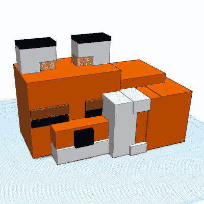

# 边玩边学

> 原文：<https://hackaday.com/2022/08/06/learning-by-playing/>

这里的暑假已经开始了，我儿子上周去参加了他的第一次类似夏令营的活动。这真的很酷——我们当地的私人实验室举办了一个研讨会，让孩子们制作一个《我的世界》建筑，然后 3D 打印出来。他喜欢在《我的世界》玩和建筑，所以我们认为这是他的拿手好戏。

TinkerCAD model of a Lego Minecraft fox. Kiddo trifecta!

我曾天真地认为它会这样工作:孩子们在《我的世界》构建一些东西，然后一些软件提取构建并将其转换成 STL 文件。有道理，因为他们已经或多或少地熟悉了《我的世界》的造型。当我想到这一点时，这是一个非常聪明的想法。

但事实更隐蔽。他们通过在《我的世界》制作一些东西来热身，然后他们打开了 TinkerCAD，这对所有的孩子来说都是新的，并在那里建立了一个 3D 模型。然后，他们将 TinkerCAD 模型转换成《我的世界》模型，在 3D 打印机嗡嗡作响的同时，玩着他们刚刚造好的东西。

孩子们甚至没有因为不得不学习一种新的 3D 建模工具而退缩，对他们来说，与他们在《我的世界》已经舒适地做的事情的相似之处是显而易见的。我儿子回家后告诉我，在“另一个《我的世界》”——他指的是 tinker CAD——里做 3D 模型要容易得多，因为你不需要用单块积木搭建所有东西。他以为他在玩游戏，但他已经秘密使用了他的第一个 CAD 工具。不错的把戏！

然后我回过头来，意识到我小时候通过玩电脑学到了多少东西。见鬼，我还是通过玩学到了很多东西。当然，我并不孤单——这是我们报道的大量项目中的亮点之一。黑进去，玩得开心！

This article is part of the Hackaday.com newsletter, delivered every seven days for each of the last 200+ weeks. It also includes our favorite articles from the last seven days that you can see on [the web version of the newsletter](https://mailchi.mp/hackaday.com/hackaday-newsletter-649368). Want this type of article to hit your inbox every Friday morning? [You should sign up](http://eepurl.com/gTMxQf)!