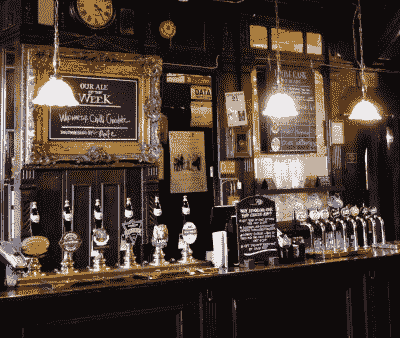

# 为什么英国人喝温啤酒？

> 原文：<https://hackaday.com/2022/08/16/why-do-brits-drink-warm-beer/>

持英国护照在欧洲大陆旅行会让你接触到一些可以预见的对话。当然还有马麦酱，然后是英国退出欧盟博览会的所有乐趣，最后是一个更严肃的话题，啤酒。你看，我不知道这一点，但在喝了几十年上等麦芽啤酒后，我被告知我们做错了，因为我们喝啤酒时是热的。“暖？”我说，想着在牛津郡的乡村酒吧里供应的一杯冰镇的本地[老酒馆](https://www.hooky.co.uk/our-beers/classic-range/)，它一点也不温，听到的回答是他们喝冰镇啤酒。稍作国际破译后，我发现“温暖”是我所说的“冷”，或者实际上是“室温”，而“冷”在他们的说法中是“冷藏”的意思，或者如我所说:“冷得尝不出任何味道”。撇开温和的幽默不谈，显然有事正在发生，所以是时候弄清楚这一切了。

## 冷得尝不出任何味道

On the left in this London pub are the ale hand pumps, on the right the pressure dispensers including lagers. Edwardx, [CC BY-SA 4.0](https://commons.wikimedia.org/wiki/File:The_Tottenham_pub,_Oxford_Street,_London,_March_2015_03.jpg).

如果你走进一家英国酒吧，假设它是一家好酒吧，你会看到一系列现成的啤酒。酒吧里会有高高的抛光手柄，手压泵用来输送当地的啤酒，酒吧的一端会有一两个闪亮的银色压力桶自动售货机，里面有一些大众市场的啤酒。正如我的欧洲大陆朋友所期待的那样，这些啤酒通常是冷冻的，并且总是包括通常高度宣传的皮尔森风格的啤酒。就在那个吧台上，你会看到这个大啤酒区背后的微观世界，线索来自于“麦芽酒”和“淡啤酒”的名字。两者都是啤酒，但不同的风格揭示了故事。

众所周知，要酿造啤酒，必须在水中煮沸大量的麦芽和啤酒花，加入酵母培养物，让它发酵一段时间。这是基本的食谱，但正是在各种各样的成分和地点中，我们发现了我们所知道的所有不同的风格。这些啤酒和贮藏啤酒都是以同样的方式从麦芽和啤酒花开始的，但是它们的酵母培养物不同。酵母是一种单细胞生物，当厌氧消耗糖时，一些变种具有产生酒精的有用特性。酵母在我们周围的空气中无处不在，所以完全有可能只用液体中的任何天然酵母来酿造啤酒，而不需要添加这样的培养物，这就是比利时[lambic beers](https://en.wikipedia.org/wiki/Lambic)背后的过程。

## 这都在酵母里

*Saccharomyces cerevisiae* cells under an electron microscope. Mogana Das Murtey and Patchamuthu Ramasamy, [CC BY-SA 3.0](https://commons.wikimedia.org/wiki/File:Saccharomyces_cerevisiae_SEM.jpg).

因为酿酒商重视产品的一致性，不愿意冒险让一批产品因细菌感染而变质，所以他们大多使用培养物。这可能是他们酿酒厂特有的品种，经过多年无数次酿造，也可能是实验室培育的品种。酿酒商感兴趣的酵母品种家族是*酵母*菌株，这是两种不同品种的*酵母、酿酒酵母*和*酵母、*依次负责麦芽酒和贮藏啤酒。即便如此，这也不像更换酵母那么简单，因为它们都有非常不同的特性。淡色啤酒酵母在高温下快速发酵，漂浮在液体的上面，而淡啤酒酵母发酵缓慢，沉入底部。这是世界“贮藏啤酒”的起源，指的是将啤酒储存在洞穴中，或在发酵完成后贮藏。

我们现在知道为什么麦芽酒和淡啤酒是不同类型的啤酒了，但是为什么英国人在室温下喝麦芽酒呢？Hackaday 不是一份啤酒评论出版物，不管我们中的一些人有多喜欢在酒吧里花更多的时间，但可以肯定地说，淡啤酒的味道比淡啤酒淡，然后观察到前者在更冷的时候味道更好，而后者如果冷藏就会失去味道。因此，英国酒吧里有了手压泵，我的欧洲大陆朋友面对英国啤酒时也感到困惑。

因此，我们已经得到了热啤酒问题的底部，但有一个最后的不公正我必须纠正。英国人把任何模糊的皮尔森风格的啤酒都称为“拉格”，好像这是拉格的唯一风格，而事实上拉格有很多种风格，皮尔森只是其中之一。即便如此，我们喝的皮尔森啤酒可能会让一位酿酒大师从皮尔森到骨子里感到震惊，这就是他们的温和。很明显，我们的欧洲朋友有很多关于麦芽酒的知识要学习，但是通过巴克斯，我们有很多关于啤酒的知识要学习！