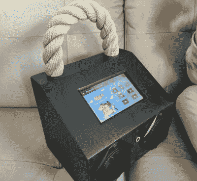

# 使用 muzibox 获得您的覆盆子 pi 干扰

> 原文：<https://hackaday.com/2022/08/15/get-your-raspberry-pi-jamming-with-mupibox/>

这些年来，我们已经看到了许多树莓 Pi 板作为媒体播放器投入使用。事实上，仅次于模仿旧游戏机，这可能是 Pi 在 DIY 构建时最常见的职业。但是，尽管这种特殊的用例很受欢迎，但似乎每个人都必须重新发明轮子。

也许这就是 MuPiBox 适合的地方。这个项目由[Eric Gerhardt]和[Olaf Split]在[Andreas Lippmann]和[Andrew Frericks]的协助下开发，旨在[将每个人最喜欢的 Linux 单板电脑变成每个人最喜欢的音乐播放器](https://mupibox.de/)。MuPiBox 不仅提供了运行你的新高科技音箱的软件，而且它甚至标准化了硬件设计，并提供了 3D 可打印外壳——尽管自然地，如果你不想让你的看起来和所有其他的*一模一样*，仍然有解释的余地。

Your MuPiBox can look like whatever you want.

最起码你需要一个树莓派，一个高保真迷你放大器和一个扬声器，尽管说明书还建议你投资一个 Pimoroni OnOff 垫片(或类似的东西)，以便更优雅地关机。为了获得最佳体验，您还需要一个五英寸的 Waveshare 触摸屏显示器和一个 USB 电源，以便您的 beats 可以移动。

下面的视频展示了抛光股票图形用户界面，这是足够简单的，即使是孩子也应该能够导航和找到他们最喜欢的曲目。这很好，尤其是它是德语的。该视频还展示了一些高级设置功能，因此您不必仅仅为了更改 SD 卡所连接的 WiFi 网络而将 sd 卡从 Pi 中拔出。还有一个网络界面，你可以从网络上的其他设备访问。

这是一个巧妙的项目，我们真的很喜欢 3D 打印外壳的美感。但是即使你不想完全复制这个项目，这里肯定有一些组件可以[用在你自己的 Pi 媒体中心构建](https://hackaday.com/2018/05/10/1960s-console-stereo-gets-raspberry-pi-touch-screen/)中。

 [https://www.youtube.com/embed/gEd_ckc3N-4?version=3&rel=1&showsearch=0&showinfo=1&iv_load_policy=1&fs=1&hl=en-US&autohide=2&wmode=transparent](https://www.youtube.com/embed/gEd_ckc3N-4?version=3&rel=1&showsearch=0&showinfo=1&iv_load_policy=1&fs=1&hl=en-US&autohide=2&wmode=transparent)

