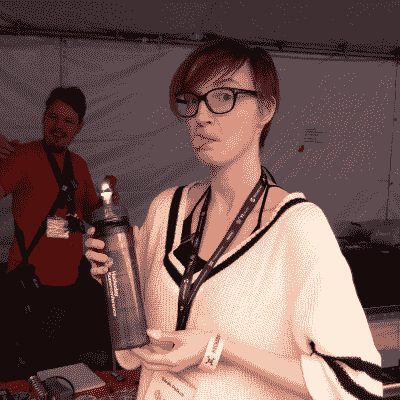

# 2022 Hackaday Supercon 门票现已发售

> 原文：<https://hackaday.com/2022/08/15/2022-hackaday-supercon-tickets-on-sale-now/>

 

我有没有告诉过你【斯佩特库】把施瓦格瓶子变成了雅各布的梯子？

[超级演唱会门票马上开售](https://www.eventbrite.com/e/2022-hackaday-superconference-tickets-402410268947)！忠实信徒的门票通常会很快售罄，所以如果你像我们一样对现实生活中的超级城市感到兴奋，现在就以健康的折扣购买吧。

我们可能有偏见，但 Supercon 是我们今年最喜欢的会议。比大多数更小，专注于硬件，你真的无法击败出席的人群和舞台上的演讲的信噪比。人们带着他们的项目、伟大的想法和远大的梦想。我们还有一个很酷的徽章。很无聊，但在现实生活中。你应该加入我们！

会议于 11 月 4 日星期五开始，首先是注册，然后是一个下午的徽章黑客活动，最后是一个派对。周六和周日是主要的展览，小巷里有一个黑客村，大量的研讨会，当然还有所有的讲座。这只是一个周末，但它会让你一整年都回想起。

## 实质性的细节

一百(100)张“忠实信徒”门票现在以每张 128 美元的价格出售，截止日期为 8 月 29 日。我们称之为“忠实信徒票”,因为我们甚至还没有完成提案征集，更不用说选择会谈了，但是相信我们，这将是一个很好的开端。(在过去的几年里，忠实信徒的门票一天之内就卖光了，所以不要睡在这上面！)之后，常规门票为 256 美元。

当然，想免费溜进去总有后门。在我们看来，[参加会议最酷的方式就是演讲](https://docs.google.com/forms/d/e/1FAIpQLSffBmw2vNLZyzdKnPJhKF6u7nvYnjTZQ-lynOhhr8_S8fAd3w/viewform?usp=sf_link)，而且你还会得到一张免费的入场券！即使你没有被选中，我们也会以折扣价给每个提交严肃谈话提议的人一张票，所以不要犹豫。志愿者也可以免费进入，我们将在 8 月 29 日发出号召。

无论你如何得到一张票，去买一张，然后去超级城市。我们很高兴再次见到你本人！