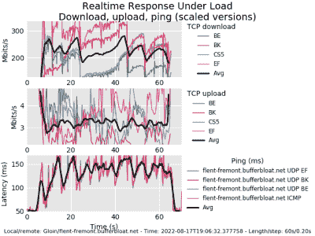

# Bufferbloat，互联网，以及如何修复它

> 原文：<https://hackaday.com/2022/08/18/bufferbloat-the-internet-and-how-to-fix-it/>

有一种可怕的疾病困扰互联网服务提供商多年。好吧，可能有几种疾病，但是今天我们要谈论的是*buffer float*。它是什么，如何测试，最后你能做些什么。哦，对所有致力于解决这个问题的人们大声疾呼。许多程序员和工程师，像温顿·瑟夫、戴夫·塔特、吉姆·盖蒂斯以及更多的人，为了我们的集体利益，已经破解了这个难题。

当您的计算机向互联网上的另一台主机发送 TCP/IP 数据包时，该数据包会经过您的计算机、网卡、交换机、路由器、ISP 调制解调器、几个 ISP 路由器，最后通过一些非常大的路由器到达数据中心。或者反过来通过错综复杂的设备链，到达另一个桌面。整件事能成功真是太神奇了。每一跳都代表着另一个出错的地方。如果真的出了什么问题，你马上就会知道。页面突然无法加载。你的网络电话被切断，或者掉线。很容易发现断开的连接，即使找到并修复它并不容易。

这是一个明显的问题。如果你有一个不明显的问题呢？网站加载，但只是比以前慢了一点点。您知道如何使用命令行，所以您尝试了一个`ping`测试。嗯，离 Google.com 还有 15 分钟。让它运行一百个包，基本上没有包丢失。但是有些事情不对劲。当其他人正在播放电影，或者一台机器正在将备份上传到远程服务器时，一切都会崩溃。这就是 bufferbloat，实际上很容易通过一个简单的测试来检测它。运行速度测试，并在连接饱和时运行 ping 测试。如果您的负载下的延迟超过了上限，您可能有 bufferbloat。甚至有几个大的速度测试网站现在提供缓冲浮动测试。但首先，一些历史。

## 崩溃的历史

20 世纪 80 年代的互联网是一个非常不同的地方。域名系统取代了`hosts.txt`成为 1982 年完成的主机名到 IP 地址解析的方式。1983 年 1 月 1 日，阿帕网采用了 TCP/IP——互联网的诞生。到了 1984 年，一个问题开始酝酿，1986 年，互联网以[拥塞崩溃](https://www2.lbl.gov/Science-Articles/Archive/information-superhighway.html)的形式遭受了一次心脏病发作。

在那些日子里，尖端的本地网络以每秒 10 兆比特的速度运行，但站与站之间的链接最多只能以每秒 56 千比特的速度传输。1986 年末，链路突然变得非常慢，比如劳伦斯伯克利实验室和加州大学伯克利分校之间的 400 码链路。这条链路突然以每秒 40 位的速度传输，而不是 56 Kbps。问题是拥挤。这与同一段高速公路上有太多汽车时发生的情况非常相似——交通慢得像爬行。

BSD 的 4.3 版本有一个 TCP 实现，它做了一些有趣的事情。首先，它会立即开始以全速发送数据包。第二，如果一个包在途中丢失了，它会尽快重新发送。在局域网上，有统一的网速，这就很好了。在早期的互联网上，特别是这个特定的伯克利链接，10 Mb/s 的局域网连接下降到 32 kbps 或 56 kbps。

为了处理这种不匹配，链路两端的网关都有一个小缓冲区，大约相当于 30 个数据包。在拥挤的情况下，超过 30 个数据包在网关处积压，多余的数据包被丢弃。当数据包被丢弃或拥塞导致往返时间超过超时阈值时，发送方会立即重新发送，从而产生更多流量。几台主机试图在太窄的连接上发送太多的数据会导致拥塞崩溃，这是一种流量反馈循环。早期的互联网无意中造成了 DDoS。

 [https://www.youtube.com/embed/QP4A6L7CEqA?version=3&rel=1&showsearch=0&showinfo=1&iv_load_policy=1&fs=1&hl=en-US&autohide=2&wmode=transparent](https://www.youtube.com/embed/QP4A6L7CEqA?version=3&rel=1&showsearch=0&showinfo=1&iv_load_policy=1&fs=1&hl=en-US&autohide=2&wmode=transparent)

解决方案是[将一系列算法添加到 BSD 的 TCP 实现](https://ee.lbl.gov/papers/congavoid.pdf)中，这些算法现在已经被采纳为标准的一部分。简而言之，为了尽可能快地发送，需要智能地降低流量。引入的第一种技术是慢启动。当您运行速度测试时，您可以看到这种方法仍在使用，连接以非常低的速度开始，然后快速上升。具体来说，在传输开始时只发送一个数据包。对于每个收到的包，返回一个确认包(ack)。收到 ack 后，又有两个数据包通过网络发送出去。这导致连接链中最慢链路的最大速率快速上升到两倍。一次“输出”的数据包数量称为拥塞窗口大小。因此，看待这个问题的另一种方式是，每次往返成功都会增加一个拥塞窗口。

一旦慢启动完成了它的工作，并且第一个数据包被丢弃或超时，TCP 流就转换到使用拥塞避免算法。这种方法强调保持稳定的数据速率。如果一个包被丢弃，窗口就被切成两半，每收到一个完整窗口的包，窗口就增加一。其结果是一个锯齿图，在整个数据路径的最大吞吐量附近不断跳动。这有点过于简化，随着时间的推移，算法得到了进一步的发展，但关键是将这种扩展推广到 TCP/IP 拯救了互联网。在某些情况下，更新通过邮件在磁带上发送，这有点像整个网络的硬重启。

 [https://www.youtube.com/embed/ZeCIbCzGY6k?version=3&rel=1&showsearch=0&showinfo=1&iv_load_policy=1&fs=1&hl=en-US&autohide=2&wmode=transparent](https://www.youtube.com/embed/ZeCIbCzGY6k?version=3&rel=1&showsearch=0&showinfo=1&iv_load_policy=1&fs=1&hl=en-US&autohide=2&wmode=transparent)

## 快进到 2009 年

自 1986 年以来，互联网有了一些发展。发生变化的一件事是，硬件价格下降了，而功能却大大提高了。1986 年的网关以千字节为单位测量缓冲区，小于 100 字节。今天，用兆字节和千兆字节的内存来解决问题是很平常的事情，路由器缓冲区也不例外。当为 50 KB 缓冲区大小编写的算法在现代设备中遇到 50 MB 缓冲区时会发生什么？可以预见，事情会变糟。

当一个大的先进先出(FIFO)缓冲区处于瓶颈状态时，在数据包被丢弃之前，该缓冲区必须完全填满。TCP 流旨在缓慢启动高达 2 倍的可用带宽，非常快速地开始丢弃数据包，并将其带宽使用减半。当流花费太多时间试图以两倍的可用速度发送，等待缓冲区填满时，就会发生 Bufferbloat。一旦连接进入稳定的拥塞避免模式，该算法就依赖于丢弃的数据包或超时，其中超时阈值是从观察到的往返时间中得出的。结果是，对于任何连接，往返延迟都会随着路径上缓冲的数据包数量的增加而增加。对于负载下的连接，TCP 拥塞避免技术被设计成在减少拥塞窗口之前填充那些缓冲器。

那么能有多糟呢？在本地网络中，您的往返时间以微秒计。你上网的时间应该以毫秒计算。Bufferbloat 将这一时间推至几秒，在一些最糟糕的情况下甚至是几十秒。真正导致问题的地方是它导致应用层的流量超时。Bufferbloat 会延迟所有流量，因此会导致 DNS 超时，使 VoIP 呼叫变得乱糟糟的，并使互联网成为一种痛苦的体验。

解决方案是[智能队列管理](https://www.bufferbloat.net/projects/cerowrt/wiki/Smart_Queue_Management/)。自 1986 年以来，在这个概念上已经做了很多工作。公平排队是最早的解决方案之一，它使中间缓冲区变得智能，并将单个流量分流到单个队列中。当链路拥塞时，每个队列每次只释放一个数据包，所以通过 Bittorrent 下载 ISO 不会完全挤掉你的 VoIP 流量。经过多次迭代，蛋糕算法已经开发出来并得到广泛应用。所有这些解决方案本质上都牺牲了一点点最大吞吐量，以确保显著降低延迟。

## 你在 Bufferbloat 吗？

我很乐意告诉你 bufferbloat 是一个已经解决的问题，你在你的网络上肯定不会有问题。不幸的是，事实并非如此。为了粗略判断你是否有问题，使用在 [dslreports](http://www.dslreports.com/speedtest) 、【fast.com】或[speedtest.net](https://www.speedtest.net/)的速度测试。这三者中的每一个，可能还有其他的，都给出了负载测量下的某种延迟。有一个由 waveform 主持的 Bufferbloat 特定测试，似乎是在浏览器中运行的最好的一个。理想的网络在出现拥塞时仍会显示出较低的延迟。如果您的延迟在测试过程中显著增加，您可能有缓冲浮动的情况。

对于我们这些书呆子来说，有一个命令行工具`[flent](https://flent.org/)`，可以进行深入的 bufferbloat 测试。我使用了命令`flent rrul -p all_scaled -H flent-fremont.bufferbloat.net`来生成这个图表，您可以看到在负载情况下，延迟在 100 毫秒内迅速扩展。这是在负载测试下运行实时响应，清楚地表明我的网络上有一点缓冲浮动问题。发现问题后，我能做些什么？

## 你可以吃你的蛋糕

因为我们都在我们的网络上运行 OpenWrt 路由器…你在运行一个开源路由器，对吗？或者，也有少数商用路由器内置了某种 SQM，但我们在 Hackaday 上对此肯定不满意。这里的自由/开源软件解决方案是[蛋糕](https://www.bufferbloat.net/projects/codel/wiki/Cake/)，一个队列管理系统，它已经在 OpenWrt 仓库中可用。你要找的包裹是`[luci-app-sqm](https://openwrt.org/docs/guide-user/network/traffic-shaping/sqm)`。安装后，您将在 web 界面上看到一个新页面，位于 Network - > SQM QoS 下。

在该页面上，选择您的 WAN 接口作为`Interface name`。接下来，将你的速度测试结果转换成千比特/秒，减去大约 5%,然后将这些转换成上传和下载速度。翻到`Queue Discipline`选项卡，在这里我们理想地希望使用`Cake`和`piece_of_cake.qos`作为选项。最后一个选项卡需要[做一点功课](https://openwrt.org/docs/guide-user/network/traffic-shaping/sqm)来确定最佳值，但是`Ethernet with overhead`和`22`似乎是开始时的明智值。启用 SQM 实例，然后保存并应用。

现在我们调整和测试。在第一次安装时，路由器实际上可能需要重启来加载内核模块。但是你应该在 bufferbloat 测试中看到一个直接的区别。如果你的上传或下载缓冲区仍然过大，调整方向的速度稍微降低百分之几。如果你的 bufferbloat 下降到 0，尝试稍微增加速度。你在寻找对最大速度的最小影响，和对 bufferbloat 的最大影响。就是这样！你已经杀死了水牛兽！

 [https://www.youtube.com/embed/-D-cJNtKwuw?version=3&rel=1&showsearch=0&showinfo=1&iv_load_policy=1&fs=1&hl=en-US&autohide=2&wmode=transparent](https://www.youtube.com/embed/-D-cJNtKwuw?version=3&rel=1&showsearch=0&showinfo=1&iv_load_policy=1&fs=1&hl=en-US&autohide=2&wmode=transparent)

[Simeon W](https://www.flickr.com/photos/46928881@N02) 的 [Thompson 路由器](https://www.flickr.com/photos/46928881@N02/24446860255)由[CC 2.0](https://creativecommons.org/licenses/by/2.0/?ref=openverse)授权。