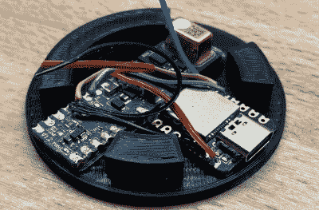

# 谨慎的二氧化碳监测器隐藏了优雅的内部布局

> 原文：<https://hackaday.com/2022/08/16/discreet-co2-monitor-hides-elegant-internal-layout/>

从表面上看，这款由丹尼尔·格纳特设计的圆滑的二氧化碳监测器看起来像是亚马逊消费电子部门制造的东西。但是打开 3D 打印的外壳，你会发现一个令人惊讶的低部件数，它被巧妙地包装起来，以充分利用外壳微薄的内部尺寸。

No wasted space here.

如果你能相信，这款设备只有三个主要组件:Seeed Studio Seeeduino XIAO 微控制器、英飞凌 S2GO PAS CO2 传感器板和一圈 WS2812B LEDs。你甚至可以完全删除环，用一个可寻址的 LED 取代它来实现相同的目标，但我们会说，如果你打算建立自己的副本，整个环是值得的。

功能非常简单 LED 环将通过点亮绿色、黄色和红色来指示检测到的 CO2 浓度。该传感器没有无线功能，但如果你把它插入你的电脑，你可以得到当前状况的本地读数。

我们喜欢这里的环境监测解决方案，就像我们喜欢设计复杂的 3D 打印外壳一样。如果你想看看这两个概念相一致的另一个项目，[看看这个可打印的 ESP8266 传感器外壳](https://hackaday.com/2019/11/28/a-printed-case-for-your-esp-environmental-sensors/)。