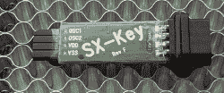
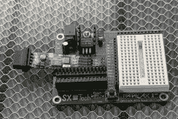

# 记住芯片:Scenix/Ubicom/Parallax SX

> 原文：<https://hackaday.com/2022/08/17/chips-remembered-the-scenix-ubicom-parallax-sx/>

如果你是一个藏书家，去二手书店绝对是一次愉快的经历。当然，你可能会发现一本你想读的旧书。但是至少一些内啡肽的冲动来自于见到老朋友。不是人类，而是你几年前甚至几十年前读过的书。最常见的情况是，你不买这本书——你可能有一本藏在某个地方的盒子里。但是看到一个老朋友，或者在发霉的书架上翻阅一两篇文章，是一种快乐的感觉。我希望我们也有类似的薯条。除了几个明显的例外，芯片往往有一个短暂的流行寿命，然后让位于其他芯片。CPU 更是如此。我特别想念的一个是 Scenix/Ubicom/Parallax SX 芯片。

前几天，我对这款处理器有了一次书店般的体验。我生产了一些基于这些芯片的产品，我还剩下一些。我小心翼翼地守护着为它们编程所需的硬件，“以防万一”嗯，很自然，有人出于某种原因需要一些，所以我必须把它们都挖出来。知道这些可能是世界上最后一些未编程的 SX 芯片让我有点怀旧。

## 故事

20 世纪 90 年代末，一家名为 Scenix 的公司开始生产一种名为 SX 的微控制器，尺寸很小。例如，SX18 是一个 18 引脚器件。到 1999 年，他们已经全力推出了 SX18 和 SX28，并推出了 SX52。

当然，很多公司生产微控制器。Scenix 产品有点特别。在那些日子里，微芯片照片是山中之王。PIC 是一个奇怪的东西，它是从一个非常有限的控制器演变而来的，这个控制器被做得又小又便宜。值得注意的是，虽然它可以支持相对较高的时钟频率(20 MHz 是常见的)，但每个正常指令需要 4 个时钟周期。所以当你的晶振显示 20 MHz 时，你正在以 5 MHz 运行指令。

SX 复制了微芯片的指令，但没有复制操作码助记符，因为那是合法的。理论上，您可以将用于 PIC 的二进制代码部署到 SX 上。因此，该设备具有与 PIC 相同的架构特点，这既是一个优点，也是一个缺点。然而，它比 PIC 有一个巨大的优势:它实际上可以运行在 50 MHz。SX 使用流水线架构，因此一旦流水线满了，它就能够每时钟运行一条指令(假设你没有通过跳转使流水线无效)。

这是一张照片实际速度的 10 倍。诚然，在 50 兆赫时，芯片消耗了大量的能量，但你可以通过降低频率来调整。即使是 10 MHz，你的速度也是 PIC 的两倍。后来的版本可以运行在 75 MHz 甚至 100 MHz，尽管这些很快就停止了。然而，这些芯片通常被超频到至少 80 MHz，例如在 XGameStation 中。

The SX-Key provided programming and debugging over the SX clock pins.

还有一个杀手级的特性，在今天看来很平常，但在当时却是一场革命:廉价的在线调试。大多数老式的 CPU 必须有一个昂贵的特殊部件来进行实时调试，而芯片上没有额外的软件。当然，您可以编写一个与串行终端对话的调试器，但是这需要假设很多东西已经在工作了。进行真正的硬件级调试通常非常昂贵。但是 SX 拥有每个芯片上所需的所有硬件。有了一个不太贵的小型串行端口加密狗，你就可以调试电路中的芯片，而不会对你的代码产生实际影响。

## 虚拟外设

SX 的一个关键概念是 CPU 保持非常简单，以降低成本和提高速度。当然，趋势是给 CPU 增加 UARTs、定时器、PWM 发生器之类的东西。SX 的做法不同。运行速度快，有一个非常确定的方法来处理中断，Scenix 吹捧一个“虚拟外设”库。这个想法是，通过使用中断，你可以建立软件外设，即使它们消耗了，比如说，你的 CPU 时间的一半，你仍然比一个有外设的 PIC 运行快很多倍。

当然，如果这行得通，那就太好了，因为你可以裁剪所有你想要的东西。需要三个 UARTs 和一个 PWM 通道？没问题。如果下一个项目需要五个 PWM 通道而没有 UART，你也可以这样做。当然，这总是在理论上比在实践中更好。“库”只不过是一些示例代码，有时将它集成到您的代码中是具有挑战性的。如果您试图集成多个应用程序，这一点尤其正确，因为它们有时会有冲突的需求。

尽管如此，你还是可以做一些在较慢的 CPU 上用软件几乎不可能完成的事情。

## 视差连接

Scenix 最终成为 Ubicom，最终被真空吸入高通，但这些芯片也与 Parallax 有关，Parallax 是一家因其基本邮票而闻名的公司，这些邮票曾是微控制器的入门药物。他们的产品使用微芯片识别器，他们开始销售一系列 SX 邮票，这些邮票几乎是他们现有产品的替代产品，但速度更快。(当然也更耗电。)他们还以可承受的价格提供了他们设计的芯片和编程硬件，这使得 SX 在业余爱好者群体中有点受欢迎。

A Parallax development board with the SX-Key plugged in.

Parallax 还为该芯片开发了书籍和课程。我甚至写了其中的一些。)有一个库，里面的代码可以完成许多常见的操作，比如 FSK、I2C、SPI、运行 LCD 和步进电机等等。

到 2005 年，Ubicom 将退出 SX，只出售给 Parallax，并打上 Parallax 品牌。2009 年中期，视差怪宣布 SX 之路走到了尽头。如今，你可以为一首歌挑选一个可以以 100 MHz 运行的 32 位处理器，集成调试很常见。现代 CPU 将拥有比 PIC 的旧存储体转换方案更合理的体系结构，也更适合 C 编译器。所以我不怀念以前的日子。但就像书店里的旧书一样，很高兴看到我的老朋友 SX。

有哪些老处理器是你的朋友？我非常喜欢 RCA [1802](https://hackaday.com/2017/07/25/kim-1-to-cosmac-elf-conversion-sort-of/) 。我也在老摩托罗拉设备上做了很多工作，比如 6805 和 68HC11。我也喜欢 T2 的基本邮票。我不禁想知道，30 年后，人们会不会深情地回过头来看 STM32 设备或者树莓派 Pico？