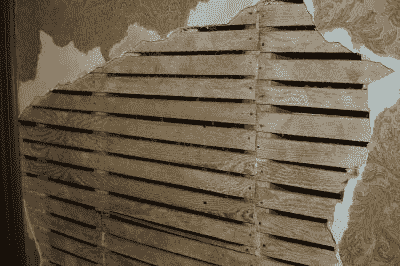
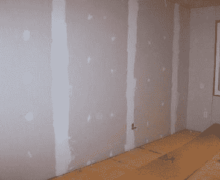

# 干墙简史或:干墙如何主宰建筑世界

> 原文：<https://hackaday.com/2022/08/22/a-brief-history-of-drywall-or-how-drywall-came-to-dominate-the-world-of-construction/>

如今，干墙在商业和住宅建筑中很常见且无处不在。我们中的许多人几乎不去想它，直到我们不得不修补它被打破的一个洞。

然而，干墙并不是一直存在的，实际上它花了很多年才成为一种受欢迎的建筑材料。今天，我们将看看它是如何产生的，以及为什么它会继续主宰建筑世界。

## **干墙前**

A lath and plaster wall, with wallpaper applied over the top. Significant skill is required to apply a smooth, consistent plaster finish. Credit: Lmcelhiney. [CC-BY-SA-4.0](https://en.wikipedia.org/wiki/File:Lathwork_and_plaster.jpg)

在干墙出现之前，墙是用一种叫做板条和灰泥的耗时工艺建造的。这通常包括在房屋的木质结构上钉上许多细木条，以构成墙壁和天花板。木条，或板条，作为熟练的工匠涂灰泥的基底。

石膏是湿的，需要很长时间才能干透。在较冷的天气里，粉刷墙壁通常是不可能的，这项工作需要很高的技能才能达到高质量的效果。多年来，技术和材料发生了变化和改进，如金属网条板和快干石膏的引入。然而，这一进程的基本限制仍然存在。

## 更快，更少混乱

在 19 世纪晚期，各种公司和个人开始试验各种方法来生产坚硬的石膏预制板。现代干墙的主要根源始于萨克特石膏板公司在这一时期继续开发萨克特石膏板。它由石膏和羊毛毡纸交替层制成，通常有四层厚。

最终，Sackett 公司被美国石膏公司收购。该产品被进一步开发，并作为“石膏板”推向市场它的特点是在两边的纸层之间有一层压缩的石膏粉。

这些早期产品中的一些被用作板条，将小面板固定在墙上作为额外手工抹灰的基底。然而，这种材料很快就发展成了今天的大型干墙板材。

Drywall after installation, prior to paint. Note the white vertical lines, where paper tape and jointing plaster has been applied to cover the joints between adjacent sheets. Credit: [Amaxson, public domain](https://commons.wikimedia.org/wiki/File:Drywall.jpg)

干墙提供了超过传统板条和石膏技术的显著优势。这种大木板可以很快地固定在木架上，覆盖大面积的墙壁，只需要钉板条和开始涂灰泥的一小部分时间。由此产生的墙壁也提供了良好的强度和耐火性。再也不用因为天气寒冷而停止施工，或者等几周时间让灰泥变干。相反，一旦木板固定下来，就可以继续快速施工，这项工作只需要基本技能。唯一需要的手工抹灰是掩盖木板之间的接缝，技术发展迅速，使这尽可能快和容易。

尽管干墙提供了阶跃式的改进，但它很难跟上。建筑行业有自己的方式，使用干墙被视为抄近路，而非明智之举。

然而，第二次世界大战改变了这一切，当时劳动力突然被用于战争，所有行业都迫切需要提高效率。干墙找到了它的时机，到 1945 年，它迅速成为美国建筑的主导方式。它将建造房屋所需的时间缩短了数周，几乎没有给传统建筑技术留下竞争的空间。

## 不利之处

当然，干墙也有自己的缺点。很难在干墙上获得真正光滑的表面，因为纸张表面往往会使这变得困难。它也很容易损坏。如果你曾经漫不经心地在房间里扔锤子，或者参加过打墙比赛，你会发现在干墙上敲出一个洞是多么容易。

它也可能是霉菌的天堂，部分原因是纸层充当了食物来源。其半多孔性意味着这种情况通常需要完全更换。水渍也是干墙杀手，不管是洪水还是管道漏水。与传统的水泥基石膏建筑相比，它在这种条件下要差得多。

## 未来

技术很少停滞不前，现在有很多选择来装修墙壁。新的干墙配方专注于环境可持续生产，或减少舒适安静的家庭的声音传播。贴面石膏法使用特殊的薄“蓝板”干墙，然后在顶部涂上一层石膏，以获得更高质量、更快、但更昂贵的饰面。其他选择，如混凝土、木板和砖内墙都是可行的。而且，如果你有钱花，你仍然可以雇佣一个传统的板条和石膏工匠，这是一个特别受欢迎的老式“乡村风格”建筑和经典修复的选择。

不过，就目前情况来看，干墙的主导地位看起来不会很快消失。这仍然是完成内墙最便宜的方法，这个行业每年在全球价值数十亿美元。预计在未来一段时间内，干墙将主导住宅和商业建筑。

横幅图片:乔·奈洛尔的作品:[干墙和壁纸](https://www.flickr.com/photos/11598937@N08/6020794910)。佐治亚州国民警卫队的:“[应用干墙填缝剂](https://www.flickr.com/photos/40994485@N04/5891937812)