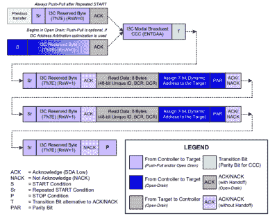
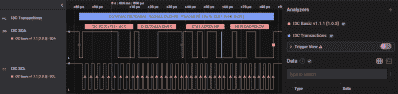

# I3C——没有打字错误——想成为你的串行总线

> 原文：<https://hackaday.com/2022/08/25/i3c-no-typo-wants-to-be-your-serial-bus/>

还记得有着巨大带状电缆的旧硬盘吗？它们是串行的，现在电源线比数据线粗多了。我们在嵌入式设备中也看到了同样的情况。如今，芯片之间的通话往往使用 I2C 或 SPI 或这些技术的一些变体，通过几个引脚发送和接收数据。但是现在有了 I3C，这是一个相对较新的行业标准，正在受到一些关注。

I2C 和 SPI 是成熟的，但他们确实有问题。I2C 可能相对较慢，SPI 通常要求每个器件都有额外的引脚。除此之外，对动态添加和删除设备或自动发现设备的支持很差。

由 MIPI 联盟创建的 I3C 旨在解决这些问题。它使用通常的两条线，SCL 用于时钟，SDA 用于数据。一个设备充当控制器。其他设备可以是目标或辅助控制器。它还向后兼容 I2C 目标设备。取决于你如何实现它，速度可以相当快，原始速度为 12.5 Mbps，使用线路编码技术可以达到 33 Mbps 左右。

## 不是 I2C

这种总线看起来像典型的 I2C 总线，但是寻址是动态的，除了传统的 I2C 设备仍然使用它们的正常地址。换句话说，控制器给它在总线上找到的设备分配地址。传统设备不能使用扩展寻址。您也可以在不停止总线的情况下连接设备。有广播消息、多重操作和带内中断的能力。对于需要低功耗运行的设计，它还具有特定的特性。除了指定设备之间的物理连接，还有主机控制器接口的规范。这意味着软件有一个标准接口与控制器和总线通信。

有多种方法可以提高数据吞吐量，尽管有些方法要求总线上没有传统的 I2C 设备。例如，当与目标设备通话时，可以同意使用双倍数据速率方案，数据出现在时钟的两个边沿。还有一种方法可以在自计时方案中使用基数 3 编码。这个想法是两位可以编码四种状态中的任何一种。从每个状态，有三个可能的下一个值。因此，与传统方案相比，每次转换都提供一个 3 位基数，在相同的时间内封装更多的数据。

不幸的是，完整的规格只提供给 MIPI 会员。不过可以下载[基本规范](https://www.mipi.org/specifications/i3c-sensor-specification)。不幸的是，这只是所有可用特性的一个子集。例如，只有单倍和双倍数据速率出现在公共规范中。但是，主机和设备会进行协商，因此有可能会有一个只说 SDR 的设备与其他想要做一些更奇特的事情的设备共存。

## 不简单

如果您想尝试实现其中的任何一项，这比对 SPI 接口进行位敲打要多得多。例如，检查一下在总线上动态分配地址的事务，它也解决了静态分配的问题，包括 I2C 设备的分配。

Transaction for setting dynamic addressing

总线运行时连接设备的能力是另一个复杂的问题。如果你只是想保持部分电路板断电，这可能是相当容易的。但是，如果你真的想插上什么东西，你需要想出如何在不破坏总线运行的情况下做到这一点。

尽管公共规范并不代表一切，但它仍然有将近 450 页！有很多东西需要消化。同样不清楚的是，有多少动机让你自己在软件中实现这一点。这里有一个龙蛋问题:大多数处理器不支持开箱即用的 I3C，因为没有多少设备使用它。但是在有更多的处理器支持它之前，为什么还要制造设备呢？

## 在实践中

将来可能就不是这样了。但对于我们大多数人来说，问题是今天有哪些设备使用这种协议？Linux 内核有一个可用的 I3C 驱动程序，也有一些设备。例如，恩智浦列出了[几款带有 I3C](https://www.nxp.com/products/interfaces/ic-spi-i3c-interface-devices/i3c-interface-devices:I3C) 的产品，还有几款温度传感器“即将推出”他们还提供几个带 I3C 外设的 ARM CPUs，如 [LPC553x](https://www.nxp.com/docs/en/data-sheet/LPC553x.pdf) 。微芯片的 [PIC18-Q20](https://ww1.microchip.com/downloads/en/DeviceDoc/PIC18-Q20-Family-Product-Brief-40002323.pdf) 可以作为目标，但不能作为控制器。此外，瑞萨、ST、TI 和少数其他供应商提供了一些 I3C 目标器件，从 6 轴 IMU 芯片到温度传感器。如果你有一台 Saleae 逻辑分析仪，你可以得到一个固件来帮助你解读 I3C。

Saleae logic analyzer decoding I3C with a 3rd-party plugin

它会流行吗？也许吧。随着廉价嵌入式 CPU 变得越来越强大，坚持简单协议的理由越来越少。然而，如果有必要的话，你可以在几个小时的有趣编码中对 UART 或 SPI 总线进行位爆炸，这是一件令人欣慰的事情。有了 I3C，你可能要依靠一个嵌入式外设来完成所有的重担。话说回来，如果它们变得普遍，为什么不呢？