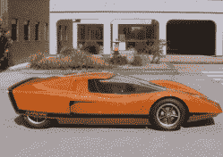
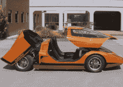
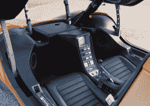
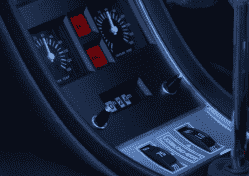

# 倒车摄像头，数码仪表盘，道路辅助…1969 年？

> 原文：<https://hackaday.com/2022/08/31/backup-camera-digital-dash-road-assist-in-1969/>

如果你的朋友告诉你，他们的车有备用摄像头、数字仪表板、气候控制、可以扫描电台，甚至可以帮助留在路上，你不会想太多。除非是 1969 年。这辆由澳大利亚汽车制造商霍顿(Holden)设计的汽车“飓风”(Hurricane)从来都不是量产车。但它远远超出了 1969 年的艺术水平，即使在今天也不算太过时。概念车其实是 1988 年发现的，到 2011 年才修复。老实说，看起来还是很棒。

这辆车看起来很棒，本来是要作为一辆研究车的，而且很可能是车展上的一大亮点。一辆中置的 253 立方英寸 V8 发动机可以容纳两名乘客，它拥有许多我们现在认为理所当然的东西:例如，备用摄像头、温度控制和(某种程度上)数字仪表板。有一个系统可以帮助它保持在车道上，但这需要路上有磁铁——毕竟那是 1969 年。

玻璃纤维车身是独一无二的，有一个顶篷而不是门。驾驶时，当顶篷升起或降下时，电动座椅会升起。乘客车厢是一个钢笼子。这款车配备了头枕、泡沫内衬油箱和火灾报警系统。其中两个刹车甚至是油冷的。

Great looks even today

Who needs gull wings?

A CRT backup camera

A 1969 digital clock

当然，这辆车不可否认很酷，但它也提醒我们超越可能是很重要的。我们设想，如果你试图建造一个远远领先于我们今天的技术的东西，你必须准备好自己融资。这辆车在短期内可能没有给霍顿带来任何经济上的好处。但是看看这辆车的设计者们有多有远见！当然，有些事情还没有准备好。带表盘的数字钟在崎岖不平的道路上可能坚持不了多久。路上的磁铁有它们自己的问题，无疑是不切实际的。但是这些想法是可靠的，你可以想象会影响未来的设计师。

那么，我们今天在做什么是我们力所不及却能激励未来的事情呢？我们只是在现有的东西上增加更多的 CPU 和内存吗？我们鼠标上的一些额外按钮？我们是否在我们选择的编程语言中增加了一个新的特性？真正创新的编程语言、CPU 架构和 I/O 设备来自哪里？很难想象 50 年后有人会记得我们今天建造的许多东西，并认为它是革命性的。

与此同时，谁准备建造一个复制的飓风？这并不像听起来那么荒谬。这并不是说[不是一个主要的任务](https://hackaday.com/2022/01/14/making-your-own-mclaren-f1-lm/)，但是用今天的技术来匹配飓风在我们登上月球之前所做的事情可能会更容易。

 [https://www.youtube.com/embed/iezc14zdYCM?version=3&rel=1&showsearch=0&showinfo=1&iv_load_policy=1&fs=1&hl=en-US&autohide=2&wmode=transparent](https://www.youtube.com/embed/iezc14zdYCM?version=3&rel=1&showsearch=0&showinfo=1&iv_load_policy=1&fs=1&hl=en-US&autohide=2&wmode=transparent)

