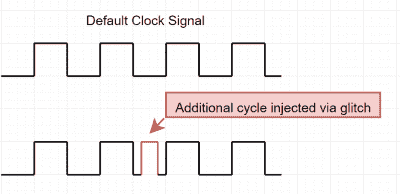

# 你不知道的一切你需要知道的关于故障攻击

> 原文：<https://hackaday.com/2022/08/25/everything-you-didnt-know-you-need-to-know-about-glitching-attacks/>

如果你一直对执行硬件攻击的想法很感兴趣，但不知道从哪里开始，那么我们为你准备了这篇文章:[深入了解硬件故障的方式和原因](https://voidstarsec.com/blog/replicant-part-1)。

细心的读者会记得，我们以前报道过[Matthew Alt]的逆向工程，比如他[在基于 Linux 的街机机柜](https://hackaday.com/2022/02/01/linux-arcade-cab-gives-up-its-secrets-too-easily/)上扎根。对于更具挑战性的东西，他这次选择了 Trezor One 加密钱包。不久前，我们简要报道了[乔·格兰德]对其中一个钱包的高风险黑客攻击(第三项)，但[马修]提供了更多、更详细的信息。

 在介绍了故障攻击的理论之后，Matthew 讨论了 Trezor 钱包的细节以及攻击是如何计划的，故障攻击试图使用各种方法迫使处理器进入不确定的状态。

他的目标——钱包的 STM32 微控制器的内部电压调节器——需要在攻击开始前拆焊几个盖子，这是用[芯片密语器](https://hackaday.com/2016/11/01/after-the-prize-chipwhisperer/)执行的。在解决了一些初始定时问题后，他能够让芯片降至最低级别的读出保护，这使得可以通过 ST-Link 调试器访问加密狗的 SRAM。

虽然这个总结可能会让整个事情听起来微不足道，但很明显，这次攻击绝不是，写这一切的努力也不是。整件事读起来有点像技术惊悚片，如果你想找一个关于芯片故障的教程，那里有很多细节。我们期待着第 2 部分，这将集中在电磁故障注入使用[一个 PicoEMP](https://hackaday.com/2022/01/15/glitch-your-way-to-reverse-engineering-glory-with-the-picoemp/) 和什么看起来像一个修改的 3D 打印机。