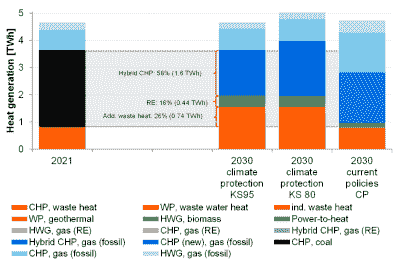
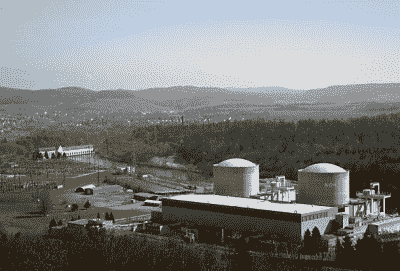
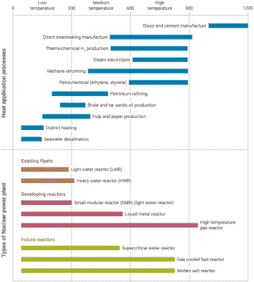
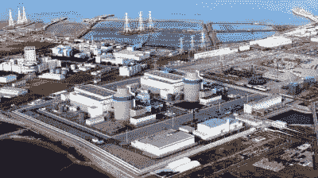

# 为舒适的家庭和幸福的工厂提供热电联产和区域供热

> 原文：<https://hackaday.com/2022/09/01/cogeneration-and-district-heating-for-comfortable-homes-and-happy-factories/>

现代社会的大部分能源消耗都以某种形式用于加热，无论是加热水、提高室内温度，还是用于工业生产。这使得它成为提高效率和弹性以及减少全球能源生产二氧化碳排放的绝佳目标。在不久的将来，区域供热和类似的解决方案可能会发挥重要作用。

在过去的几十年里，一些国家已经建成了大面积的区域供热网，或者正在这样做。这些供热网的主要优势在于，它们不仅允许更高效、更集中地产生热量，而且允许例如工业废热得到有效利用而不是浪费，即使大部分热量将来自专用或[热电联产](https://en.wikipedia.org/wiki/Cogeneration)热电厂。

最近，区域供热以核热电联产的形式在中国得到了大力推动，同时也在探索利用蓄热来缓冲热量以备后用的可能性，以及将数据中心与供热网相结合的概念。尽管区域供暖并不是什么新鲜事，但它可能有助于让人类轻松进入低碳未来，同时又不失一丝舒适。

## 复杂的历史

[区域供热](https://en.wikipedia.org/wiki/District_heating) (DH)的主要好处是它们的整体效率比许多较小的热源有所提高，例如单个家用燃气或矿物油锅炉，这也是因为使用了本来大部分是废热的东西。此外，向该系统供热的来源可以是非常多样的，即使煤一直是西方供暖网的首选燃料。第一代 DH 系统建于 19 世纪晚期，纽约市的[蒸汽管网](https://en.wikipedia.org/wiki/New_York_City_steam_system)就是一个最好的例子。这种类型的第一代系统也显示了阻止他们在许多其他城市采用的问题。

2007 年纽约市蒸汽爆炸是自 1987 年以来的 12 次蒸汽管道爆炸之一，2007 年的爆炸涉及一根 83 岁的管道破裂，使高温高压蒸汽冲破地面，严重伤害了人们，造成了大量损失。从 20 世纪 30 年代到 70 年代建造的 DH 系统将使用热水，由热电联产工厂加热。虽然仍处于加压状态，但这些系统不会造成与加压蒸汽系统相同的安全风险。

这些第二代分布式供热系统及其后续改进(如用绝缘管代替普通混凝土管)通常以热电联产电厂为基础，因此附近的城市和社区可以同时获得热和电，而不是主要由一组专门的燃煤电厂为蒸汽系统供电。这种方法在斯堪的纳维亚国家和前苏联得到了广泛采用。

Suggested heat supply sources for Berlin by 2030 under different scenarios. (Gonzalez-Salazar et al., 2020)

然而，在过去的几十年里，DH 系统的建设基本上停滞不前。由于可获得廉价的天然气，并且在像挪威和法国这样的国家，由于低电价，通常缺乏为新的 DH 系统铺设管道或扩展现有 DH 系统的经济激励。许多现有的 DH 系统的能源来源也从低碳核能转向化石燃料，前苏联的 DH 电网就是这种情况。东德的格雷夫斯瓦尔德和类似的 T2 热电联产 VVER 压水堆在 20 世纪 90 年代被关闭，取而代之的是煤和天然气发电厂。

在 1989 年 3 月的 IAEA 公告中， [Losev 等人](https://inis.iaea.org/search/search.aspx?orig_q=RN:43003884)描述了当时存在的 DH 计划，以进一步将核电厂热电联产的使用扩展到苏联的欧洲部分。当然，随着苏联在 1991 年的解体，从那时起实施的少数 DH 系统主要使用化石燃料作为它们的来源。

柏林等城市就是一个很好的例子，它们有两个(西部和东部)独立的 DH 系统。虽然这个网络基本上延伸到了苏联解体前的城市规模，但它仍然是德国最大的 DH 系统。目前，柏林正试图寻找方法摆脱为其提供大部分供热的高碳燃煤电厂，Gonzalez-Salazar 等人(2020 年)提供了一些可能的情景。

在他们对替代能源的评估中，他们发现工业废热可以提供一小部分，大部分被燃烧(严重污染)的公共固体废物(垃圾)和[生物质](https://physicsworld.com/a/biomass-energy-green-or-dirty/)所吸收，主要是在目前的燃煤电厂中以木屑的形式。绝大多数的供热将由化石燃料气体(ng)来提供，然而，设想像(绿色)氢这样的 NG 替代品可以在未来的某个(遥远的)点被替换。

在他们的理想场景中，还将使用电能-热能(P2H ),这涉及到使用电阻加热、热泵等技术将电能转化为热能。

## 找到正确的平衡

The Swiss Beznau nuclear power plant in 2003\. (photo: Roland Zumbühl)

正如柏林和纽约市的情况所显示的，拥有一个 DH 系统并不一定意味着它是低碳的，或者很容易从一个排放污染的怪物转化而来。除了整合低碳热源之外，供热的选址对于系统效率也很重要。对于热电厂和工业废热源，这意味着它们必须位于离用户足够近的地方，一般在几十公里以内，以尽量减少热损失。

当涉及到利用太阳能和风力发电装置的过剩电力来加热某种形式的热存储的 P2H 场景时，这也发挥了作用。由于存储必须放置在离最终用户足够近的地方，这意味着电力必须通过输电线路传输到这个存储设施。如果这些输电线路没有足够的可用容量，过剩的电力仍将不得不削减。仅仅依靠过剩的电力也意味着输入系统的热量高度可变，需要某种备用供热，如化石燃料或核能，或者接受无法满足供热需求的时期。

最有效的方案可能是传统的核能联合发电厂，前苏联国家大量使用，瑞士的 Beznau 核电厂也大量使用。该工厂于 1984 年进行了改造，为附近的社区提供区域供热，这带来了额外的好处，即减少了附近河流中的废热，并为相关家庭节省了超过 1400 万立方米的天然气。

这种热电联产设备的一个方面是部分蒸汽用于 DH 系统，而不是用于发电。由于这种蒸汽是在汽轮机级已经(部分)膨胀后提取的，所以发电量的减少通常是最小的。即便如此，可以想象通过在 DH 系统中增加蓄热和接受来自工业过程以及数据中心等的废热。需要转移的蒸汽会更少，从而可以产生更多的电力，而不会影响系统。

在这种情况下使用 P2H 可能没有什么意义，因为增加更多的热量将释放更多的电力，但 P2H 只有在当地电网已经有多余电力的情况下才有意义，这使得它基本上没有用处。然而，使用相对稳定的热源，如数据中心和铝冶炼设施(如在挪威所见)，可以为系统提供额外的冗余供热。

## 增加热度

Temperature ranges of heat application processes and types of nuclear power plant (source: IAEA)

在许多国家，持续获得供暖是重要的，也是生死攸关的问题，包括在极端天气事件期间，如 2021 年 2 月德克萨斯州冬季风暴期间，许多家庭被切断了天然气和电力。类似地，许多行业需要持续的热源，如玻璃和钢铁制造业，以及石油化工行业。这些加热需求在很宽的温度范围内变化，从 DH 系统的 100°C 左右到工业用热的 300°C 到 1000°C 左右。

可靠性要求强调了拥有可靠热源的重要性。在这里，核电厂是唯一一种容量系数大于 90%的能源，不依赖于每天、每周甚至每月的换料。这也是为什么寻求摆脱化石燃料的化工厂和其他行业对用于工业过程热量的小型模块化反应器有着浓厚的兴趣，因为即使供应热量的短暂下降也可能导致生产停顿，甚至摧毁生产线。

高温(氦)气冷堆(HTRs)——像中国的[HTR-PM](https://en.wikipedia.org/wiki/HTR-PM)——比传统的水冷(LWR 或 HWR)反应堆达到更高的温度，使它们适用于更多的工业过程，同时还提供电力。理想情况下，这种燃料可以为工业生产提供全年无休的热能和电力，使其成为一种极具吸引力、经济实惠的低碳能源。

The Haiyang 1 and 2 reactors. (Credit: SPIC)

热电联产核电厂的可靠性已经被证明了几十年，这使得它成为像中国这样的国家的显而易见的选择，因为他们寻求在他们的 DH 系统中找到燃煤电厂的替代品。中国山东省海阳市目前正致力于将其供热系统从燃煤锅炉完全转换为核能热电联产。据报道，仅 AP-1000 海洋一号反应堆的热量就足以替代 12 台燃煤锅炉。

目标是利用这一座核电站为整个海阳市生产足够的热量，以及用于海水淡化的电力和热量，有效地消除该市居民使用的大部分化石燃料。

## 区外

井下系统的一个不可避免的部分是，大直径的隔热管道必须埋在地下，这可能相当具有破坏性。根据具体情况，[热泵](https://en.wikipedia.org/wiki/Heat_pump)系统可能是一个可接受的替代方案，提供比简单的电阻加热系统更高的效率。这些当然需要可靠的电力来源，但热泵系统可以根据房主的意愿安装。

自 2004 年以来，欧盟已经实施了热电联产指令，该指令旨在促进热电联产和区域供热在欧盟范围内的推广。尽管如此，最明显的变化往往是家庭从取暖用矿物油转向天然气(由于感觉到的成本节约)，同时推动热泵。

当将欧盟的供暖脱碳努力与完全支持使用核电进行供暖和工业供暖的国家进行比较时，它提出了许多关于创建不涉及核电的低碳供暖系统的可行性的问题。看看未来几年这方面的事情如何发展会很有意思，尤其是当前的能源危机已经完全破坏了化石天然气背后的经济。

[标题图片:[罗蒙诺索夫院士号](https://en.wikipedia.org/wiki/Akademik_Lomonosov)浮动核电站，停泊在俄罗斯佩韦克。它为这个与世隔绝的社区提供电力和热量。]