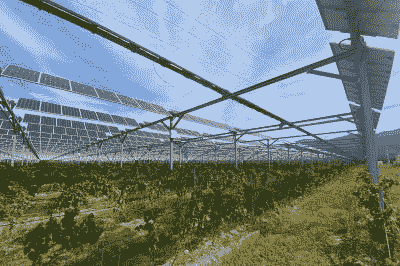

# 农业光伏发电是一种土地使用黑客最大化的生产力

> 原文：<https://hackaday.com/2022/09/07/agrivoltaics-is-a-land-usage-hack-for-maximum-productivity/>

土地往往是有价值的东西。总的来说，除了迪拜的一些奇怪的项目，他们不会再做更多了。这意味着，当我们试图为不断增长的人口提供食物和能源时，我们需要仔细考虑如何使用我们拥有的土地。

农业光伏领域关注的是土地的双重用途，既用于粮食生产，又用于发电。这一切都是为了最大限度地利用我们现有的土地和阳光。

## 同时做两件事

世界上适合粮食生产的土地有限。优质农业用地因其高产作物种植能力而受到重视。这通常归结于有利的土壤、容易获得的水源和充足的阳光等因素。

然而，事实证明，农业用地也非常适合安装太阳能电池板。太阳能装置需要尽可能多的阳光，它们不喜欢太热。对于太阳能电池板来说，农田更凉爽、潮湿的条件使它们比沙漠更有吸引力，因为较低的温度有助于电池板保持在最有效的工作范围内。

Vineyards can potentially add solar power as a revenue stream, while simultaneously reaping the benefits of less water loss due to the shade provided. Credit: [SunAgri, press release](https://sunagri.fr/en/solar-panels-help-french-winemaker-keep-climate-change-at-bay/)

因此，对于阳光充足、气候温和的土地，尝试将它用于粮食生产和发电是有意义的。农业光伏领域关心的是找到实现这一目标的最佳方法。

最重要的考虑是遮荫。如果太阳能电池板安装不小心，将没有足够的阳光来种植任何有意义的产品。在这一点上，你只是在做光伏发电，你已经把农业扔出了窗外。通常，诀窍是将面板抬高到离地面相当高的位置，以便工人和机械能够接触到下面的作物。这确实增加了大量成本，这是这种组合安装的代价。

说到农业光伏，植物的选择是关键。那些在阴凉条件下生长良好的植物是理想的，而那些需要充足阳光的植物是糟糕的选择。西红柿、莴苣和简单的草在农业光伏系统中可以生长得很好，因为它们可以在低日照量下成功生长。另一方面，像小麦这样的宽亩作物在这种条件下产量很低，不是一个合适的选择。

欧洲的 BayWa r.e .项目已经在荷兰和德国的各种农业光伏系统中取得成功。这些由生长在凸起的光伏板下的各种浆果和蔬菜组成。这实际上在炎热的日子里带来了意想不到的好处。这些天来，太阳能板的阴影实际上有助于植物降温，减少蒸发和热应力。面板的安装似乎也有助于保持种植区夜间温暖，减少了对塑料盖的需求，以保护脆弱的浆果免受寒冷。

葡萄园也能从这种装置中受益。在法国，在葡萄藤上安装太阳能板有助于减少需水量，因为植物在热浪中可以免受最严重的阳光照射。在 Sun'Agri 进行的一项实验中，遮阳葡萄树生产的葡萄也具有更好的芳香特性，这使它们更适合用于酿酒。

与此同时，[一个中国项目](https://journals.plos.org/plosone/article?id=10.1371/journal.pone.0254482)已经找到了一种方法来缓解阴影问题，以获得更大的灵活性。在离地面几米的高度上，安装有凹槽的玻璃面板和太阳能电池板。玻璃面板的作用是将阳光均匀地散射到下面的作物上，减轻太阳能电池板的遮挡效应。在测试中，作物产量等于或高于正常条件下的产量，并且在系统中添加 LED 照明能够生产出更高质量的作物。

更基本的系统也可以工作。一些人选择简单地在农田上安装太阳能电池板，稍微抬高一点，让羊或其他动物在下面吃草。只要有足够的阳光让草生长，这是一种在同一块土地上结合粮食生产和发电的简单方法。在希腊的一次试验中，羊提供了有益的植被控制。不需要割草，以避免过多的草生长和火灾风险。相反，放牧抑制了草的生长。

随着世界转向太阳能来满足更多的能源需求，必然会寻找更多的土地来安装太阳能电池板。有了农业技术的武装，人类将最有可能从我们必须依赖的有限的农业土地中获得最大可能。预计未来会有更多的农场转向农业光伏发电，这既是为了增加太阳能发电的收入，也是为了帮助提供我们的社会迫切需要的清洁能源。