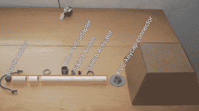

# 巨型键盘正是我们喜欢的类型

> 原文：<https://hackaday.com/2022/08/27/giant-keyboard-is-just-our-type/>

我们喜欢大键盘，我们不能说谎，这些年来我们已经看到了一些相当大的键盘。但是这个——这个可能是人们见过的最大的工作板。[【RKade】和【Kristine】着手制作吉尼斯标准下世界上最大的键盘](https://www.youtube.com/watch?v=HIEdF88NW5A)——16 英尺长，你会认为他们会打破世界纪录。稍后会详细介绍。

正如你可能已经发现的，这里发生的事情是，每个巨大的按键驱动我们希望是樱桃品牌的杠杆开关，它连接到正常大小的键盘 PCB 的焊盘上。一旦他们设计了布局，他们确定绝对没有现有的商业容器，当倒置时，会适合所需的尺寸，所以他们计算出需要 350 块纸板来制作 70 个 5 面键帽，并开始工作。

 抛开这个东西一般的牛逼，我们真的很喜欢定制的按钮，大部分是 PVC 组件，3D 打印的零件，还有一根回位弹簧的弹力绳。

[RKade]在框架构建方面遇到了一些问题——主要是扭曲的木板和 70 个按键安装处的收缩孔。在所有的东西都连接好之后(我们可以加上，聪明的是，用以太网电缆对)，[RKade]用三层刨花板重建了整个框架。

顺便说一下，吉尼斯拒绝了申请，理由是它必须是现有键盘的精确复制品，而且必须按照商业/专业标准建造。他们也自相矛盾，没有返回`biggest keyboard`的搜索结果，但在启动世界纪录应用程序时提供，毕竟有一个记录保持键盘，它有 8 英尺(2.4 米)长。它不是[非功能性的混凝土俄语键盘](https://www.atlasobscura.com/places/keyboard-monument)，但我们想知道它是否可能是[CES 2018](https://www.youtube.com/watch?v=rLs-GImKBYE)中使用 Kailh 大开关的 Razer。

一旦键盘启动并运行起来，[RKade]和[Kristine]就开始了一场[打字攻击](https://yaksgames.com/games/typing-attack/G997477A5A)的游戏，输的一方必须在巨大的键盘上打出“永远不会放弃你”的所有歌词。休息之后来看看。

 [https://www.youtube.com/embed/HIEdF88NW5A?version=3&rel=1&showsearch=0&showinfo=1&iv_load_policy=1&fs=1&hl=en-US&autohide=2&wmode=transparent](https://www.youtube.com/embed/HIEdF88NW5A?version=3&rel=1&showsearch=0&showinfo=1&iv_load_policy=1&fs=1&hl=en-US&autohide=2&wmode=transparent)

通过 [KBD #92](https://kbd.news/A-really-big-keyboard-1602.html)