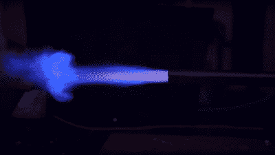

# 使用树脂印刷制作的爆震发动机原型

> 原文：<https://hackaday.com/2022/08/29/a-detonation-engine-prototyped-using-resin-printing/>

多年来[Integza]已经炸毁或熔化了许多类型的喷气发动机，包括不起眼的 pulsejet。早期的改进围绕着泵入更多的燃料，或强制进气口，但现在是时候对这个想法进行更多的改进了，他向更可控的爆震发动机迈出了一步。他的[最新实验](https://www.youtube.com/watch?v=12NZCxUrMZQ)(视频，嵌入下方)试图将这一概念再放大一点。首先，他用一套树脂打印部件建造了一个原型，带有相关的管道和气体控制阀，以及一根长长的丙烯酸管来向下输送废气。丁烷和空气喷射的控制，以及火花点火的触发，都是由一个 Arduino 来处理的——尽管他可能只是使用了一个 555 定时器——驱动几个固态继电器。这提供了对脉率的一些可重复的控制。这是一个非常有趣的发动机设计之旅，被称为[旋转爆震发动机](https://hackaday.com/2021/09/02/japanese-rocket-engine-explodes-continuously-and-on-purpose/)。如果他能让它工作的话，这将是非常有趣的。

Supersonic exhaust plume with the characteristic ‘mushroom’ shape

爆轰发动机是根据总推力方程中的压力部分工作的，压力部分的作用是在爆轰燃烧中。爆燃在恒定压力下发生，理论上应该比无聊的老式爆燃有更高的效率，但风险也更高。显然，用燃料/空气混合物很难做到这一点，因为混合物中没有足够的能量。[Integza]确实尝试添加了一个 [Shchelkin 螺旋](https://en.wikipedia.org/wiki/Shchelkin_spiral)(我们在这里称之为弹簧)，它可以减缓燃烧，并缩短从爆燃到爆炸的时间。

它有点工作，但还不够好，所以用丁烷和纯氧运行是前进的方向。这证明了基本的想法是可行的，最后一步是用金属重建整个东西，用数控加工的端板和一些用几个螺栓夹紧的箱形部分。这看起来在大约 10 脉冲/秒时工作得相当好，有一些可测量的推力，但不是很多。我们认为还有更多的工作要做。

我们暗示过早期关于强制空气脉冲射流的工作，所以这里的[就是](https://hackaday.com/2021/02/10/3d-printed-turbocharger-boosts-pulsejet-performance/)。当然，当我们谈到 pulsejets 时，我们不能不提到[Colinfurze]和他的[pulse jet 卡丁车](https://hackaday.com/2015/05/17/do-not-try-this-at-home-a-jet-powered-go-kart/)。

 [https://www.youtube.com/embed/12NZCxUrMZQ?version=3&rel=1&showsearch=0&showinfo=1&iv_load_policy=1&fs=1&hl=en-US&autohide=2&wmode=transparent](https://www.youtube.com/embed/12NZCxUrMZQ?version=3&rel=1&showsearch=0&showinfo=1&iv_load_policy=1&fs=1&hl=en-US&autohide=2&wmode=transparent)

