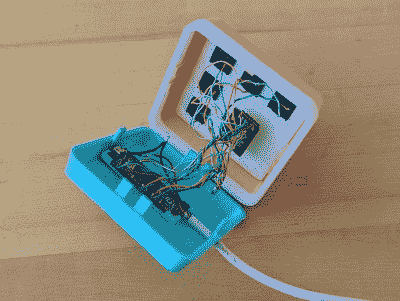

# 漂亮的微型大平板电脑让回到办公室的过渡变得容易

> 原文：<https://hackaday.com/2022/09/03/pretty-pico-macropad-eases-transition-back-to-office/>

[Thomas "Mel" Maillioux]对定制的机械键盘游戏并不陌生——面对不得不返回办公室的情况，他们决定制作一个可爱的小 macro pad,既纪念这一时刻，又让工作变得更轻松。

 这个棉花糖色的美人块是为了向[梅尔]最喜欢的操纵杆致敬而设计的，TRS-80 自定心数字带有单个红色方形按钮，看起来棒极了。他们通过研究笔记本电脑上的关键图例开始了这一旅程，以确定哪些宏可能最适合他们，基于哪些图例是最陈旧的。

幸运的是，他们想要使用的所有宏——锁定工作站、保存当前活动文件、最小化/恢复所有窗口、将窗口向左或向右对齐以及音量控制——都已经包含在 windows 中，这使得事情变得相当容易。

就硬件而言，它不会比一个树莓派微微，一些机械开关，一根旧的 USB 电缆和捐赠的 CAT5 对更容易，所以它看起来内外都很漂亮。此外，方便的旋转编码器音量旋钮将静音和取消静音时，按下。我们认为卡扣式外壳看起来很棒，而且不需要任何支撑。如果你想自己制作，一定要查看回购协议。

好吧，我们撒了个谎:[如果你能使用 3D 打印机，宏垫的制作确实变得更容易了](https://hackaday.com/2021/12/29/snap-together-macropad-does-it-without-solder/)。

Via [MKKC 不和](https://discord.gg/cNYc3d3p)