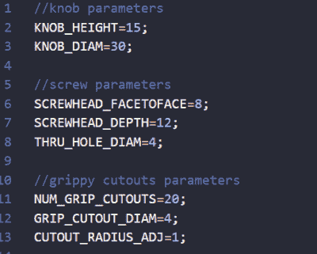

# 仅用几行代码定制印刷旋钮

> 原文：<https://hackaday.com/2022/08/30/custom-printed-knobs-in-just-a-few-lines-of-code/>

虽然不是每个人都必须支持 OpenSCAD 背后的 CAD-via-code 原则，但不可否认，该软件特别适合参数化设计。使用一些选择变量，可以在 OpenSCAD 中创建一个其他用户可以轻松调整的模型——即使他们之前没有 CAD 经验。

 以【aminGhafoory】写的这个[参数旋钮制作器为例。](https://github.com/aminGhafoory/parametric-knob-maker)这段代码只有不到 100 行，但是如果你正在寻找自己的版本，你真正需要注意的是顶部清楚标注的变量。只需插入你想要的直径和高度，稍微摆弄一下输入 grip 生成函数的值，然后点击 F7 将它导出到 STL 文件中，准备打印。

不可否认，用这段代码生成的所有旋钮看起来都差不多。但是这就是开源的美妙之处，如果你想打印出一些看起来很疯狂的按钮，你至少可以使用这些代码作为基础。有了核心功能后，您只需要编写一个新的函数来生成更符合您喜好的 grip 纹理。

当然，如果你想让你的 OpenSCAD 设计更容易被其他人修改，[你会想看看它令人印象深刻的定制功能](https://hackaday.com/2017/06/27/a-crash-course-in-thingiverse-customizer/)，它用友好的滑块和文本输入框取代了手动编辑的变量。[像我们在 2018 年看到的*终极盒子制造商*这样的项目](https://hackaday.com/2018/03/02/printed-it-custom-enclosure-generator/)是一个很好的例子，表明如果你给你的设计适当的预先考虑，OpenSCAD 可以多么强大。