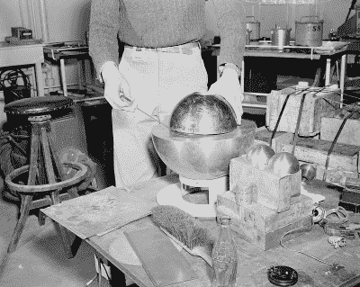

# 建造一个发光的恶魔核心灯

> 原文：<https://hackaday.com/2022/08/31/building-a-glowing-demon-core-lamp/>

所谓的*恶魔核心*是一个被诅咒的物体，一个 6.2 千克重的钚，旨在安装在核武器中。相反，草率的实验技术使它出现在几起悲惨的核事故中，并导致多人死亡。现在，你可以[为自己建造一盏以这个邪恶致密球体为主题的灯。](https://www.printables.com/model/268457-glowing-demon-core-lamp)

A later recreation of the infamous “Slotin Accident” that occurred with the Demon Core. Credit: Public Domain, Los Alamos National Laboratory

创造者[skelly]设计了这种灯来复制事件中的[slot in，其中球形的*恶魔核心*被放置在两个半球形的铍中，作为中子反射体，使其接近临界状态。因此，核心被打印成一个小球体，薄到足以让光逃逸，模仿导致路易斯·斯洛廷死亡的辐射释放。外部的球体被印上银色的 PLA 来复制铍半球。这一切都是在一个模仿 20 世纪 40 年代洛斯阿拉莫斯国家实验室的支架上组装的。](https://www.losalamoshistory.org/history-blog/the-slotin-accident-inside-the-archives)

为了模仿*核心的*致命蓝光，该构建使用了来自美元树灯的廉价 LED 模块。通过增加限流电阻，它们可以安全地使用 USB 电源。

恶魔核心最近已经成为一个迷因，也许是因为新一代人认为他们足够聪明，不会摆弄 6.2 公斤的钚和一把螺丝刀。这并不是说没有危险的核实验在进行，[甚至是 DIY 类型的](https://hackaday.com/2011/08/06/the-diy-nuclear-reactor/)。在外面小心点！