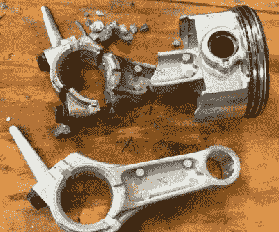

# 小引擎故障导致临时拆卸

> 原文：<https://hackaday.com/2022/09/01/small-engine-failure-leads-to-impromptu-teardown/>

当他孩子的卡丁车中的 6.5 马力(212 cc) Harbor Freight Predator 发动机在一些特别艰难的驾驶后熄火时，[HowToLou]认为这是一个在低成本动力装置内四处闲逛的好时机，以获得我们的观看乐趣。作为奖励，他甚至让[重新启动并运行](https://www.youtube.com/watch?v=sI_LGlLNxtQ)。

The shattered rod, and its replacement.

对于一个零售价仅为 160 美元的引擎，我们必须承认，掠夺者的内部看起来并不寒酸。不可否认，[HowToLou]确定故障的原因是连杆被吹断，但他也提到*有人*之前移除了发动机的调速器，使其转速远远超过了 3,600 RPM 的标称最大转速。没人知道是谁溜进去把州长拉了出来，但我们打赌不是那个 7 岁的司机…

更换连杆意味着将发动机的大部分拆开，但为了我们的教育，[HowToLou]决定更进一步，将发动机上的所有东西都拆下来。在把它拆成块后，他一边解释它的功能，一边重新安装每一块。如果你想知道是什么让这些小引擎运转起来，或者你有一辆需要修理或改造的 Predator 212 cc，这个演示是一个极好的资源。

顺便说一句，这不是我们第一次看到有问题的卡丁车——早在六月，我们[报道了【HowToLou】为它](https://hackaday.com/2022/06/26/go-kart-reverse-without-the-pain/)设计的独特电动倒车。