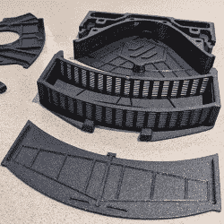

# 当工程师为 3D 打印机设计空气过滤器时，你会得到永不超生

> 原文：<https://hackaday.com/2022/09/03/nevermore-is-what-you-get-when-engineers-design-air-filters-for-3d-printers/>

当工程师设计 3D 打印机的空气过滤器时，他们热衷于功能，拒绝妥协，希望没有难闻的气味或烟雾，会发生什么？你得到了永不超生，这是一个再循环活性炭过滤系统的设计，用来处理 3D 打印产生的挥发性有机化合物。

3D-printable parts and an easy-to-fill chamber for bulk-activated carbon make this recirculating air filter for VOCs a smart, space-saving design.

[永不超生微型](https://github.com/nevermore3d/Nevermore_Micro)(和更大的[永不超生最大](https://github.com/nevermore3d/Nevermore_Max))最初是为了补充[沃龙](https://vorondesign.com/) 3D 打印机的设计，但它们可以用于任何其他东西。这些过滤器使用 3D 打印部件，并设计为使用散装活性炭容易填充(和重新填充)，而不是像大多数商业产品那样使用某种专有的预包装过滤器。沃龙项目是一个不折不扣的打印机，永不超生来自同样的设计精神。

一个永不超生过滤器位于建造室内，当空气通过活性炭时，空气在室内循环。这个想法是通过在一个相对较小的建造室内集中处理问题的源头，人们不需要大量的气流。一个小的再循环空气过滤器可以有效地完成这项工作，尽管为了达到最佳效果，建造室应该尽可能地密封。

一个有趣的警告是，似乎不是所有的活性炭都是一样的，在像永不超生这样的再循环过滤器中只使用无酸、蒸汽活化(非酸洗)的活性炭是绝对重要的。有一些可怕的照片显示，由于使用酸渣碳，金属表面被氧化，其中一些只发生了几分钟。幸运的是，对于已知的好东西，有可靠来源的指示。

众所周知， [3D 打印会产生化学物质和粒子排放](https://hackaday.com/2016/02/01/3d-printing-fumes-new-science/)。这些差异取决于打印机的材料和类型，但这是一个值得关注的问题。一种是用类似 HEPA 过滤器的东西来处理微粒，但挥发性有机化合物需要碳过滤器。这就是永不超生的用武之地。活性炭过滤器会因为暴露在空气中而磨损，所以如果你真的想在打印时清洁挥发性有机化合物，绝对值得看看像永不超生这样设计的散装碳。