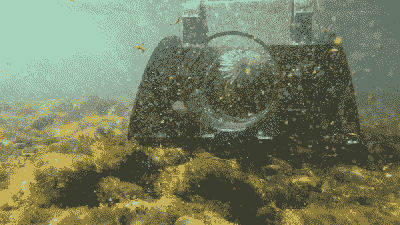

# 2022 年 Hackaday 奖:水獭一号通过吸取海胆来保护海藻森林

> 原文：<https://hackaday.com/2022/09/08/hackaday-prize-2022-otter-force-one-protects-kelp-forests-by-sucking-up-sea-urchins/>

当想到森林正受到人类活动的威胁时，大多数人会立即想到雨林。在海洋表面之下，还有另一种类型的森林处于危险之中:北加利福尼亚海岸的海藻森林。海水变暖引发了紫色海胆数量的激增，这些海胆以惊人的速度吞食海带。据估计，沿着 350 公里的海岸线，90%的海藻森林已经被海胆吞噬。

解决方法就像除掉海胆一样简单，但是手动收集数以百万计的多刺生物是不现实的。幸运的是，[RobotGrrl]为这项任务设计了合适的工具: [Otter Force One，一个自主水下机器人](https://hackaday.io/project/186901-otter-force-one)，它可以收集水生入侵者，并将其放入袋中进行清除。该设备仍在开发中，但迄今为止的进展是有希望的。基本想法是使用机器视觉识别海胆，然后用喷水器将其驱逐，最后使用抽吸泵将其拉入机器并储存在袋子中。

 一个由 3D 打印组件制成的原型目前正被用于测试这个想法。它的电机由带电机控制器的 ESP32 驱动，系统由一组结实的锂电池供电。对塑料海胆模型的测试证实了抽吸机制的有效性，尽管喷水和机器视觉系统仍然需要测试。但是即使没有这些，人类潜水员仍然可以使用“水獭力量一号”来提高他们采集海胆的效率。

我们肯定会关注这个项目，并希望看到它演变成一个全自动的海胆猎人。水下害虫控制机器人并不是全新的:我们已经看到了一种用于鲑鱼养殖场的激光驱鼠器。还有[机器海星](https://hackaday.com/2020/04/23/underwater-crawling-soft-robot-stays-in-shape/)和[章鱼](https://hackaday.com/2014/10/03/robotic-octopus-to-take-over-the-seas/)。

[hack adayprize 2022](https://prize.supplyframe.com)主办单位: