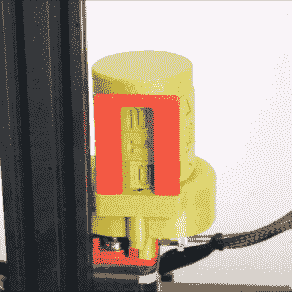

# 细丝计量器:当你绝对想计算每一个使用过的计量器时

> 原文：<https://hackaday.com/2022/09/09/the-filamentmeter-for-when-you-absolutely-want-to-count-every-meter-used/>

[ArduinoNmore]采用了一种有趣的方法来设计一个计数器，旨在[准确显示 3D 打印机已经使用了多少米的细丝](https://cults3d.com/en/3d-model/tool/filamentmeter)。长丝计数器看起来有点像 3D 打印的手持计数计数器(或计圈计数器)，但不是一个按钮来推进每个数字，读数代表多少米的长丝已经通过挤出机。

Driving the digit rotation from the extruder motor itself means that even retractions are accounted for.

乍一看，它可能看起来像里面隐藏着一个马达，或者该设备以某种方式直接感应到灯丝。但实际上是挤压机马达的运动驱动了这个装置。打印机挤压机上的一个小直齿轮驱动一系列齿轮，推动数字前进。这意味着回缩-印刷过程中挤出机马达的小反转-在总数中得到适当的考虑，这是一个很好的接触。

[ArduinoNmore]为 Ender 3 设计了这款产品，这款丝量计依赖于特定的挤出机设计和方向才能正常工作。当然，由于它是 3D 打印的，根据自己的目的修改设计应该非常简单。

好奇？这个设计卖几块钱，而且有一个免费的测试片,人们可以在点击购买按钮之前打印并使用它来确认这个设计是否可行。[非免费的可打印 3D 模型可能是一个买家当心的世界](https://hackaday.com/2020/08/26/3d-printering-the-world-of-non-free-3d-models-is-buyer-beware/)，但测试件和可靠的文档是让买家对你的工作有信心的好方法。

该单位的内部真的很复杂，有一个发条式的优雅。你可以在短视频里看到这一切，嵌在下面。

 [https://www.youtube.com/embed/9otUdDi829I?version=3&rel=1&showsearch=0&showinfo=1&iv_load_policy=1&fs=1&hl=en-US&autohide=2&wmode=transparent](https://www.youtube.com/embed/9otUdDi829I?version=3&rel=1&showsearch=0&showinfo=1&iv_load_policy=1&fs=1&hl=en-US&autohide=2&wmode=transparent)

