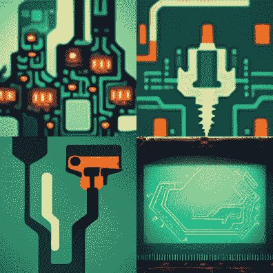

# 艾在旅途中想象“通往天堂的阶梯”

> 原文：<https://hackaday.com/2022/09/14/ai-midjourney-images-stairway-to-heaven/>

这个 GPU 加速的人工智能应用的现代时代有其好处。从堆积如山的原始数据中提取有用的信息，提醒用户驾驶危险，或者只是关注蜜蜂数量都是有帮助的。最近，制作(或者应该是策展)的尝试越来越多？)精心雕琢的艺术品。

 一个这样的 [AI 艺术项目是中途](https://www.midjourney.com/home/)，可以通过 Discord 集成机器人玩。这个机器人接受一些文本输入，然后用它“做梦”,产生有时不可思议，经常是彻头彻尾令人不安的图像。

你可以在短时间内免费使用它，但如果你想“真正”使用它，无论这意味着什么，都需要每月付费。YouTuber [Daara]已经将齐柏林飞船的《通往天堂的阶梯》中的歌词输入到它的中，并制作了一个最终输出的视频供你阅读。

只是为了——你知道——科学,我们在中途加入了一些黑客作者的个人资料，看看会有什么发现。你能猜出哪些作者匹配这些图片吗？

  Each image tile represents one HaD author, but who’s who?  /imagine circuit board hammer drill

像我们这样的工程书呆子可能不是最好的判断这是否算作艺术的人，但对于从一个粗略的概念中制作有趣的图像来说，它至少肯定是有趣的。普通输入会发生什么，比如“电路板锤钻”？

齐柏林飞船已经存在了一段时间，有一些有趣的颂词，比如这个[C64 demose hack](https://hackaday.com/2012/11/14/playing-led-zeppelin-on-a-c64/)直接从简陋的软盘上播放一首歌，听起来还不错。如果这整个人工智能图像的东西是熟悉的，我们确实涵盖了另一个应用，[稳定扩散](https://hackaday.com/2022/09/06/stable-diffusion-and-why-it-matters/)就在几周前。

 [https://www.youtube.com/embed/ZCKdPhepB1s?version=3&rel=1&showsearch=0&showinfo=1&iv_load_policy=1&fs=1&hl=en-US&autohide=2&wmode=transparent](https://www.youtube.com/embed/ZCKdPhepB1s?version=3&rel=1&showsearch=0&showinfo=1&iv_load_policy=1&fs=1&hl=en-US&autohide=2&wmode=transparent)

感谢[安迪·皮尤]的提示！