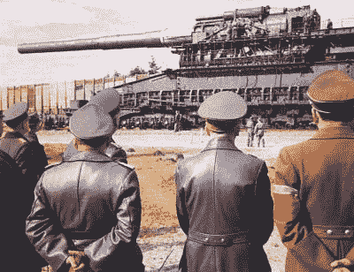
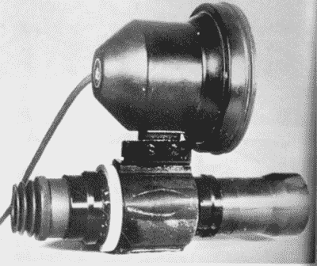

# 未来的纳粹武器

> 原文：<https://hackaday.com/2022/09/23/nazi-weapons-of-the-future/>

我们知道。这个标题听起来像是 1942 年的一部糟糕的新闻纪录片。然而，事实证明，纳粹真的很擅长将资金投入到军事研究和开发——或试图开发——他们称之为“神童”的神奇武器。虽然我们认为今天的火箭和喷气式飞机相当普通，但当德国在二战期间部署它们时，它们是最先进的。虽然火箭相当成功，但喷气式飞机太少，也太晚了，无足轻重。然而，这些只是冰山一角。德国军工企业有很多计划，从巨型建筑到秘密武器，这些计划似乎都出自低级科幻杂志。

## 尺寸很重要

部分计划包括大型船只，包括排水量为 56500 吨的航空母舰。其中许多从未完成，在某些情况下，从未真正开始。相比之下，埃塞克斯级大黄蜂号排水量为 31300 吨，列克星敦号为 37000 吨。H 级战列舰的排水量可能高达 140，000 吨，使大和级(73，000 吨)和衣阿华级(53，000 吨)相形见绌。

在水下，有一个弹道导弹潜艇的计划从未起飞。XXI 型 U 型潜艇有全电力推进，所以它们可以长时间完全在水下运行。虽然有 118 座在建，但只有 4 座完工。有几个其他潜艇计划与空气独立推进。

Gustav railway gun

其中一个没有实现的更有趣的设计是 XI 型——一种可以携带可折叠飞机的潜艇。在计划被取消之前有四个正在建造中。虽然这听起来有些牵强，但日本人发射了四艘可以携带三架飞机的 I-400 潜艇。

还计划建造大型坦克，包括一辆重达 1000 公吨的坦克。Landkreuzer P. 1000 Ratte 拥有两门 280 毫米加农炮、一门 128 毫米反坦克炮、八门高射炮和两门重机枪。

Karl-Gert 是一种自行迫击炮。完成的 7 个可以发射 60 厘米的炮弹。你可能会认为这是一个典型的固定迫击炮的一半大小，直到你意识到一个固定迫击炮通常是 120 毫米或 12 厘米！然后是施韦勒古斯塔夫 T1，一种 80 厘米长的铁路火炮，实际上已经服役。有未实现的计划把它安装在坦克上。

## 高技术

Vampire night scope (public domain)

夜视？德国人在一些坦克上有 FG 1250，在特种突击步枪上有 zielgrt 1229(被称为吸血鬼)。如果你是少数几个拥有吸血鬼的幸运儿之一，你必须携带一个 33 磅重的电池组来为它供电。

当然，德国人有足够的火箭计划，包括 A9 和 A10，能够打击美国东部。A7 a 是一种类似巡航导弹的带翼火箭，以及从未面世的制导导弹。Wasserfall 超音速制导地对空导弹也没有。说到巡航导弹，V1——臭名昭著的嗡嗡炸弹——是一种服役过的巡航导弹。

除了公开的武器，德国的战争机器还有许多技术，如雷达、模拟计算机炸弹瞄准器和导航系统。特别是，X 设备使用 60 兆赫无线电波束非常有效地控制夜间轰炸。作为洛伦兹光束的一种形式，特殊装备的飞机会跟随光束保持航向。当飞机接近目标时，交叉的波束会警告无线电操作员何时释放炸弹。这个系统非常有效，但是只有一些飞机有这个装置，所以他们会投下照明弹来提醒普通飞机也投下炸弹。

当然，著名的是，他们进行火箭研究的皮内明德设施也在研究重水反应堆，这些反应堆可能导致核裂变，从而导致原子弹等。几件事凑在一起使德国原子弹不太可能制造出来。首先，盟军付出了巨大的努力来破坏德国的重水来源(挪威的一座水电站)。

然而，希特勒没能得到原子弹的最大原因是因为维尔纳·海森堡。他认为裂变需要大量的铀(大约 10 吨),这就限制了这个项目。具有讽刺意味的是，由于海森堡与不确定性联系在一起，关于发生了什么仍然存在争议。这位著名的物理学家真的犯了错误吗？还是他故意犯了错误来阻止炸弹的制造？有证据支持这两种观点。

海森堡和一些同事在宣布轰炸广岛的消息时是英国人的“客人”。隐藏的麦克风捕捉到了海森堡的反应:“美国的一些对此知之甚少的外行已经唬住了他们，”他说。"我不相信 t 和铀有任何关系."他提到盟军不可能有十吨纯 U235。除非他是在为他怀疑藏在那里的麦克风表演——这当然是可能的——看起来他真的认为这需要大量的素材。但是，就像他著名的原则一样，我们将永远不确定。

## 牵强附会

德国工程师当然愿意尝试几乎任何事情。声波炮使用甲烷燃烧室产生 44 Hz 的高强度声波，通过抛物面反射器进一步放大。这种武器有些效果，但非常容易损坏。在战争后期，有用 X 射线和加速粒子射击飞机的实验。

还有飞碟或“喷火战斗机”、带有放射性的神秘机器“Xerum 525”以及其他接近科幻小说的奇异飞行器和超级武器的传闻。但是我们最喜欢的是太阳枪。受赫尔曼·奥伯特早在 1929 年的一个想法的启发，德国科学家在战争期间计划用金属钠制作一面太空镜。这个 3.5 平方英里的镜子能够将太阳聚焦在地球表面，其能量足以煮沸一片海洋或烧毁一座城市。听起来像超级坏蛋电影情节。然而，战争结束后，科学家告诉盟军，这种武器将在未来 100 年内完成。

我们之前已经研究过德国的火箭项目 T1，该项目后来成为盟国的至少两个太空项目。我们还观察了一些战争机器背后的[机器](https://hackaday.com/2018/09/01/retrotechtacular-the-iron-giants-that-built-the-jet-age/)。看不够神童吗？请看下面西蒙关于这个话题的视频。或者，去看[铁血天空](https://www.youtube.com/watch?v=Py_IndUbcxc)。

 [https://www.youtube.com/embed/YkQr0yY236Q?version=3&rel=1&showsearch=0&showinfo=1&iv_load_policy=1&fs=1&hl=en-US&autohide=2&wmode=transparent](https://www.youtube.com/embed/YkQr0yY236Q?version=3&rel=1&showsearch=0&showinfo=1&iv_load_policy=1&fs=1&hl=en-US&autohide=2&wmode=transparent)

横幅图片:[80 厘米 Dora 铁路炮型号，九龙博物馆](https://en.wikipedia.org/wiki/Schwerer_Gustav#/media/File:Gesch%C3%BCtzDora2.JPG)由斯卡基尔。