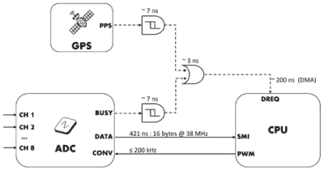

# 用于同步测量的 RPI 帽

> 原文：<https://hackaday.com/2022/09/15/a-rpi-hat-for-synchronized-measurements/>

亚琛工业大学复杂电力系统自动化研究所(ACS)的一个团队已经对广泛分布的电力系统进行了一段时间的分析。为了摆脱高度专业化(且昂贵)的电子平台，他们生产了一些设计用于 Raspberry Pi 平台的仪器，以及一个开源软件堆栈。他们称这个平台为 [SMU(同步测量单位。)](https://git.rwth-aachen.de/acs/public/automation/smu)SMU 由一顶放在 RPi3 上的帽子组成，放在一个 3D 打印的盒子里，盒子旨在连接到 DIN 导轨上。毕竟，这应该是一个工业平台。

硬件方面，展会的明星是德州仪器 [ADS8588S](https://www.ti.com/product/ADS8588S#features) ，这是一款 16 位 8 通道同步采样 ADC。这是一款相当不错的器件，具有 200 kSPS 吞吐量和每通道可编程前端，封装在一个对黑客友好的 64 引脚 QFP 中。然而，让这个项目有趣的是他们如何解决控制采样数据采集和同步的问题。

1-PPS and BUSY edges converted to levels, then OR’d to trigger the DMA

通过将 ADC 编程为字节并行模式，然后将 BCM2837 二级存储器接口(SMI)模块与 DMA 一起使用，样本以最小的 CPU 开销传输至存储器。板载 [U-Blox Max-M8 GNSS 模块](https://www.u-blox.com/en/product/max-m8-series)提供 1PPS(秒脉冲顶部)信号，该信号以非常简单的方式与 ADC busy 信号相结合，从而实现采样速率控制以及一个装置中多个单元之间的同步。他们认为他们可以在 180 纳秒内实现同步，这对于测量相对缓慢变化的电力系统来说应该足够了。HAT PCB 是在 KiCAD 中创建的，可以在 [SMU GitHub 硬件部分](https://git.rwth-aachen.de/acs/public/automation/smu/hw)中找到，这使得它很容易根据您的需求进行修改，或者至少调整设计以匹配您实际可以得到的部件。

就软件而言，[完整的栈是由内核模块](https://git.rwth-aachen.de/acs/public/automation/smu/sw)提供的，内核模块处理底层的东西，提供 up /dev/SMU，一直到管理守护进程和基于 QT 的 GUI。完整的系统级描述可以在相关的[开放访问文章](https://www.mdpi.com/1424-8220/22/14/5074)中找到。

我们在 Hackaday 上看到许多电源监控项目，因为从长远来看，多一点用电知识可以帮你省钱。[这是另一个 RPi HAT 项目](https://hackaday.com/2020/07/24/a-complete-raspberry-pi-power-monitoring-system/)，就是为了这个目的。当然，你不必这么聪明，如果你有一个合适的电表，你可以[数眨眼](https://hackaday.com/2018/09/05/monitoring-power-by-counting-blinks/)然后就收工。