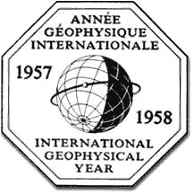
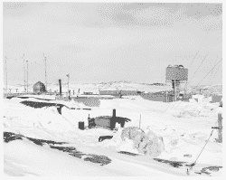
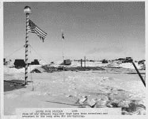

# IGY:我们相处的那一年

> 原文：<https://hackaday.com/2022/09/20/igy-the-year-we-all-got-along/>

如果你是斯迪利·丹的粉丝，你可能知道唐纳德·费根的歌曲“IGY”在这部电影中，法詹歌唱了一个美好的未来，有高速海底铁路、太阳能、让生活变得更美好的巨型计算机和弹力夹克。由于这首歌出现在 1982 年的专辑《夜飞》中，它已经太老了，有些人已经记不起来了，但它的名称甚至可以追溯到更早:国际地球物理年，实际上比 1957 年和 1958 年的一年稍长。国际地球年是 67 个国家为增进人类对地球的了解而共同努力的结果。这是成功的，是当时的大新闻，虽然现在不太记得了。

真正的起源要追溯到更早。1882 年和 1932 年是国际极地年，致力于研究地球的极地区域。在某种程度上，这样做是有意义的。为什么要让 60 个或更多的国家各自向如此恶劣的环境发起艰难、危险和昂贵的探险？然而，不是第三个极地年，詹姆斯·范·艾伦(他有一个著名的腰带)和其他一些科学家认为，许多领域的进步使它成为研究地球物理学的正确时间。从科学的角度来看，IGY 正好与太阳活动周期的最大值相吻合。但是也有其他因素在起作用。

## 花名册和政治

The official IGY logo

IGY 不仅仅是科学的。这是政治。二战后，冷战阻止了“东方”和“西方”(即西欧和美国及其盟友对抗苏联及其盟友)的合作。双方几乎没有科学交流。

另一个政治问题是 1932 年极地年的结果。由于战争，当年的一些数据和分析永远丢失了，因为一些国家拥有这些数据的唯一副本。虽然中国投了弃权票以抗议台湾的加入，但大多数主要国家都以某种方式参与了进来。IGY 计划者决定所有国家都有所有的数据，以避免重复前一个极地年的问题。

比利时人 Marcel Nicolet 被选为“科学年”的负责人。尽管不如肯尼迪总统的“月球”演讲那么出名，艾森豪威尔总统的政府宣布美国将在先锋计划下发射[“小型绕地卫星”](https://www.eisenhowerlibrary.gov/sites/default/files/research/online-documents/igy/1955-7-29-press-release.pdf)作为 IGY 的一部分。苏联宣布了同样的意图，但没有提供时间表，只是在 1956 年 8 月说，这将是“在不久的将来。”不久的将来就是 1957 年 10 月 4 日，人造卫星环绕地球。在几次失败的先锋尝试后，美国终于发射了探索者 1 号，但不是在苏联发射了人造卫星 2 号之前。

## 1957 年的互联网

作为保存 IGY 数据努力的一部分，委员会建立了世界数据中心系统。美国有数据中心“A ”,而苏联有数据中心“b”。还有数据中心“C ”,分布在各个欧洲国家、澳大利亚和日本。每个中心都有所有 IGY 数据的完整副本，通常保存在穿孔卡片或磁带上。数据中心保存的所有数据都必须免费提供，以支付复制和发送信息的费用。

这可能是 IGY 最大的遗产。该系统扩展到 12 个国家的 52 个中心。2009 年，该系统与另一家数据收集服务机构合并，形成了一个名为 [ICSU 世界数据系统](https://www.worlddatasystem.org)的新系统。

## Brrr…

Wilkes station

像早期的极地年一样，IGY 也专注于北极和南极研究，包括建立几个南极基地，其中一些仍在运行。在真正的南极上的两人营地是为了帮助精确定位南极光和研究帝企鹅。

如果你听说过伯德、埃尔斯沃思、阿蒙森-斯科特、威尔克斯、哈雷特、小美洲五号或麦克默多，它们都是在 IGY 期间建造的，或者是在它到来之前建造的。麦克默多站和阿蒙森-斯科特站仍在运行。麦克默多站的 85 座建筑可以容纳 1200 多人。

The South Pole station

阿蒙森-斯科特站在夏季(六个月的白天)容纳约 150 人，在冬季(六个月的黑夜)容纳约 50 人。原车站于 1975 年被废弃，2010 年被积雪掩埋并遭受坍塌后被拆除。

在北极,“冰刀 2 号”是一个漂浮的研究站，用于绘制北冰洋的海底地图。一个令人紧张的事件发生了，船员们几乎失去了与外界的所有无线电通讯一个月。

## 遗产

谈到南极洲，IGY 导致了《南极条约》的缔结，该条约导致了 41 个签署国之间的进一步科学合作。数据中心这个词收集了大量的数据，也许最重要的是分发了大量的数据。

科学上，范艾伦带被发现了。对南极洲冰深度的研究使人们对冰川有了更好的了解，改进了气象预报，并从根本上修正了对地球总冰含量的估计。海底和洋流以及地球磁场都被绘制出来了。对板块构造和高层大气的新理解也是结果。

准备好迎接另一个 IGY 了吗？不完全是，但是 2007 年是第四个极地年，60 个国家再次在极地研究上合作。国际空间站是另一项多国合作的努力，尽管它不会永远存在，而且值得注意的是，俄罗斯已经宣布它可能想要退出。我们希望看到更多的国际科学合作。

正如你所料，住在南极洲意味着你可以预期做一定数量的黑客活动。顺便说一下，业余无线电在让 T2 的一些 IGY 科学家与家乡的亲人保持联系方面发挥了关键作用。哈姆也为 IGY 的努力贡献了数据[。](http://www.arrl.org/files/file/History/History%20of%20QST%20Volume%201%20-%20Technology/QS09-56-Southworth_opt.pdf)