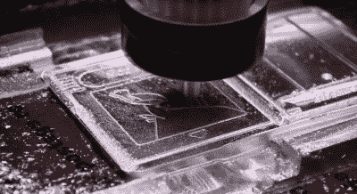

# 纯银制成的口袋妖怪银盒

> 原文：<https://hackaday.com/2022/09/16/a-pokemon-silver-cartridge-made-of-pure-silver/>

口袋妖怪银的最大问题是它装在一个盒子里，盒子是由微亮的灰色塑料制成的。[修改]决定解决所有这一切，[制造一个全银弹夹代替](https://www.youtube.com/watch?v=7sN6IiTMJa8)。

首先对墨盒进行建模，以尽可能接近地匹配原始墨盒，并对其进行 3D 打印以进行适应性检查。从那里，一个测试弹药筒由一块铝块加工而成，以验证一切都是正确的。这是明智的一步，因为它的制造依赖于一根 1 公斤重、价值约 750 美元的银条。

 一切检查无误后，加工银器就可以进行了。每一片可以从 CNC 加工中省下来的银都被收集在一个盒子里，以便回收利用。在这个过程中，大约损失了 28 克银。WD40 在加工过程中被用作冷却剂，因为没有它，银加工不干净。最后一辆车重 164 克。

对于一个有经验的数控操作员来说，这不是一个特别困难的项目，但却是一个昂贵的项目。主要支出是银条和口袋妖怪购物车本身的费用，在通常的拍卖网站上大约 50 美元就可以买到。

然而，成品的“重量和光泽”是无可争议的辉煌。想象一下，把它交给一个朋友，让他插入他们的游戏机！只是别忘了要回来。如果你足够富有，可以用口袋妖怪黄金或者 T2 白金做同样的事情，不要犹豫给 T4 写信。

我们喜欢好的 casemod，这一款让我们想起了过去几年的一款出色的 crystal PlayStation 2。

 [https://www.youtube.com/embed/7sN6IiTMJa8?version=3&rel=1&showsearch=0&showinfo=1&iv_load_policy=1&fs=1&hl=en-US&autohide=2&wmode=transparent](https://www.youtube.com/embed/7sN6IiTMJa8?version=3&rel=1&showsearch=0&showinfo=1&iv_load_policy=1&fs=1&hl=en-US&autohide=2&wmode=transparent)

