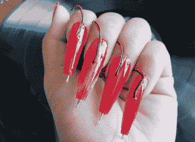

# 黑色黑胶唱片上钉子的声音

> 原文：<https://hackaday.com/2022/09/16/the-sound-of-nails-on-black-vinyl-records/>

维多利亚·沈(Victoria Shen)[修改了粘在指甲上的指甲](https://evicshen.com/sound)，让她能够用手指弹奏黑胶唱片。细节是轻的，但从许多迷人的照片来看，它看起来像她用细拾音器线将唱机针穿过胶钉，然后大概进入音频插孔进行放大。

[Victoria]在她的艺术和表演中尝试新的音乐工具。一定要看看钉子在行动的视频。“刮擦”和用自由手指改变黑胶速度的能力相结合，创造了一种怪异和恐怖的体验。

使用她的“针钉”，[Victoria]发现她能够同时播放多张唱片。多亏了 33、78 和 45 乙烯基的不同直径，她能够将它们叠起来，同时仍然保持手指在上面。

像手套一样的乐器并不是什么新鲜事，但是对时尚、魅力和技术的新颖运用让[Victoria Shen]可以自由地创造一些独特的怪异和酷的东西，以至于[碧昂斯在为《Vogue》拍摄视频时使用了它。](https://twitter.com/BritishVogue/status/1542825378217185281)

> 介绍针钉。抓挠变得容易。💅[pic.twitter.com/fEgtJC7GIK](https://t.co/fEgtJC7GIK)
> 
> —维多利亚·沈(@ evicchen)[2021 年 6 月 11 日](https://twitter.com/EvicShen/status/1403368102742532096?ref_src=twsrc%5Etfw)