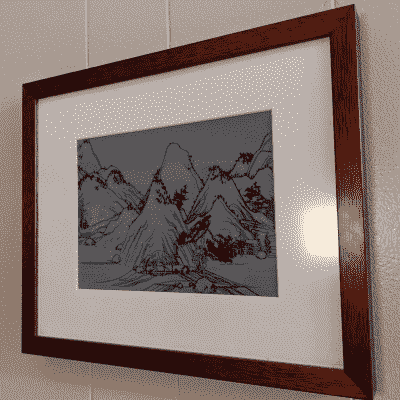

# 无限滚动的 E-Ink 风景永不重复

> 原文：<https://hackaday.com/2022/10/31/infinitely-scrolling-e-ink-landscape-never-repeats/>

传统的中国山水画卷可能有几十英尺长，需要观众沿着它的长度移动，才能看到每个部分所有复杂的细节。[Dheera Venkatraman]用一个 [E-Ink 相框](https://dheera.net/projects/einkframe/)复制了这种效果，它展示了一个无限滚动、永不重复的山水风格的景观。

A new landscape every time you look

风景从不重复，是用由黄灵东创作的脚本程序生成的。它由一个内嵌 JavaScript 的 HTML 文件组成，所以你可以用最少的资源在本地运行它，或者观看[在线演示](http://shan-shui-inf.lingdong.works/)。灵感来源于《T4》*《千里江山图* 《富春山居图 》等历史艺术品。

[Dheera]的实现使用了安装在现成相框中的 10.3 英寸电子墨水，连接到运行[Lingdong]脚本的[分叉版本](https://github.com/dheera/shan-shui-inf)的 Raspberry Pi Zero。它很好地避免了自发光的电子外观，并创造了一种你可以很容易地站在那里盯着看很长时间的装饰。

随着像 [Dall-E](https://hackaday.com/2022/07/03/ai-image-generation-sharpens-your-bad-photos-and-kills-photography/) 和 [Stable Diffusion](https://hackaday.com/2022/10/24/how-the-art-generating-ai-of-stable-diffusion-works/) 这样的人工智能模型的出现，计算机生成的艺术正在掀起轩然大波。用一句简单的话创造原创艺术的能力将对艺术界产生不可否认的深远影响。