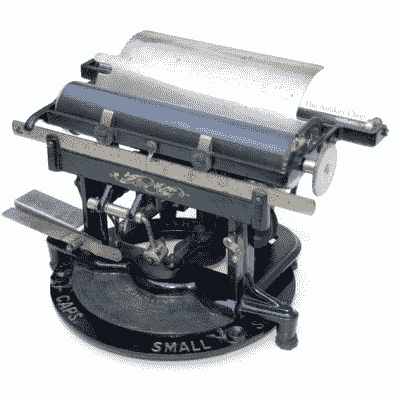
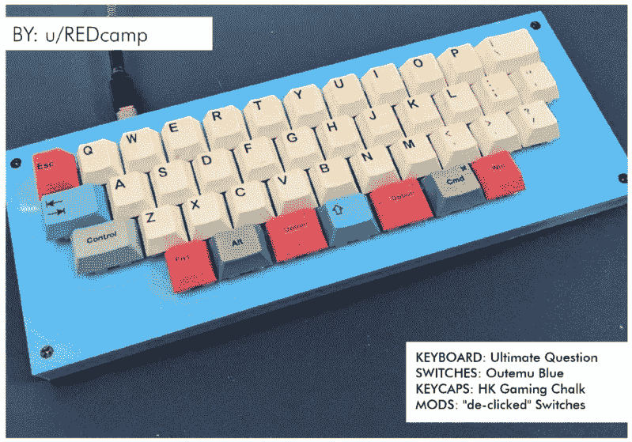

# 和克里斯蒂娜一起跳舞:南瓜键盘的那个

> 原文：<https://hackaday.com/2022/11/08/keebin-with-kristina-the-one-with-the-pumpkin-keyboard/>

哦，塑料带我们去的地方。有争议的更好的发明之一可能是假的可雕刻南瓜，它或多或少保证不会在你的门廊上枯萎和腐烂，尽管它可能会被狡猾的青少年和隔壁的有机兄弟一起打碎。

虽然它们会存在更长时间，但假的种类有助于各种各样的创作，包括这个来自[BunkEbear]的作品，这是一个“噩梦”。是的，我们打赌它是沿着[Aaron Rasmussen]的[球形键盘](https://hackaday.com/2021/05/20/spherical-keyboard-build-leaves-hacker-well-rounded/)的路线，除了里面，因为那个是凹的。

这款美味的键盘是模仿 Malling-Hansen 的书写球(T1)设计的，它可以说是第一台商用打字机，可以追溯到 1865 年。[BunkEbear]的南瓜版本具有 54 个键的布局，外加两个额外的 Shift 和 Escape 键，以适应现代需求。由于南瓜的内部非常小，[BunkEbear]在原型板上将所有连接紧密地连接在一起，并在光荣的熊猫开关本身和 Arduino Pro Micro 之间使用 JST 延长线。

 [https://www.youtube.com/embed/V1iW9sOHY0k?version=3&rel=1&showsearch=0&showinfo=1&iv_load_policy=1&fs=1&hl=en-US&autohide=2&wmode=transparent](https://www.youtube.com/embed/V1iW9sOHY0k?version=3&rel=1&showsearch=0&showinfo=1&iv_load_policy=1&fs=1&hl=en-US&autohide=2&wmode=transparent)

## 历史的噼啪声:爱迪生打字机

Image via [Antikey Chop](https://www.antikeychop.com/edison-typewriter)

在你过于兴奋并想知道你不知道的其他东西之前，[不，这个东西不是托马斯·爱迪生发明的](https://www.antikeychop.com/edison-typewriter)——它是通过从蜡纸上切割模版来支持爱迪生油印机的，但作为一个特殊的奖励，它的功能也像一台打字机。爱迪生的名字被许可给一个叫艾伯特·布莱克·迪克的人，目的是通过他的办公用品公司出售这些机器。

不幸的是，它很难使用，而且两个功能都不好。作为一台打字机，它很慢，平均每分钟 30 个字，而竞争对手平均每分钟 80 个字。其他打字机甚至更擅长切割蜡纸。

就像弗兰克·劳埃德·赖特和某些以他的名字命名的建筑一样，爱迪生与这台打字机断绝了关系，并很快远离了它。然而，这些年来生产了三种型号，每一种都有更多的钥匙。这些可怕的事情最终消失了，因为其他制造商威胁要从零售商那里撤回他们的机器，除非他们停止供应爱迪生打字机。嗯，这是一种方法。

## 插页:[REDcamp]回答了终极问题

Image via [Damn Fine Keyboards #3](https://www.nerdbude.com/dfk/dfk_issues.html)

你肯定熟悉生命、宇宙和一切事物的终极答案，当然是 42。但终极问题是什么？为什么，就是这里的这个键盘，来自第三期[该死的精致键盘](https://www.nerdbude.com/dfk/dfk_issues.html)。

不管和 H2G2 有没有关系，都不用费心去数五颜六色的塑料盖，因为有合适数量的开关在场。恰当地说，它们是蓝色的，以搭配可爱而简单的 3D 打印表壳。虽然他们也可能会自豪地大声宣布[REDcamp]已经解决了这个年代之谜，但他们似乎选择了通过取消他们的点击来修改 Otemus。恐怖啊！各有所好。

你在尖叫的桌面上摇动一套可爱的外围设备吗？发送一张图片到该死的精致键盘连同你的手柄和所有血淋淋的细节，你可能会在这里出现！

## 我们举办了一场网络甲板比赛

 我不知道你怎么会没注意到我们举办了有史以来的第一次网上竞赛，但是我们办到了，天哪，参赛作品太多太棒了，获胜者很难选出。[但不知何故我们做到了](https://hackaday.com/2022/10/13/2022-cyberdeck-contest-picking-the-best-of-the-best/)。

是的，“第一次”意味着还会有更多。我已经迫不及待地想看看这些条目会是什么样子，现在我们已经有这么多的人建立了什么是网络平台。

无论如何，这里有一个我个人最喜欢的产品——[[Tinfoil _ haberdathery]的模块化、基于 ARM 的 S/EA-X cyber deck](https://hackaday.io/project/187018-the-sea-x-cyberdeck)——它在 Jacking In 类别中赢得了荣誉奖。

在这种情况下，插入来自 S/EA——串行/能源连接——允许用户快速轻松地连接终端和其他外围设备。为分体键盘而来，为用户手册而留，只是锦上添花。

下一次网络竞赛是什么时候？不能说，真的，但应该不会太远——如果我的消息来源可信的话，可能是 2023 年年中。所以在此期间要保持烙铁的热度。

* * *

有关于键盘的热门提示吗？通过发送一两个链接来帮助我。不想让所有的黑客抄写员看到它？欢迎[直接给我发邮件](mailto:kristinapanos@hackaday.com?Subject=[Keebin' Fodder])。