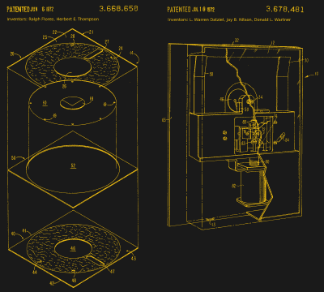

# 软盘销售的密度比你想象的要高

> 原文：<https://hackaday.com/2022/09/21/floppy-disk-sales-are-higher-density-than-you-might-think/>

软盘在日本可能很大，但怀旧和/或需要的美国软盘爱好者不必担心——只需用 AOL 关键字将浏览器指向 floppydisk.com 的 T4 就可以了。在那里，你可以购买各种大小的新软盘，新的和旧的都可以，回收你的磁盘，或者把它们送进去，把所有珍贵的古董都转移出来。

那个令人愉快的 Web 1.0 网站的所有者是 Tom Persky，他自认为是“软盘行业的最后一人”。我们能和谁争论呢？顺便说一句，汤姆大约从 1990 年就拥有了这个地址——显然那是一个域名抢注者以 1000 美元的价格提供了这个域名，尽管汤姆嘲笑为任何网址支付 1 美元，但他的妻子拿出了支票簿，从那以后他一直感谢她。

> 我的生意，以前 90%是 CD 和 DVD 复制，现在 90%是卖空白软盘。我很震惊。—汤姆·帕斯基

在写书的过程中，作者尼克·希尔克曼(Niek Hilkmann)和托马斯·瓦尔斯卡尔(Thomas Walskaar [坐下来与汤姆谈论在电动汽车](https://eyeondesign.aiga.org/we-spoke-with-the-last-person-standing-in-the-floppy-disk-business/)的时代销售轻便马车是什么感觉。

汤姆还拥有[diskduper.com](https://diskduper.com)，这是他开始制作软盘的地方——通过复制它们。在 80 年代和 90 年代，做这一行有点像在地下室里生产法定货币。随着时间的推移，越来越多的公司停止销售软盘或干脆倒闭，汤姆的公司的重点从复制转向销售。虽然这个行业曾经有 90%的复制和 10%的软盘销售，但在 2022 年，这些百分比已经翻了个底朝天。

### 那么，到底是谁在买软盘呢？

High-density badgelife, yo. Image via [Twitter](https://twitter.com/steadyonthego/status/1042830986281672705)

虽然 Tom 的大部分收入来自爱好者，他们倾向于想要工作磁盘，以及艺术家，他们可能更喜欢使用坏掉的磁盘，但他最大的客户是商业客户。他估计，世界上大约一半的客机机龄超过 20 年，仍然在航空电子设备中使用软盘。如果你在 2002 年还在用软盘，请举手。我知道我是，虽然我家里也有一个 100 兆的 ZIP 驱动器。

汤姆还列举了仍在使用软盘的老旧医疗设备、使用软驱相机的工业公司，以及他最大的客户——刺绣企业。市面上有成千上万台花哨的自动画线机，它们大多是在 3.5 英寸软盘是数据存储技术最发达的时候制造的。事情就是这样。

然后是业余爱好者、艺术家和“其他”类别。“爱好者”当然包括反计算机人群，这可能与“其他”有一点交叉，这是由被用作会议徽章的大量软盘所代表的。汤姆说他为此卖了“很多磁盘，尤其是不能重新格式化的回收磁盘。”想打赌吗？

### “软盘”:优雅媒体的优雅名称

Amalgam of original IBM floppy patents [#US3668658](https://patents.google.com/patent/US3668658) and [#US3678481](https://patents.google.com/patent/US3678481)

在这个精彩的采访中，汤姆指出，虽然 CD 和 DVD 看起来很前卫，很时髦，但它们的生产几乎就像将塑料倒入模具一样简单。另一方面，软盘有几个组成部分，其中大约有九个是唯一的。

与光盘和 DVD 不同，软盘是一种特殊的技术，制造过程复杂。尽管像黑胶唱片和盒式磁带这样的旧媒体已经获得了重生，但汤姆认为软碟并不等待这样的命运。

有人可能会说盒式磁带也相当复杂。但是考虑到[数据中心和服务器农民从未真正停止使用磁带备份](https://www.techradar.com/news/the-role-of-tape-in-the-modern-data-center)，尽管他们经常被归入第四道防线。

虽然磁带看起来不太像我们在中学时穿的 Alice In Chains EPs，但制造包含在两个卷轴之间运行的磁带的塑料部件的工具和设备从未完全消失。同样不能说软盘工具和设备，汤姆估计将花费约 2500 万美元从死里复活。我现在看到了:凤凰软盘。他们会被解雇。

### 软盘已经过时了吗？

虽然从增加存储的角度来看，向刚性一体塑料圆形介质和 USB 驱动器的转移显然是好的，但回过头来看，这感觉像是一个技术诱饵和开关——一种伪装成前进的微妙倒退。嘿，你看看这个闪亮的新相机阵列，我们把耳机插孔拿走了。当然，当这个行业的其他人采用这种荒谬的方式时，问题就来了，然后公司慢慢地但肯定地停止生产耳机插孔，或其他一些优雅的机电产品，这些产品几十年来一直很好地为我们服务。我不想做对这件事。

72 岁的汤姆没有退出软盘行业的计划。当被问及为什么他今天仍然对它们感兴趣时，他开玩笑说这是因为他忘了出去，但很明显汤姆对软盘的兴趣不止一点点。这是一次很棒的采访，采访对象是一个听起来像我们中的一员的很棒的人。“我呢，就是喜欢早上起来，有人问我问题，想办法解决问题。”