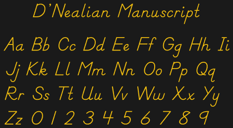
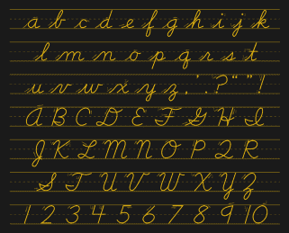
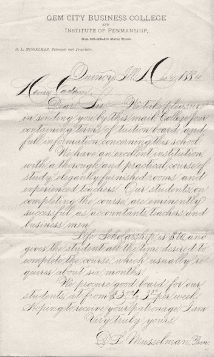
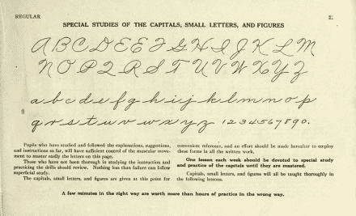
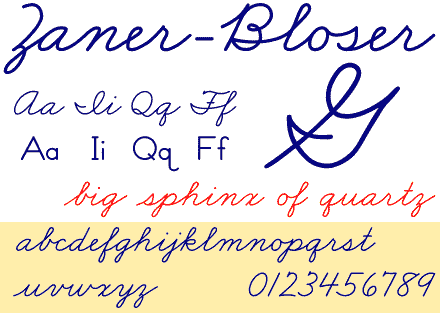
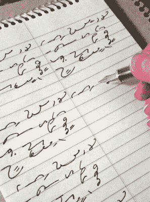

# 诅咒草书的诅咒

> 原文：<https://hackaday.com/2022/09/27/cursing-the-curse-of-cursive/>

可能与大多数人不同，我喜欢手写——但我一直不喜欢签名。这是为什么呢？我觉得是因为签名应该是[草书](https://americanhistory.si.edu/blog/cursive)的，不然不算。至少，这是我从小到大被教导的。(而且我真的没那么老，我发誓！)

和我母亲的名字一模一样意味着对青春期的我来说，与众不同是很重要的，这包括确保我们的签名一点也不像。虽然她温柔的、成圈的手表明了她敏感和友好的天性，但我笨拙的版画只是发泄我青少年焦虑的另一种方式。在过去几十年的某个时候，我的签名变成了`K-squiggle P-squiggle`，这实际上是我的现代笔迹的加速版，是印刷体和草书的结合。

  D’Nealian print. Notice the ‘monkey tails’ on every possible lowercase letter.  D’Nealian cursive. Notice the stroke order and the ridiculous capital Q.

但是让我们倒回去一点。我在幼儿园开始学习写作，但那当然是用脚本，用单独的字母。我和我的同事 Xen NiAl zeigeistians 学会了一种特殊的印刷方法，叫做 T2 D ' nealian T3，它的设计是为了方便从印刷到草书的过渡，每个字母上都有卷曲的尾部。

我们练习了我们的 D'Nealian(好花哨！太成熟了！)写在一种叫做 [Zaner-Bloser](https://en.wikipedia.org/wiki/Zaner-Bloser_(teaching_script)) 的纸上，这种纸至今仍在使用，可能到了二年级，已经从简单的佐罗式小写字母 Zs 过渡到了看起来相当成熟的草书双曲线。就好像我们的笔迹从白天到晚上都在移动，变化和移动的速度和我们一样快。你可能会认为，我们会喜欢学习一种更像我们自己的写作方式——模糊的活动，一切都是相互联系的，一个奇怪的模块化字母表，本该在成年后很好地为我们服务。但是我们没有。我们讨厌它。你可能也是。

### 强化的源泉

是这些象形文字的死记硬背吗？我们的老师在给任何东西打分时，似乎对我们的笔迹给予了极度的关注？也许这是事实，在美国，没有真正的成人礼附加到学习书写或草书，除了你逃脱了糟糕的分数在书法部。或者不管怎样，最终你不得不用钢笔而不是铅笔。我记得我被激起用不可擦除的蓝色墨水而不是模糊的可擦除石墨书写细线。

Thomas’ first fountain pen. Image via [Lamy](https://us-shop.lamy.com/en_us/fountain-pen-lamy-abc.html#)

在其他国家，孩子们在某些时候被迫使用自来水笔。据主编埃利奥特说，德国孩子都会在某个时候去商店挑选他们的第一支自来水笔，这让我非常开心。这就是美国本土草书辩论所缺少的一切吗？一点点~~受贿~~正强化？是啊，也许吧。如果有一件事用钢笔比用圆珠笔更容易，那就是创造更有创意的字体的能力。[钢笔](https://hackaday.com/2021/03/29/a-few-of-my-favorite-things-pens/)都是用不同的压力跳舞，形成适当平衡的粗细线条，而受压的[圆珠笔](https://hackaday.com/2020/12/17/tech-hidden-in-plain-sight-the-ballpoint-pen/)只会产生更暗的单线字母。

### 草书的相关历史

信不信由你，随着时间的推移，草书变得越来越容易。从 1850 年到 1925 年，打字机被广泛采用的时期，每个美国人都学习了斯宾塞体文，这是一种纤细的、高对比度的手写字体，由一个叫普拉特·罗杰斯·斯潘塞的人发明。[帕尔默方法](https://en.wikipedia.org/wiki/Palmer_Method)意在简化斯宾塞手稿，与之竞争的[赞纳-布洛泽](https://en.wikipedia.org/wiki/Zaner-Bloser_(teaching_script))手稿也是如此，它是在 1900 年左右开发的。Zaner-Bloser 接手了印刷和草书两种不同的字母，但两者在字体上的巨大差异导致了 1978 年 D'Nealian 的发展。通过在每个印刷体字母上添加“猴尾”，孩子们逐渐习惯了字母可以很容易地连接在一起的想法，并开始相信草书比印刷体快得多。

  Spencerian script sample. Image via [Wikipedia](https://en.wikipedia.org/wiki/Spencerian_script)  The Palmer Method’s alphabets. Image via [Wikipedia](https://en.wikipedia.org/wiki/Palmer_Method)  A little bit of Zaner-Bloser. Image via [Wikipedia](https://en.wikipedia.org/wiki/Zaner-Bloser_(teaching_script))

### 一种比猪拉丁语更私密的语言(或者:草书是颠覆性的)

Believe it or not, each squiggle represents an entire word. Image via [Pinterest](https://www.pinterest.com/pin/219972763026676843/)

人们肯定会说现在是 2022 年——我们已经习惯了使用各种键盘，无论你使用十个手指还是两个拇指，这本身就是一种技能。我们不再给对方留便条，而是在房间的另一头发短信，甚至发短信。如果我们真的手写一些东西，那往往是仓促而潦草的；我们生活的时代的产物。手写需要耐心，即使你写得很快。最近又缺一样东西。

所以为什么要费心去学草书而不仅仅是好看的印刷体呢？简单地说，一旦你知道了草书是怎么回事，你就知道要寻找什么，所以你就能很好地阅读各种笔迹，草书或其他。(活到老，学到老。)而且一般来说，用草书写比用印刷体写快。

正如婴儿潮一代所说，对于许多 25 岁以下的人来说，草书看起来像是一种外国语言或秘密语言，所以可以随意尝试使用它。(但如果你真的想淘汰读者，那就去学学格雷格速记吧——这就像草书微积分，或者至少是高等代数。)我母亲的大部分职业生涯都是做法律秘书，她在速记簿上记录口述时，速度大概能跟得上法庭书记员，至少直到她的手抽筋。

### 数字世界中的印刷

好吧，忘了草书吧。当你可以用手机或笔记本电脑这样或那样做笔记时，为什么还要手写呢？如果你真的想学习或记住一些东西，你就不能不把它写下来。

我们甚至还没有开始谈论在 OCR 世界中合并历史手写文档的模数转换方面，谈论手写字体的讽刺，甚至没有为拥有漂亮的手写字体进行辩护。所以加入我的第二部分，好吗？

通过 [Unsplash](https://unsplash.com/photos/y02jEX_B0O0) 的主图像和缩略图