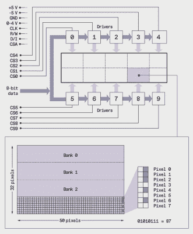
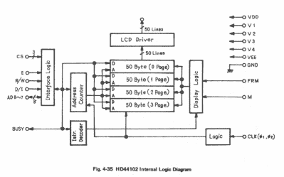

# TRS-80 型号 100 获得 Arduino 心脏移植

> 原文：<https://hackaday.com/2022/09/23/trs-80-model-100-gets-arduino-heart-transplant/>

当[Stephen Cass]发现自己有一台坏了的 Tandy TRS-80 Model 100 便携式计算机时，最简单的解决方法是再买一台坏的，用两台不能工作的计算机制作一台可以工作的计算机。然而，这让他进退两难——如何处理剩下的(现在甚至更多)残破的？

LCD layout is unusual by modern standard, but optimized for fast updates

自然地，他做了我们很多人都会做的事情，使用现代硬件与仍然工作的原始部件进行接口。在这种情况下，这意味着[用 Arduino Mega 2560](https://spectrum.ieee.org/upcycle-a-vintage-lcd) 替换主板。

幸运的是，Model 100 拥有大量粉丝，网上有很多有用的信息，包括详细的[维修手册](https://archive.org/details/TandyM100ServiceManual/page/n7/mode/2up)，帮助【Stephen】了解如何驾驶这款不同寻常的显示器。LCD 的分辨率为 240×64 像素，分为八个 50×32 像素的区域和两个 40×42 像素的区域。然后，每个区域被进一步分成四组，每组八个像素高，因此每列八个像素对应一个字节。

十个区域中的每一个都由单独的 [HD44102](https://www.alldatasheet.com/datasheet-pdf/pdf/169418/HITACHI/HD44102.html) 驱动器 IC 控制，连接到 30 位宽的总线，用于选择正确的芯片、存储体和列。

由于 Arduino 处理数据，旧的 LCD 仍然需要-5 V 电源用于对比度，并需要一个 RC 滤波器来平滑[Stephen]用来调整视角的 PWM 信号。

通过新的界面，[Stephen]能够访问原始显示器上的所有像素，并使用现代图形库，如 [displayio](https://docs.circuitpython.org/en/latest/shared-bindings/displayio/) 。随着显示问题的解决，他打算使用单独的 Teensy 4.1 与键盘矩阵连接，并提供 VT100 终端接口。

Schematic of the HD44102 driver circuit

升级旧的、坏的硬件很有趣，而且总是有教育意义的。了解为什么在工程权衡不同的时候做出某些设计决策，可以在资源紧张时获得与现代设计直接相关的见解。在这种情况下，古怪的 LCD 驱动程序是为了尽可能高效地显示文本，以免处理器负担过重。

TRS-80 电脑的“为服务而建”设计已经成熟，我们过去也展示过一些。一些用更新的东西代替了主板，比如【Stephen】，而另一些[也替换了显示屏](https://hackaday.com/2021/01/17/trs-80-model-100-gets-64-bit-cpu-and-a-very-wide-lcd/)，或者[将它们连接到手机网络](https://hackaday.com/2018/01/04/trs-80-model-100-goes-cellular/)。

你找到让旧硬件工作的新方法了吗？请在下面的评论中告诉我们，或者在[黑客提示热线](https://hackaday.com/submit-a-tip/)上给我们发消息。

感谢【nb0x0308】的提示！