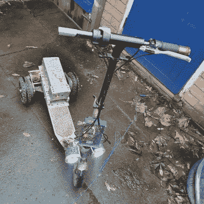

# 给电动滑板车增加第三个轮子(和速度提升)

> 原文：<https://hackaday.com/2022/09/24/adding-a-third-wheel-and-speed-boost-to-an-electric-scooter/>

[托尼]的三轮电动滑板车是如何诞生的故事有一个听起来很熟悉的开头。一天，他正在浏览海外经销商，偶然发现了一个新零件，紧接着一个好主意仙女来了。这也是他去年将自己的 DIY 电动滑板车升级为三轮的原因，在这个过程中速度大大提高了！

 【托尼】碰到的部件是一个双无刷驱动装置，用于机动化一块登山板。山地板是一种越野滑板，这个单元在一个方便的包中提供了两个动力轮。[托尼]最终从他的电动滑板车上卸下了后轮，换上了动力山地车组件。

他还制作了自己的基于 Arduino 的控制器接口，提供单独的油门和制动输入，因为传统的滑板车油门并没有真正跟上新的(更强大的)滑板车的速度。用电池把所有东西连接起来后，三轮电动滑板车就诞生了。它甚至有前灯！

[【托尼】对自己制作电动滑板车并不陌生](https://hackaday.com/2019/06/24/failed-scooter-proves-the-worth-of-modular-design/)，而且零件容易获得的事实使得这种车辆实验几乎可以在任何人手中进行。所以，如果你发现自己受到了启发，为什么不订购一些东西，把这些东西组合在一起，去一趟[唯一的限制是个人勇气的地方](https://hackaday.com/2018/04/23/3000w-unicycles-only-limitation-is-personal-courage/)？