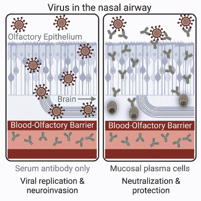

# 鼻内疫苗:冠状病毒大流行的潜在出口

> 原文：<https://hackaday.com/2022/09/29/intranasal-vaccines-a-potential-off-ramp-for-coronavirus-pandemics/>

关于人类免疫系统的一个有趣但也令人讨厌的方面是，它不是一个整洁、集中的系统，在这个系统中，你在一个地方输入一种抗原模式，突然体内的每个 T 和 B 淋巴细胞都知道如何攻击入侵者。通常，免疫局限于特定区域，如血管和淋巴系统，以及身体的肠道和粘膜(鼻)部分。

其结果是，特定类型的疫苗具有不同的效果，正如用[脊髓灰质炎疫苗](https://en.wikipedia.org/wiki/Polio_vaccine)非常简洁地证明的那样。口服脊髓灰质炎疫苗(OPV)和灭活疫苗(注射脊髓灰质炎疫苗，或 IPV)之间的主要区别是，前者使用一种弱化的病毒，在肠道中诱导强大的免疫力，而后者没有这种功能。这样做的效果是，虽然两者都保护了个人，但不会影响脊髓灰质炎病毒的粪-口感染途径，从而不会影响社区传播。

疫苗的最佳结果是，它既能保护个体，又能作为所谓的消毒免疫的一部分防止进一步感染。后一种特性使得 OPV 疫苗如此有吸引力，因为它可以防止社区传播，而 IPV 疫苗足以作为常规疫苗接种的一部分。决定使用像 OPV 和 IPV 这样的疫苗是医生可以调整人群对疾病的保护的方法之一。

这就是当前一批常用的新型冠状病毒疫苗显示出的主要问题，因为它们不能在鼻腔粘膜组织中提供显著的免疫力，即使这是病毒最初感染宿主的地方，也是病毒复制和感染其他宿主的地方。在这里，鼻内疫苗可以达到 OPV 治疗脊髓灰质炎的效果。

## 去打一拳

从逻辑上讲，靶向鼻内(IN)疫苗以解决冠状病毒具有很大的意义，因为冠状病毒是与例如普通感冒有关的一组病毒之一。像鼻病毒和腺病毒一样，它们是强烈适应呼吸系统的病毒，就像脊髓灰质炎病毒喜欢肠道一样。基于这一认识，多种鼻内疫苗已被开发和批准，大多数[最近在印度和中国](https://www.nature.com/articles/d41586-022-02851-0)。

中国疫苗由 CanSino Biologics 开发，它与常规的基于病毒载体的肌内(IM)疫苗基本相同，只是它的形式允许它在喷雾器中吸入。它被批准在初次 IM 疫苗接种后用作加强剂。

Bharat Biotech 公司生产的印度疫苗( [BBV154](https://www.bharatbiotech.com/intranasal-vaccine.html) )旨在接种两剂疫苗，而不仅仅是加强疫苗。CanSino 和 Bharat 疫苗都基于非复制型腺病毒载体，这意味着雾化形式不需要特殊的疫苗配方。在吸入雾化疫苗后，腺病毒载体将简单地做它自然做的事情:进入粘膜细胞沉积其遗传有效载荷。

这些 in 疫苗加入了 2021 年 10 月 31 日在伊朗获得紧急使用授权的伊朗[拉齐 Cov Pars](https://en.wikipedia.org/wiki/Razi_Cov_Pars) 疫苗(三剂基于重组蛋白亚单位的 IN 加强剂)。虽然还没有这些疫苗的大规模疗效数据，但最近在小鼠身上进行的一项[美国研究](https://www.niaid.nih.gov/news-events/mva-nasal-study)已经证实，基于病毒载体的疫苗可以诱导强大的免疫力。在 2021 年由 [Van Doremalen 等人](https://www.science.org/doi/10.1126/scitranslmed.abh0755)使用[cha DOX 1](https://en.wikipedia.org/wiki/ChAdOx1)nCoV-19/azd 1222([阿斯利康](https://en.wikipedia.org/wiki/Oxford%E2%80%93AstraZeneca_COVID-19_vaccine))病毒载体进行的一项研究中，发现仓鼠和猕猴的疫苗接种可防止大规模感染，并显著降低粘膜病毒载量。

这些发现是西方科学家推动疫苗上市的根本原因，一些美国科学家，包括斯克里普斯研究公司的埃里克·托普和 T2，呼吁建立一个相当于“曲速行动”( OWS)的“曲速行动”,该行动最初生产了从 2020 年末开始在欧洲和北美使用的 IM 疫苗。人们希望，在西方获得批准的疫苗可能会抵消新型冠状病毒病毒的持续传播，因为 IM 疫苗对新病毒变种的效力正在减弱。

## 长期的努力

Viral infection with and without nasal mucosal immunity. (Credit: Wellford et al., 2022)

与病毒越来越相关的一个方面是被称为“长 COVID”的慢性疾病的集合，其中包括血凝块( [Knight 等人](https://www.ahajournals.org/doi/10.1161/CIRCULATIONAHA.122.060785)，2022)和阴性神经结果([徐等人](https://www.nature.com/articles/s41591-022-02001-z)，2022)。值得注意的是，对于如此长的 COVID 病例，患者不必表现出严重的新冠肺炎症状，也不必住院。

其原因可能是，虽然 IM 疫苗在血管系统中诱导免疫反应，这通常有效地保护身体的器官，但这似乎不能为嗅觉上皮和大脑提供保护，这两者都可以从鼻腔的粘膜组织直接感染( [Wellford 等人](https://www.cell.com/immunity/fulltext/S1074-7613(22)00411-3)，2022)。

尽管新型冠状病毒感染在粘膜组织内提供了恢复期免疫力(即抵抗感染)，但这种免疫力会随着时间的推移而减弱，很像新型冠状病毒疫苗接种所提供的免疫力。由于每次感染都有永久性损伤(和死亡)的风险，理想的方法似乎是一年两次加强免疫(与大约 6 个月的效力下降相匹配)，这可以提供杀菌免疫。

从本质上讲，这就是为什么疫苗越来越多地被视为有效应对这些呼吸道病毒的一种可能方式，因为它们应该为个体提供更好的保护，同时还限制社区传播。

## 制造疫苗的工作

尽管人们可能认为已经有三种 in 疫苗获得了(紧急)授权，但 IN 疫苗并不常见。也许最著名的尝试要追溯到新型冠状病毒疫情之前，以流感疫苗( [LAIV](https://en.wikipedia.org/wiki/Live_attenuated_influenza_vaccine) )的形式出现，这是迄今为止唯一一种 FDA 批准的疫苗。这种流感疫苗值得注意的是使用减毒流感病毒，而不是 IM 流感疫苗的灭活病毒，并提供与 IM 流感疫苗相当的效力。它的主要吸引力在于它避免了针头的使用，并且不需要训练有素的人员来注射疫苗。

疫苗测试的挑战在于[缺乏黏膜免疫的标准化测试](https://www.the-scientist.com/bio-business/nasal-vaccines-are-commercially-high-risk-perhaps-high-reward-70068)。这在很大程度上是因为没有受到太多的关注，这使得对这种疫苗进行大规模试验并评估其效力在很大程度上是许多监管机构未探索的领域。即便如此，阿斯利康和其他制药公司目前正在新型冠状病毒进行疫苗试验。

IM 疫苗是否可以作为 IN 疫苗，主要取决于疫苗的类型。亚单位类型的疫苗(例如拉齐 Cov Pars)可能需要[佐剂](https://en.wikipedia.org/wiki/Adjuvant)以产生足够强的反应，而基于腺病毒的 IM 疫苗基本上可以按原样使用，因为如前所述，腺病毒天然感染粘膜组织。例如，在目前正在进行的阿斯利康疫苗试验中，在缺乏明确的方案和技术的情况下，面临的挑战似乎主要是确定效力。

[![Effect of nasal vaccines on the upper and lower respiratory tract for the generation of mucosal and systemic immunity. (a) Protective immune responses in the nasopharynx-associated lymphoid tissue (NALT), with the pathogen-mediated reaction resulting mainly from by secretory IgA antibodies generated by mucosal epithelial cells. (b) Humoral immune response in the lower respiratory tract with bronchus-associated lymphoid tissue (BALT) having humoral as well as mucosal/local immune responses. Abbreviations: CTL, cytotoxic T lymphocyte; DC, dendritic cell; NK, natural killer; TCR, T cell receptor. (Credit: Chavda et al. 2021)](img/be809e24339c554f68aa5dde6eddb25f.png)](https://hackaday.com/wp-content/uploads/2022/09/nasal_vaccine_effect_chavda_et_al_2021.jpg)

Effect of nasal vaccines on the upper and lower respiratory tract for the generation of mucosal and systemic immunity. (a) Protective immune responses in the nasopharynx-associated lymphoid tissue (NALT), with the pathogen-mediated reaction resulting mainly from by secretory IgA antibodies generated by mucosal epithelial cells. (b) Humoral immune response in the lower respiratory tract with bronchus-associated lymphoid tissue (BALT) having humoral as well as mucosal/local immune responses. Abbreviations: CTL, cytotoxic T lymphocyte; DC, dendritic cell; NK, natural killer; TCR, T cell receptor. (Credit: Chavda et al. 2021)

IN 疫苗的另一个挑战是，鼻粘膜表面通过形成捕获潜在病原体的粘性陷阱来提供针对感染的先天保护( [Chavda 等人](https://www.ncbi.nlm.nih.gov/pmc/articles/PMC8319039/)，2021)。这也是为什么在肌内 mRNA 疫苗中使用的充满 mRNA 的液体纳米颗粒似乎不太适合在疫苗中使用。由于这些依赖于让身体细胞从 mRNA 中产生靶抗体，缺乏有效的方法让 mRNA 进入细胞是一个主要障碍，这是病毒载体根据其基本设计不必处理的事情。

## 观望

现在全世界可能有数十亿人可以获得新型冠状病毒疫苗，这有望为新型冠状病毒疫情做些什么，就像 OPV 在 20 世纪 50 年代和 60 年代为脊髓灰质炎做的那样。根据这些疫苗授权的效力，一些地区甚至国家可能会发现自己能够在几年内宣布社区传播的结束，如果不是更短的话。

与此同时，西方制药公司仍在进行自己的疫苗试验，明年可能会有积极的结果。所有这些都意味着，如果没有 OWS 那样的推动，伊朗、印度和中国可能最早在明年就让我们初步看到呼吸道病毒疫苗的未来。

如果运气好的话，它不仅能为新型冠状病毒疫情提供最受欢迎的疫苗，还能提供急需的 R&D 疫苗。毕竟，谁不想要一年两次的鼻喷剂来预防普通感冒，或者更有效的流感疫苗呢？

标题图片:由劳伦·毕夏普为[疾病控制和预防中心](https://www.cdc.gov/)拍摄