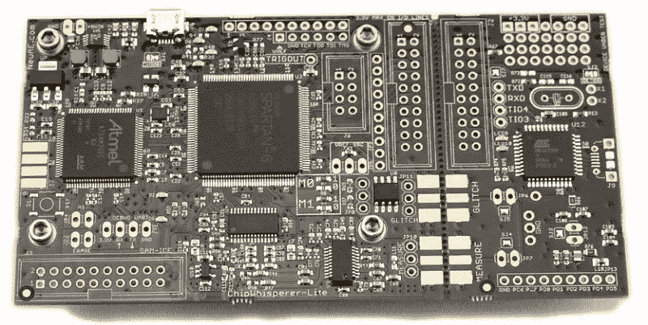

# 马修·奥尔特在为正义而战

> 原文：<https://hackaday.com/2022/09/30/matthew-wrongbaud-alt-is-fighting-the-good-fight/>

在一个完美的世界里，我们所有的电子设备都会有完整的文档，而且会有开源库可以用来连接我们想要的任何东西。永远不会有任意的封锁阻止我们以制造商不认可的方式使用硬件，并且“云”不会是地球另一端某个数据中心的黑匣子服务器，而是一个透明而灵活的基础架构，用于安全地存储和共享信息。

不幸的是，这不是我们生活的世界。更糟糕的是，这个行业似乎在朝着相反的方向前进，而不是朝着电子乌托邦前进。似乎每个月我们都会听到另一项服务被关闭，留下可行的硬件在风中扭曲。就在昨天，谷歌宣布他们将在明年年初退出 Stadia 游戏流媒体服务——让用户拥有独特的互联网连接控制器，不再有后端通信。

Matthew Alt

幸运的是，还有像马修·奥尔特这样的人。这位多产的黑客专门从事逆向工程，他不仅擅长弄清楚事物如何工作，还擅长与他人交流这些发现。他的征服已经多次为这些页面增光添彩，我们很幸运地让他在 2020 年为 HackadayU 的 ghid raT3【级】掌舵 [*逆向工程导论。本周，他在 Hack Chat 上谈论了逆向工程*](https://hackaday.io/course/172292-introduction-to-reverse-engineering-with-ghidra)的[过去、现在和未来。](https://hackaday.io/event/187001-reverse-engineering-hack-chat)

马修在大学期间开始从事逆向工程，当时他在一家专门调谐发动机控制单元(ECU)的商店工作。他负责弄清楚 ECU 是如何工作的，这最终将允许它们被修改，以改善发动机性能，超越车辆的库存配置。有时，这涉及到上传修改后的校准数据，或禁用对发动机性能有害的功能。这些软件的变化可能会使发动机输出增加多达 50 马力，尽管他说有时目标只是增加油门响应，这样车辆在路上会感觉更具侵略性。

谈到交易工具，Matthew 解释了为什么他更喜欢使用 Ghidra 作为嵌入式目标，而不是像 IDA Pro 这样的经典逆向工程工具。作为一个例子，他提到了最近的一个项目，在这个项目中，他使用 Ghidra 的 API 和中介语言 PCode 来破解 Game Boy Advance 游戏中的密码。尽管他确实提到，如果你想看一些 Windows C++软件，IDA 仍然有它的位置。

Matthew 还指出了用于处理故障注入的新技术和工具，这些技术和工具在过去的几年中开辟了许多令人兴奋的可能性。事实上，他说随着新设备采用先进的安全功能，像芯片密语这样的工具将变得非常有价值。当小工具使用安全引导和加密固件时，要获得访问权限，不仅仅是在板上找到一个无铅串行端口。故障攻击将变得越来越普遍，所以你最好现在就开始行动。

Colin O’Flynn’s ChipWhisperer makes side-channel power analysis and glitching attacks far more accessible.

为此，马修指出了一些指导课程，这些课程是他和乔·格兰德等其他 T2 硬件黑客为那些想开始实践逆向工程并有一些可支配收入的人准备的。对于那些更愿意自己解决问题的人，他提供了几个[夺旗(CTF)活动](https://microcorruption.com/)和[战争游戏的链接，你可以用它们来磨练你的技能](https://pwnable.kr/)。

我们要感谢 Matthew Alt，他不仅来到了 Hack Chat，还成为了 Hackaday 社区的好朋友。他的工作对我们所有人来说都是鼓舞人心的，当他写了一篇新的博文详述另一个被击败的挑战时，这总是令人兴奋的。下次你最喜欢的 MegaCorp 发布一些反消费者的小玩意时，你可以感到一些安慰，因为你知道他仍然在按照自己的意愿弯曲硬件。

* * *

Hack Chat 是一个每周一次的在线聊天会议，由来自硬件黑客世界各个角落的顶尖专家主持。对于黑客来说，这是一种有趣和非正式的联系方式，但如果你不能现场直播，这些概述帖子以及发布到 Hackaday.io 的[文字记录确保你不会错过。](https://hackaday.io/event/187001-reverse-engineering-hack-chat)