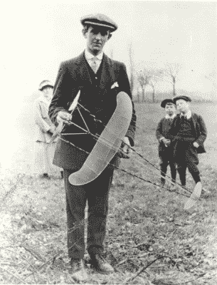

# 橡皮筋巨兽向世界纪录进发

> 原文：<https://hackaday.com/2022/10/06/rubber-band-behemoth-winds-its-way-toward-world-record/>

在要求更多飞机视频的崇拜者的怂恿下，[ProjectAir] [决定打破橡皮筋动力飞机的世界纪录](https://www.youtube.com/watch?v=PJk245qi-PI) …尽管从未建造过橡皮筋动力飞机。为什么是橡皮筋动力？

在小型二冲程发动机变得负担得起之前，在电动发动机和电池成为可能之前，你的模型飞机没有太多的动力选择。一项真正腾飞的技术是橡皮筋动力。通过缠绕橡皮筋，它可以储存足够的能量来短时间转动螺旋桨。正如你在下面的视频中看到的，一个 10 英尺高的模特打破了目前的世界纪录，[ProjectAir]决定看看他是否能打破这个纪录。

Rubber Band Powered Free Flight c1915 By [Unknown author](http://www.transportarchive.org.uk/getobject.php?rnum=G2179&amp;searchitem=&amp;mtv=&amp;pnum=, Public Domain, https://commons.wikimedia.org/w/index.php?curid=11368784) –

从一架由泡沫板制成的成功的自由飞行飞机开始，[ProjectAir]简单地将其放大到 11 英尺的机翼——比 10 英尺的世界纪录保持者大 1 英尺。因为现在有八个橡皮筋马达，所以创造了一种机制来同步释放螺旋桨，但这是有问题的。最终发现了一种稍重但坚固的溶液。

[ProjectAir]做了更多的测试，解决了更多的问题，通过快速迭代，他最终能够在无线电控制下成功飞行。他超过了个人 12 秒飞行的目标，然后吉尼斯打电话来了！他们有兴趣证明他的尝试，只要他的飞机能飞行至少 30 秒——几乎是他目前能力的两倍。他会怎么做？也可以查看视频，了解[ProjectAir]向社区发起的挑战，与他一起努力打破世界纪录。听起来很有趣！

除了为试图打破世界纪录的无线电控制飞机提供动力，你知道你可以建造一个橡皮筋驱动的冰箱吗？是真的！

 [https://www.youtube.com/embed/PJk245qi-PI?version=3&rel=1&showsearch=0&showinfo=1&iv_load_policy=1&fs=1&hl=en-US&autohide=2&wmode=transparent](https://www.youtube.com/embed/PJk245qi-PI?version=3&rel=1&showsearch=0&showinfo=1&iv_load_policy=1&fs=1&hl=en-US&autohide=2&wmode=transparent)

