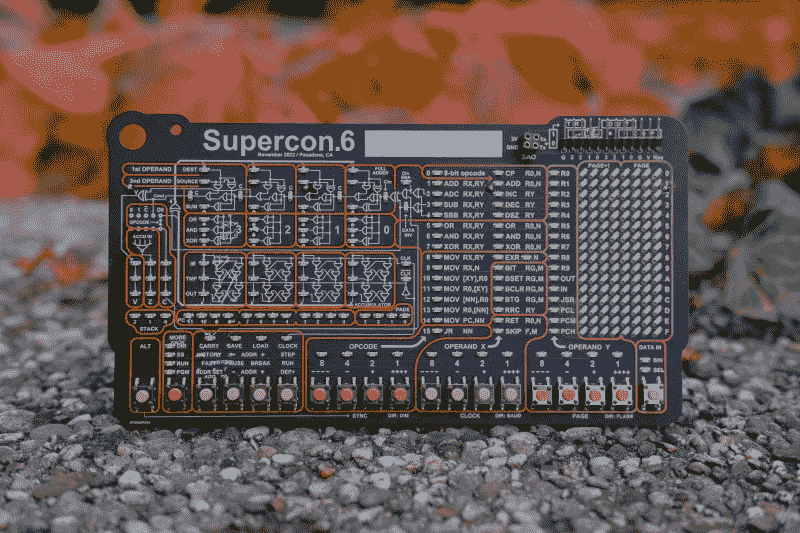
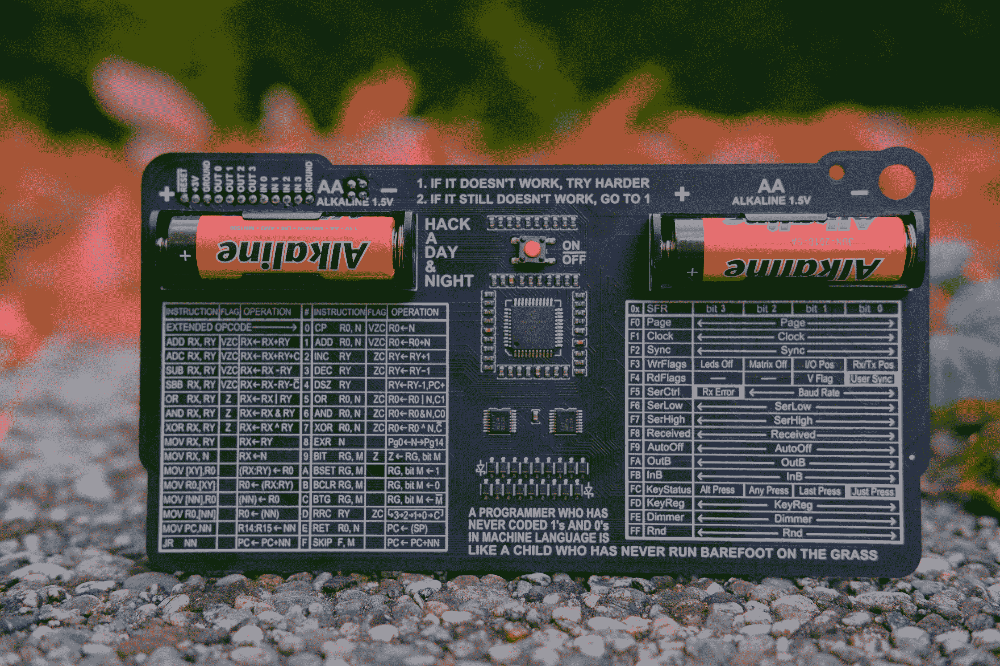
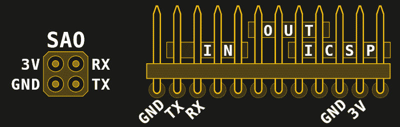

# 2022 年超级计算机徽章是一次穿越计算历史的手持旅行

> 原文：<https://hackaday.com/2022/10/12/the-2022-supercon-badge-is-a-handheld-trip-through-computing-history/>

在过去的几年中，有一种趋势是设计更加复杂和强大的电子活动徽章。彩色显示器、传感器、WiFi、USB、蓝牙——凡是你能想到的，可能都有一个 con 徽章把它们打包了。甚至我们自己的 2019 Supercon 也开辟了新的领域，包括运行 RISC-V 内核的 Lattice LFE5U-45F FPGA。诚然，观察这场非官方的军备竞赛令人着迷。但是众所周知，黑客并不是由他们所拥有的工具来定义的，而是由他们运用这些工具的技巧和想象力来定义的。

所以今年，我们采取了一种稍微不同的方法。我们决定回到井里，而不是试图用比 2019 年更先进的硬件来填充徽章。2022 Supercon 徽章是一个教训，告诉我们真正控制一个硬件意味着什么，知道每一位内存在做什么，为什么。毫无疑问，这将是一个挑战。事实上，我们敢打赌，11 月 4 日拿到徽章的大多数人之前都没有从事过类似的工作。人们会被拉出他们的舒适区，但是，当然，这是整个想法。

## 虚拟逆向计算机

那些精通桌面计算历史的人可能会发现今年 Supercon 徽章的正面令人奇怪地想起。装饰着按钮和发光二极管，它的设计类似于早期微型计算机的前面板，如在战争游戏中出名的 Altair 8800 和 IMSAI 8080。

[](https://hackaday.com/wp-content/uploads/2022/10/DSCF3242.jpg)

但是相似之处不仅仅是表面上的。这个徽章不仅仅看起来像早期微处理器的前面板，它实际上是。嗯，至少是模拟的。当徽章背面的 PIC24FJ256GA704 在技术上运行时，用户与传奇人物 Voja Antonic 设计的虚拟 4 位处理器[进行交互。](https://hackaday.io/project/182568-badge-for-2020-supercon-years-of-lockdown)

程序可以通过徽章正面的一排触摸按钮一点一点地输入电脑。每个 12 位序列由一个操作码和一个或两个操作数组成，存放在程序计数器 led 指示的内存地址中。如果你犯了一个错误(你会的)，你可以通过程序计数器来检查和纠正给 CPU 的指令。

[](https://hackaday.com/wp-content/uploads/2022/10/DSCF3244.jpg)

为了帮助你，徽章的 4 位 CPU 接受的 31 条指令列在电路板的背面。此外，一旦您输入了二进制操作码，徽章正面相应助记符旁边的 LED 就会亮起。虽然丝印笔记不能与 Voja 收集的特殊文件相比，但至少你会有一个快速的参考。

由于所有操作码的长度都在 4 到 8 位之间，编程也变得更加容易。虽然像 Altair 这样的机器可能要求每条指令存放多达三个二进制序列，但较短的操作码意味着总有足够的空间来同时输入所需的操作数。

[](https://hackaday.com/wp-content/uploads/2022/10/badge22_full_instruction.png)

## 扩展空间

真正的早期计算机，徽章试图模仿，没有太多的板载硬件。在隔离状态下，所有的输入都是徽章前面的物理按钮，输出仅限于使用 8×16 LED 阵列显示的内容，该阵列提供了一个进入 CPU 内存的窗口。对文档的仔细检查确实揭示了有一个伪随机数发生器可以使用，但是不要期望比这更奢侈。

但是别担心，我们不会让你没有成长的空间。正如你可能对现代电子活动徽章的期望一样，有一个 4 针[简单附加(SAO)插头](https://hackaday.io/project/175182-simple-add-ons-sao)，可以让你插入各种小工具和活动。在这种情况下，标准的 I2C 数据和时钟信号已经被简单的 UART 取代，但这不应该破坏与大多数附加设备的兼容性，这些附加设备除了从端口获取功率之外没有什么作用。

[](https://hackaday.com/wp-content/uploads/2022/10/badge22_expansion.png)

徽章右上角还有一个 12 针标准间距接头形式的专用 I/O 连接器。该接头与 SAO 连接器共享 UART TX 和 RX 引脚，但功能更多。首先，如果你想或需要重新编程，它可以作为徽章的电路串行编程器(ICSP)接口。但更有趣的是，它提供了四个输入和四个输出引脚，可以在程序中通过读写适当的内存寄存器来访问这些引脚。

## 分享是关怀

徽章黑客是 Supercon 体验的一大部分，在为期三天的活动中，我们希望看到为这台仿复古计算机开发的各种有趣的软件和硬件。鉴于你的时间相对较短，强烈鼓励团队合作——不要羞于询问其他与会者他们正在做什么，看看你是否能帮忙。

当然，如果共享代码的唯一方式是在纸上潦草地写出二进制代码，那么协作开发就有点困难。如果你只用集成外围设备就能在徽章上完成一些重要的事情，我们会永远尊重你(甚至可能赢得一个特殊的奖项)，但我们没有邪恶到让你这样做。

[](https://hackaday.com/wp-content/uploads/2022/10/badge22_saveload.png) 因此，扩展端口上的 UART 引脚可用于通过标准 USB 转串行适配器将程序从徽章上传到您的计算机。适配器连接好后，您只需将徽章置于`DIR`(直接)模式，然后按下`SAVE`按钮。

这将导致徽章立即开始吐出数据，所以你应该已经有你的接收方设置，并准备在按下按钮。在*nix 机器上，看起来像这样:

```
cat /dev/ttyUSB0 > out.hex
```

如果您按下`LOAD`按钮，该过程反向进行。从您的计算机发送的十六进制文件将被加载到徽章的内存中，在那里可以立即执行。这样，手工输入到一个徽章中的程序可以快速备份并分发给其他人。这也意味着，如果你适当地格式化它，你可以在你的计算机上写代码，然后简单地把它发送到徽章上执行…

顺便提一下，虽然徽章一次只能加载一个程序，但多达 15 个程序可以存储到板载闪存中。这是通过首先按住`ALT`并使用`OPERAND Y`按钮在可用的存储插槽中循环，然后在仍然按住`ALT`的情况下，按下`SAVE`或`LOAD`来实现的。有了这种技术，你可以安全地保存你自己的个人程序，同时你可以尝试任何流行的新魔法。

## 去买一个吧

现在，得到一张票的最好方法是[给自己买一张票，来加入我们的超级演唱会](https://www.eventbrite.com/e/2022-hackaday-superconference-tickets-402410268947)。但是如果你不能来，我们理解。我们将很快发布 Gerbers，一个完整的徽章仿真器，以及 PIC 的代码，敬请关注。