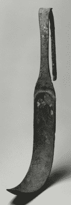

# 出版或灭亡:数据存储与文明

> 原文：<https://hackaday.com/2022/10/13/publish-or-perish-data-storage-and-civilization/>

提到古代文明，你会想到谁？罗马人？希腊人？中国人？印度？埃及人？斯基台人、缪斯卡人、加纳王国人或克马人呢？你可能不容易认出第二组，因为他们都没有书写系统。伊特鲁里亚人、米诺斯人或复活节岛的居民也是如此，只是程度较轻，但没有人记得如何阅读他们的作品。在发现罗塞塔石碑之前，甚至埃及人也是神秘的。我们想象一个用伊特鲁里亚语写作的作者并不认为将来没有人能够阅读这些作品——他们可能认为他们在永远记录他们的思想。狂妄自大？也许吧，但是我们越来越多地以比特形式存储在某个地方的文档怎么办？

当你有穿孔卡片和磁介质时，情况已经够糟了。我们确信有一些磁带格式不再适合阅读。你能读懂磁泡盒吗？这么多年过去了，它还能继续存在吗？但现在问题更严重了。你的《黑客日报》在哪里？你的电子邮件在哪里？“在云端”是老生常谈，但很恰当。1000 年后，将不会有谷歌服务器，无论它现在使用的是什么存储介质，都可能会成为尘土，即使想阅读它的人知道如何阅读。

Do you know the function of this? (Public domain; from the Walters Aret Museum)

而且越来越糟。如果你看到一块石头或一张羊皮纸上有潦草的字迹，你可以推断这是书写。如果你看到一些有结的绳子会怎么样？印加人用这样的系统来记录东西。我们仍然不知道如何阅读它们。未来的考古学家会用闪存卡或硬盘做什么？他们不太可能使用类似的东西，就像我们不太可能使用 stri Gil——罗马人用来清洁自己的刀。如果你看到一个没有背景的东西，你可能会认为它是木工工具，而不是浴室用具。如果你知道如何阅读，为什么我们未来的考古学家会认为一些小盒子里面可能有文字？

## 古董媒体 vs 现代媒体

至少一些最古老的媒体还有一些生存的机会。穿孔卡片和纸带可能和书籍一样坚固。就像石碑一样，很明显，它们保存着数据，很容易解码，甚至可以用手来解码。

然而，磁性的东西就不那么确定了。基于磁带的氧化物不会永远存在，它们上面的磁性信息更加脆弱。光学媒体可能会持续，但你很难确定是否意识到数据被编码了。他们可能会被误认为艺术。磁带也有同样的问题。很容易想象未来的某个博物馆会展示一些用于未知宗教仪式的带子，这些宗教仪式包括带有高架地板的避难所。

现代媒体很可能是基于 flash 的，这肯定不会永远持续下去。更难意识到他们身上可能有什么东西。即使是现在，我还能在我的桌子上看到六个 USB 设备，其中一半不是闪存盘，但看起来也没什么不同。

然后是所有的云数据。当然，它确实存储在硬盘的某个地方(磁介质或闪存)。据推测，如果未来的考古学家在某个地方发现了一个埋藏的数据中心，他们可能会解锁大量的数据，但前提是他们意识到这是什么以及如何读取它。

## **编码问题**

即使在今天，如果没有一个系统，读取写在该系统上的磁盘也是很困难的。在一些常见的情况下，这变得更容易了，因为一些格式几乎是通用的，但是总有异常的情况。

作为一个思想实验，想象你是一个未来的考古学家，正在研究 21 世纪的遗迹。你的助手带给你一个拇指指甲大小的黑色小矩形，上面标着“32 GB，10 级”首先，你需要意识到它是一个闪存设备。然后，您需要了解如何给它加电，并通过串行总线向它发送正确的命令，以便从中提取数据。

但好戏才刚刚开始。有了这些数据，您需要弄清楚文件系统的格式。然后你开始钻研不同种类的文件，每一个文件本身都是一个科学项目。PDF 文件？图像和视频？祝你好运。想象一下，如果埃及人出于不同的目的使用不同的象形文字，然后对它们进行数据压缩以尽量减少冗余。

## 真实生活

我们不是唯一在思考这个问题的人。例如，哥廷根大学在过去 40 多年收集的“永久”档案中管理着 5pb 的数据。他们声称他们使用的磁带有 20-30 年的寿命，但管理它们的技术只能使用 10 年。因此，他们不断地将数据从一种介质转移到另一种介质，这需要大约两年的时间才能完成。当然，如果他们停止运作，你可以假设在 300 年或 400 年后，将没有多少机会检索任何数据。

将你的数据“永远”存储在云中的服务并不缺乏，但很难看出他们如何真正保证这一点，以及如果它不起作用将意味着什么。例如， [Ardrive](https://ardrive.io/can-data-really-be-stored-forever/) 使用“blockweave”以分布式方式存储数据，但很容易想象出这可能会被破坏的许多方式。正如大英图书馆数字保存负责人亚当·法夸尔所说，“如果我们不小心，我们对 20 世纪初的了解将超过 21 世纪初。”

不是说纸质记录好很多。纸张会变质。语言消失了。亚历山大图书馆发生了著名的火灾。但是石头似乎能持久。具有讽刺意味的是，我们对图坦卡蒙的父亲奥克亨那坦了解很多，因为埃及人试图通过毁坏他的作品将他从历史中抹去。他们重新利用这些石头，通常作为新建筑的基础，所以我们发现大部分保存完好。

随着我们向更奇特的存储介质推进，问题只会变得更糟。我们已经了解了在玻璃中存储[数据(见下面的视频)和使用液氮在 80K 下进行分子存储。这些都不会比我们今天使用的更明显或更有生命力。事实上，大量使用会使问题变得更糟。](https://www.microsoft.com/en-us/research/project/project-silica/)

 [https://www.youtube.com/embed/n_xvUoHm9Ho?version=3&rel=1&showsearch=0&showinfo=1&iv_load_policy=1&fs=1&hl=en-US&autohide=2&wmode=transparent](https://www.youtube.com/embed/n_xvUoHm9Ho?version=3&rel=1&showsearch=0&showinfo=1&iv_load_policy=1&fs=1&hl=en-US&autohide=2&wmode=transparent)

我们不知道他们有多认真，但“[十亿年档案](https://www.archmission.org/billion-year-archive)”项目确实在埃隆·马斯克的太空旅行特斯拉的手套箱里发送了一个装有艾萨克·阿西莫夫基金会三部曲的石英盘。他们显然还在 2019 年向月球发送了一个图书馆。然而，这些图书馆使用 DNA 存储，这似乎很奇怪，因为我们今天很难恢复旧的 DNA，也很难将微小的文本蚀刻到镍薄膜上。除此之外，它搭载的探测器坠毁了，图书馆的生存也成问题。

 [https://www.youtube.com/embed/Vky3h5_mFYY?version=3&rel=1&showsearch=0&showinfo=1&iv_load_policy=1&fs=1&hl=en-US&autohide=2&wmode=transparent](https://www.youtube.com/embed/Vky3h5_mFYY?version=3&rel=1&showsearch=0&showinfo=1&iv_load_policy=1&fs=1&hl=en-US&autohide=2&wmode=transparent)

然而，很难想象我们的后启示录考古学家在月球漫步，并意识到一些金属箔和一些晶体的重要性。这就引出了两个有趣的问题:第一，你如何为遥远的未来存储显而易见的数据，使其能够保存并被理解？这个问题有点像[外星人的信息](https://hackaday.com/2021/05/06/ask-hackaday-if-aliens-came-by-would-we-even-notice/),很难弄清楚另一个生物能解码什么。如果没有这个答案，我们有一天可能会成为另一个神秘的“失落的文明”。

第二个问题是:如果这种情况以前发生过呢？这有点像疯狂的科学，但是如果某个古代艺术品上有信息编码，而我们甚至不认识它呢？当然，其中一些我们认识，但我们不知道如何处理它们，就像下面视频中的印加绳结一样。有这些问题的答案吗？把它们留在评论里吧。

 [https://www.youtube.com/embed/AmPyz1kCbOw?version=3&rel=1&showsearch=0&showinfo=1&iv_load_policy=1&fs=1&hl=en-US&autohide=2&wmode=transparent](https://www.youtube.com/embed/AmPyz1kCbOw?version=3&rel=1&showsearch=0&showinfo=1&iv_load_policy=1&fs=1&hl=en-US&autohide=2&wmode=transparent)

[Banner image: " [埃及象形文字](https://www.flickr.com/photos/65724937@N02/6191496007)"作者 Martie Swart