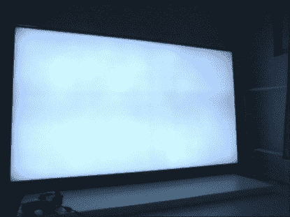

# 补偿电视背光

> 原文：<https://hackaday.com/2022/10/10/compensating-for-your-tvs-backlight/>

[PE kka vnen]有一台松下电视，背光损坏，产生不均匀的粉色/绿色。虽然这对大多数电影来说没什么大不了的，但黑白电影往往表现出最大的效果。因此，通过将失真建模为一个函数，[Pekka]开始寻找一个反函数[，在失真到达电视](http://www.lofibucket.com/articles/tv_backlight_compensation.html)之前对其进行校正。

 然而，对于某些颜色，背光发出的光不够，这意味着蓝色和绿色通道需要变暗。如前所述，失真是不均匀的，因此需要捕捉失真，然后进行计算。

他用手机拍了几张照片，校正了透视，应用了模糊。相机也有一些失真，但作为第一近似值工作，但这不是他在这里涵盖的东西。接下来，他安装了一个网络摄像头，并将其对准电视，试图用 Python 找到好的增益和偏移值。

现在只是变成了最小化每像素差异的问题。最终，他只是选择了随机方法，而不是退火或爬山方法。现在他有一个函数可以应用了，只需要在他的视频播放器中添加一个自定义的着色器，其中包括一个实时着色器编辑器。他不得不修改以支持外部纹理，但是他很友好地在文章中加入了着色器代码和补丁。

结果非常好，对于一台旧电视来说，这是一个很大的用处。但是，也许在某些情况下，完全更换背光是值得的。