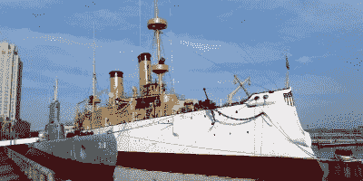

# 不要错过这个周末的费城创客节

> 原文：<https://hackaday.com/2022/10/11/dont-miss-the-philadelphia-maker-faire-this-weekend/>

对于美国东北部正在寻找周末活动的读者，我们谨建议参加 10 月 15 日星期六举行的 2022 年费城创客节一日游。在因新冠肺炎事件停办两年后，该活动已转移到独立海港博物馆隆重回归，并肯定会吸引大量渴望展示其疫情项目的黑客和制造商。

当然，这些事件的本质是你永远不会真正知道你将会看到什么，直到你真正到达那里。但是只要[浏览一下已经确认的项目清单](https://philly.makerfaire.com/meet-the-2022-makers/)，就会发现有一些非常有趣的东西摆在那里——从战斗机器人和全息打印机，到等离子物理学和电动水翼艇。虽然提交项目供官方纳入的截止日期早已过去，但根据经验，我们可以告诉你，这不会阻止人们带着自己的小工具向被俘虏的观众炫耀。尤其是如果它们是可穿戴的那种；除非有人穿了会闪光的东西，否则这不算是真正的制造者集会。

*Olympia* and *Becuna*

当然，集会本身显然是主要活动，但不要忘记，当您在那里时，独立海港博物馆本身也值得一去。你可以参观有 130 年历史的美国军舰奥林匹亚号和 T2 号，这是二战中仅存的巴拉奥级潜艇之一。

虽然社区可能永远不会真正从失去纽约和加州的旗舰制造商 Faires 的损失中恢复过来，但我们确实感到一些安慰，因为我们知道像这样的小型地区性展会在过去几年中一直在增长。它们不仅是与你所在地区志同道合的人联系的好方法，还能帮助你联系到你可能不知道的对制造商友好的供应商和组织。