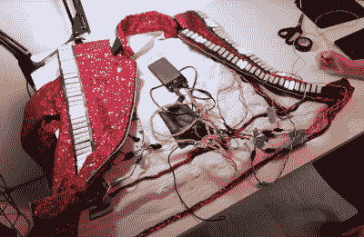

# LED“颤栗”夹克带来的震撼

> 原文：<https://hackaday.com/2022/10/11/thrills-with-an-led-thriller-jacket/>

[路易丝·卡佐维茨]设计了一件[亮灯夹克](https://www.youtube.com/watch?v=K04Jjx3YSFw)，其风格与迈克尔·杰克逊在 1983 年《颤栗》音乐录影带中所穿的夹克相同。[路易丝·卡佐维茨]的颤栗夹克是将缝纫技术和电子技术相结合的完美范例，打造了一件令人敬畏的耐磨夹克。

一件飞行员夹克被用作基础形式，以覆盖亮片和 LED 条。[Louise]使用的不是金属钉带，而是 WS2812B 60 像素/m LED 灯条。3D 打印的透明 PLA“宝石”被放置在 led 的顶部，以模仿原始外壳中的金属钉的形式，并为下面的 led 提供漫射。

每个 LED 灯带都放在一片乙烯灯带上。然后，切割乙烯基顶层，让每个 led 穿透，3D 打印宝石超级粘合在顶部。组装好的 led 灯带通过 Velcro 固定在护套上，布线在衬里材料后面，可以通过小挂钩轻松取下。整个事情是由一个 Arduino Nano 和一个 5 V 电源组驱动的。

随着细节和流程的完成，[Louise]甚至为她的狗做了一件迷你版的夹克。我们之前介绍过 LED [可穿戴设备和时尚](https://hackaday.com/2019/11/24/mimic-artfully-employs-leds-in-fashion/)，【路易丝】的夹克是一个很好的补充。这些项目对于任何想在即将到来的万圣节让朋友们大吃一惊的人来说都是完美的。休息后的视频！

 [https://www.youtube.com/embed/K04Jjx3YSFw?version=3&rel=1&showsearch=0&showinfo=1&iv_load_policy=1&fs=1&hl=en-US&autohide=2&wmode=transparent](https://www.youtube.com/embed/K04Jjx3YSFw?version=3&rel=1&showsearch=0&showinfo=1&iv_load_policy=1&fs=1&hl=en-US&autohide=2&wmode=transparent)

