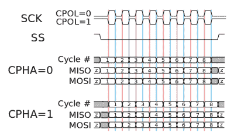
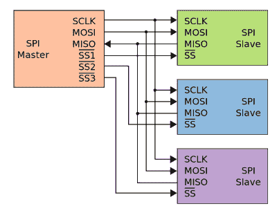

# 裸机 STM32:设置和使用 SPI

> 原文：<https://hackaday.com/2022/10/24/bare-metal-stm32-setting-up-and-using-spi/>

串行外设接口(SPI)最初由摩托罗拉于 1979 年标准化，用于嵌入式系统中的短距离通信。在其最常见的四线配置中，全双工数据传输可以在两条数据线(MOSI、MISO)上进行，数据速率远超过 10 Mb/s。这使得 SPI 适合高带宽、全双工应用，如 SD 存储卡和大分辨率、高刷新显示器。

STM32 器件带有不同数量的 SPI 外设，F042 中有两个 18 Mb/s，F411 中有五个。在 STM32 系列中，SPI 外设相对相似，寄存器布局差异很小。在本文中，我们将了解如何在主机模式下配置 SPI 外设。

## 定义 SPI

关于 [SPI](https://en.wikipedia.org/wiki/Serial_Peripheral_Interface) 的一个有趣但可能令人讨厌的事实是，虽然它可以支持多个器件，但它没有寻址总线，而是要求将器件上的指定引脚拉低，通常称为从机选择(SS)或片选(CS)。SS 为高电平时，从机将其其它引脚置于高阻态模式，从而有效断开 SPI 线路。STM32 SPI 外设提供专用 SS 引脚(NSS ),如果只连接一个器件，可以简化这一过程。一般来说，您需要使用 GPIO 引脚来切换这些 SS 引脚，每个器件一个 GPIO 引脚。

因此，对于四线 SPI，主机和从机通过以下线路连接，SS 线路为每个额外的从机复制:

*   SCLK(串行时钟，来自主机)
*   MOSI(主机输出，从机输入)
*   MISO(主机输入，从机输出)
*   SS(从属选择)

[](https://hackaday.com/wp-content/uploads/2022/10/SPI_timing_diagram.png)

SPI timing diagram, showing the different CPHA and CPOL configurations.

设置 SPI 外设相对简单，需要配置时钟和参数，例如 8 位或 16 位传输。SPI 时钟极性(CPOL)和相位(CPHA)参数不太明显。这里的默认值(模式 0)通常是 CPOL 0 和 CPHA 0，这意味着时钟线空闲为低电平，新数据在当前时钟周期的后沿被推送到数据线上。CPOL 1 和 CPHA 1 导致相反的行为。从机可能支持模式 0 以外的模式，但每个从机的数据手册必须根据具体情况进行查阅。

考虑到所有这些，我们可以看看如何在 F411 和 F042 微控制器上配置 SPI。鉴于上述 STM32 系列 SPI 外设之间的相似性，调整初始化程序相对简单。数据传输程序本身保持不变。

## 设置事物

设置 SPI 主机首先要配置我们将要使用的 GPIO 引脚。这包括设置适当的备用功能(AF)模式和引脚参数，例如端口 a 上 F411 MCU 引脚 4 至 6 上的 AF5，SPI 引脚本身具有以下属性:

*   SCLK:漂浮，推拉，高速。
*   MOSI:漂浮，推拉，高速。
*   MISO:上拉，推挽，高速。
*   SS:上拉，推挽，高速。

由于 SPI 依赖于推挽式配置，而不是 I2C 的开漏配置，因此我们必须设置所有引脚以匹配这一配置，并通过快速 GPIO 速度选项来跟上 SPI 信号。保持引脚悬空还是激活其上拉电阻主要取决于这些引脚的功能。对于 select 引脚，必须将其保持在高电平状态，以防止在系统完成初始化之前意外激活器件。

激活 MISO 引脚的上拉电阻是为了在未选择任何器件时使该线路保持已知状态，因此没有器件驱动 MISO 线路。即使主机没有读取传入数据寄存器，中间电压也可能[导致问题](https://electronics.stackexchange.com/questions/234703/spi-bus-termination-and-pull-up-resistors)，例如过度的[功率消耗](https://www.avrfreaks.net/forum/why-have-pullup-mosi-and-miso)。

如此配置 GPIO 引脚后，目标 SPI 外设在相关的复位和时钟控制(RCC)使能寄存器中使能。例如，SPI 1 外设在`RCC_APB2ENR`寄存器中使能，而 SPI 2 和 SPI 3 通常位于 APB1 总线上，因此在 RCC 的相应寄存器中使能。接下来是配置 SPI 外设本身。

这里要配置的第一项是`SPI_CR1`寄存器中的 SPI 时钟分频器(波特率，`BR`)。这使用 APB 频率(外设总线频率，或 f [PCLK] )作为 SPI 时钟的输入，可以使用三位分辨率将其设置在 f [PCLK] /2 和 f [PCLK] /256 之间。应选择分频器来实现合理的时钟，从而提高应用的传输速度。

虽然 F0 和 F4 系列的默认传输大小都是 8 位，但后者的外设只允许在`SPI_CR1` `DFF`(数据帧格式)寄存器中将数据帧格式设置为 8- 16 位。使用 F0 的 SPI 外设，在`SPI_CR2`寄存器中配置其 DS(数据大小)值时，选项范围要大得多。这是一个 4 位值，允许将数据大小配置为 4-16 位之间的任意值，例如 8 位对应于 b0111。

除非有特殊要求，否则默认 8 位数据大小、默认模式 0 配置和默认 MSB 优先设置是适用于大多数 SPI 器件的良好默认选择。这意味着在所有情况下只需配置时钟除数，之后可以在`SPI_CR1` ( `MSTR`)中启用主机模式。然后可以通过设置`SPI_CR2`中的`SSOE`来启用 SS 引脚并将其设置为输出。

最后，可以通过设置`SPI_CR1`中的`SPE` (SPI 外设使能)来使能 SPI 外设。

## 数据传输

[](https://hackaday.com/wp-content/uploads/2022/10/common_spi_layout.png)

Typical SPI bus: master and three independent slaves. (Credit: Cburnett)

如前所述，SPI 支持全双工传输。这增加的复杂性来自 SPI 的完全同步特性:主机每将一个字节放在 MOSI 线上，从机就会将一个字节放在 MISO 线上，反之亦然。由于时钟线由主机发送的字节驱动，因此为了从从机接收数据，主机必须将 MISO 上每个字节的数据(例如空字节)放在 MOSI 上。

一种解决方法是使用`SPI_CR1`中的`BIDIMODE`将 SPI 总线从四线配置更改为三线(半双工)配置，这需要在传输之间繁琐地重新配置外设。通常情况下，您会希望只在 MOSI 上放置空字节来省去这个麻烦。

为了向从机发送字节，在拉低目标的 SS 线后，我们遵循以下顺序:

1.  等待`SPI_SR_TXE`(状态寄存器:发送寄存器为空)变为真。
2.  将数据(8-16 位)写入`SPI_DR`。如果需要写入更多数据，从(1)开始重复。
3.  等待`SPI_SR_TXE`再次变为真。
4.  等待`SPI_SR_BSY`(状态寄存器:总线忙)变为假。

再次拉高 SS 即可结束该序列，但请注意，一些 SPI 从机支持在单个序列中执行多次写操作。这个序列中的一个问题是，当我们向`SPI_DR`写入 16 位的<数据时:即使我们向这个寄存器写入一个 8 位的`uint8_t`变量或类似的变量，它最终总是会向寄存器写入 16 位，我们的数据加上这个填充被放到 MOSI 上，破坏了数据传输。为了解决这个问题，我们必须将 SPI_DR 寄存器设置为所需的大小，例如，对于 8 位数据阵列:

```

*((volatile uint8_t*) &(SPI1->DR)) = data[i];

```

为了从从机接收数据，我们要么将 SS 拉低，要么在前一个传输序列之后保持低电平，并遵循以下序列:

1.  等待`SPI_SR_BSY`变为假。
2.  将虚拟数据(例如 0x00)写入`SPI_DR`以产生时钟信号。
3.  等待`SPI_SR_RXNE`(状态寄存器:接收数据寄存器不为空)变为真。
4.  将数据从`SPI_DR`读入本地缓冲区。返回(1)以接收附加数据。
5.  等待`SPI_SR_BSY`来假。

这里，再次拉高 SS 也可以结束序列。请注意，写入虚拟数据与发送数据面临相同的问题。在写入数据之前，确保`SPI_DR`寄存器被正确转换。至于为什么我们同时读写`SPI_DR`是因为它是一个共享寄存器，连接到 SPI 外设的 TX 和 RX FIFOs。

最后，为了执行全双工收发操作，我们可以将这两个序列结合起来，在从从机接收数据的同时提交数据而不是伪字节。这当然是一个必须由所讨论的从属设备支持的操作。对于许多常见的 SPI 器件和传感器，大多数操作可能以半双工方式执行。

## 包扎

正如前面所暗示的，SPI 还有很多功能，尽管许多配置选项相当模糊且很少使用，例如 LSB 优先和 16 位传输、TI 模式以及各种时钟相位和极性设置。SPI 外设更常用的一个方面是大多数 STM32 MCUs 都有的 I2S 模式，我们将在下一篇文章中讨论。这是外部音频编解码器的连接接口，通常作为 SPI 外设的辅助模式。

SPI 本身在更高分辨率的显示器和数据存储中有着重要的用途，但除了 I2C 接口之外，许多传感器，如博世的 BME280 和相关的 MEMS 传感器也实现了 SPI 接口。由于路由或其他限制，视系统而定，将这些器件放在 SPI 而不是 I2C 上可能更有意义。