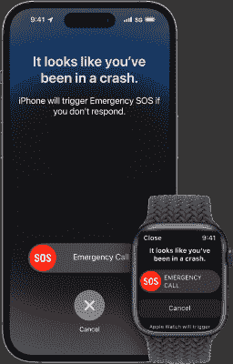
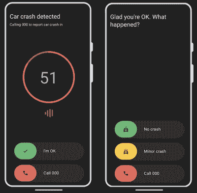

# 过山车正在触发 IPhone 的碰撞检测系统

> 原文：<https://hackaday.com/2022/10/12/rollercoasters-are-triggering-the-iphones-crash-detection-system/>

苹果一直忙于为其智能手机和智能手表产品添加新功能。其新的 iPhone 14 和 Apple Watch 8 现在具有一个安全系统，如果用户发生车祸，该系统可以联系紧急服务机构。

然而，与许多新技术一样，这一功能与意想不到的后果法则相冲突。有报道称“碰撞检测系统”在过山车和其他奇怪的情况下会错误地触发。让我们来看看这些系统是如何工作的，以及为什么会发生这种情况。

## 你能感觉到什么吗？

如今，智能手机不仅仅是电信设备或掌上电脑。它们是复杂的传感器包，我们无论去哪里都随身携带。顶级型号现在囊括了从[高级导航芯片组](https://hackaday.com/2020/07/07/not-just-gps-new-options-for-global-positioning/)到[卫星通信硬件](https://hackaday.com/2022/09/09/apples-satellite-emergency-texts-how-do-they-work/)甚至 [3D 扫描仪的一切。](https://hackaday.com/2022/07/14/building-a-better-3d-scanner-with-an-iphone-and-making-art/)

[Apple’s Crash Detection](https://support.apple.com/en-us/HT213225)

不过，总的来说，几乎所有现代智能手机都内置了某种加速度计。这种设备最明显的用途是检测手机相对于重力的方向，以便根据需要旋转显示屏以适应纵向或横向模式。它们也通常用于控制游戏，或者作为十年前流行的光剑和“数字啤酒”应用的基础。随着时间的推移，这些传感器变得越来越复杂，现代手机通常内置三轴加速度计、陀螺仪甚至磁力计。

苹果现在决定将 iPhone 的传感器套件用于一个更崇高的目的，即检测用户是否遭遇了车祸。这是谷歌硬件 Pixel 系列的延续，该系列已经有类似功能好几年了。加速度计可用于确定用户是否受到高加速度，例如当撞上另一辆汽车并突然停止时。类似地，GPS 也可以提供速度突然变化的数据。此外，如果手机知道它处于驾驶状态，麦克风可以用来检测大的噪音，如玻璃破碎。手机上的气压计甚至可以检测到车窗关闭的汽车中气囊的压力峰值。

但是他们首先也会试图判断你是否在车里。他们声称正在监测你是否在车里，是否经过 WiFi 站，是否绑定了汽车的蓝牙。

当检测到坠机时，手机通常会发出警报，并显示提示，告诉用户已经检测到坠机。如果用户在短时间内没有取消提示，手机会自动拨打紧急服务，甚至可以通知联系人用户发生了事故。

## 真实的世界

Google’s crash detection system allows the user to provide feedback on what just happened after a detection event. Credit: Google Pixel

总的来说，有一整套功能可以协同工作来检测事故。然而,*《华尔街日报》*的测试显示,现代智能手机的碰撞检测功能也有一些警告。在垃圾场环境下进行的一系列测试中，iPhones 和 Pixel 手机都未能触发警报。问题是，没有与汽车的蓝牙设备配对，没有 GPS 显示用户在公共道路上，手机并不总是记录他们处于驾驶环境中。因此，他们没有处于启用碰撞检测系统的模式。

显然，如果一部手机没有检测到重大事故，那就不好了。然而，这些功能是新的，我们很少有人依赖它们作为关键的安全设备。即使他们只是工作来检测一些崩溃，他们仍然提供了一个净好。

然而，假阳性也有一个问题，即在没有发生崩溃的情况下检测到崩溃。一名 iPhone 用户报告说，他的 iPhone 从高速公路上他的摩托车的车把上飞了出去。骑手很好；只是手机从自行车上脱落了。不幸的是，这显然触发了手机的碰撞检测系统，该系统通知几个联系人，机主发生了严重的事故。在寻找替换手机时，主人收到了家人惊慌失措的语音邮件，以为他受了重伤。

过山车也被证明是有问题的。紧急调度员已经在处理来自这种游乐设施的重复呼叫，发生了几起关于俄亥俄州国王岛游乐园的事故。多莱坞主题公园现在张贴了[的标志](https://twitter.com/Coaster101/status/1575146836557500418?ref_src=twsrc%5Etfw%7Ctwcamp%5Etweetembed%7Ctwterm%5E1575146836557500418%7Ctwgr%5Eefa97de08b61757bcd86693cecb1b144284db1d8%7Ctwcon%5Es1_&ref_url=https%3A%2F%2Fd-18674883402873266225.ampproject.net%2F2209142312000%2Fframe.html)，警告人们在游乐设施上经历的剧烈加速会触发苹果手表和其他智能设备上的紧急呼叫功能。

## 那个喊着“狼来了！”

想到我们的电子设备在照顾我们，感觉真好。当有人丧失行动能力时，智能设备可以呼叫紧急服务，这种技术确实有机会挽救生命。

当然，如果技术不可靠，这一切都会受到影响。人类本能地倾向于忽略喊狼来了的男孩，以及喊“撞车了”的智能手机在过山车上并不遥远。

事实是，苹果的新硬件是当前大多数报道的主题。谷歌的 Pixel 手机没有因为这些假阳性结果而受到类似的指控。因此，这种技术似乎基本上是可靠的和可行的。苹果可能需要做更多的工作。

[横幅图片:Lewin Day 的“Lewin 还没有崩溃检测”