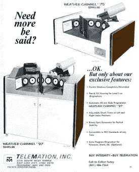
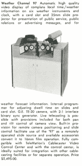
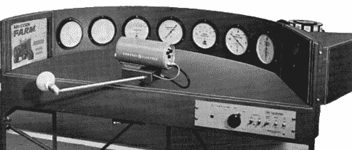
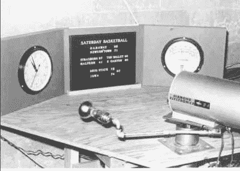
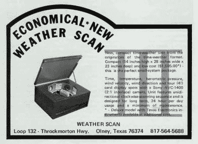

# 原始天气频道

> 原文：<https://hackaday.com/2022/10/20/retrotechtacular-the-original-weather-channel/>

天气频道决定停止自动天气显示，这是各地天气爱好者最喜欢的体验。然而，它不是最初的天气呆子电视台。比你想象的要早得多，早期的有线电视网络已经有了自己的低技术版本。例如，看看下面的视频，它展示了 1975 年的一个气象站。

 [https://www.youtube.com/embed/JGZAs5hkiQ0?version=3&rel=1&showsearch=0&showinfo=1&iv_load_policy=1&fs=1&hl=en-US&autohide=2&wmode=transparent](https://www.youtube.com/embed/JGZAs5hkiQ0?version=3&rel=1&showsearch=0&showinfo=1&iv_load_policy=1&fs=1&hl=en-US&autohide=2&wmode=transparent)

音频来自当地的调频电台，你也可以欣赏手写的公共服务公告。

## 供应商

我们总是想知道这一切的硬件到底是什么样子的。你可以猜测一些人没有来回摇动相机。当然，互联网都知道，所以没多久就发现了几个为这项服务制作的商业单元。我们看到至少可以追溯到 1964 年的新闻稿，看起来 1967 年是这些设备变得非常主流的时候。

  Fully automatic!  Note the price tags!  A 1967 blurb for an automated weather channel

这种“本地起源”设备的一个主要供应商是远程信息处理，[T. Buckingham Thomas]对它的运作以及它如何让他成为一家中型有线电视公司的项目总监有着很好的[回忆。有几个不同的单位相当昂贵，尤其是在那些日子里。有几个竞争者在争夺这个市场。](https://www.t2buck.com/middletown.htm)[德克萨斯电子公司](https://texaselectronics.com/product/complete-weather-station/)仍在生产气象站，但可能不再生产自动摄像机。另一方面，Telemation 被出售了几次，并作为 Thompson 的一部分继续存在。

请注意，有些型号有幻灯机，可能还有扫描幻灯片的方法(可能是背投屏幕)。同样，在底部看到带有公告或广告的爬虫也并不少见。

## 技术

你可能会注意到这些机器至少有两种不同的设计。在其中一个场景中，摄像机前后移动。另一个摇镜子——大概更容易，因为没有电源或信号旋转。然而，这也意味着，我们假设，要么表盘是镜像的，要么相机扫描考虑到了镜像。

这些单元变得越来越小，直到最后完全消失。

  The units got smaller…  .. and smaller…  …and smaller

## 乡愁

我们不能诚实地说我们怀念这些旧的天气频道，但它们确实提醒我们更简单的时代。想象一下今天要做同样的功能需要设计什么。没有哪个企业巨头会允许你为手写广告投放位置。当然，你不必这样。今天，您可以从互联网上获取天气数据，使用任何数量的渲染技术对其进行格式化，并以零机械足迹全天输出视频。

好些了吗？也许吧，但这并不妨碍我们怀旧。我们也惊叹于当你没有太多选择的时候，你是多么的巧妙和简单。此外，我们有点惊讶，有人不是从这些古老的野兽或今天的复制品之一流。气象扫描的 MAME 模拟器在哪里？

如果你只是想要一个你自己的古怪天气显示器，那就去做吧。如果你真的喜欢天气扫描的模拟氛围，[你也可以这样做](https://hackaday.com/2021/03/10/supersized-weather-station-uses-antique-analog-meters/)。