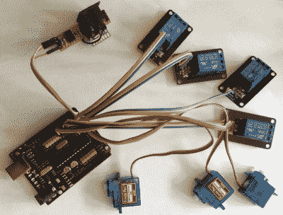

# 高保真管弦乐队学习管状钟

> 原文：<https://hackaday.com/2022/10/14/lo-fi-orchestra-learns-tubular-bells/>

硬件项目通常分为三类:闪光项目、发声项目和移动项目。[由[Kevin]的“高保真管弦乐队”进行的这一精湛的表演](https://diyelectromusic.wordpress.com/2022/10/10/the-lo-fi-orchestral-tubular-bells/)管理了所有三个部分，同时出色地再现了麦克·戈登·欧菲尔德 1973 年的音乐经典*管状钟*。

对于 Arduinos 等简单的微控制器板来说，同时产生不同音色的体面复音是一个挑战，因此[Kevin]接受了“更多就是更多”的理念，并像传统管弦乐队一样将声音生成工作进行了分解。总之，11 个 Arduino Nanos、6 个 Arduino Unos、一个 Arduino Pro Mini、一个 Adafruit Feather 32u4 和一个运行 [MT32-Pi](https://github.com/dwhinham/mt32-pi) 的树莓 Pi 组成了这个电子合奏。

Arduino Servo & Relay Drumkit

伺服和继电器鼓包是一个特别的亮点，提供一些物理声音，以配合其他固态一代。

整个项目是通过 MIDI“指挥”的，中间闪烁的音序器给出了近乎催眠的音乐的视觉指示。表演分为两个视频(休息后)，将为 70 年代音乐和经典恐怖电影的粉丝所熟悉。我们很惊讶[凯文]如此准确地捕捉到了原始录音的情绪。

如果这一切看起来有点熟悉，那可能是因为我们以前报道过低保真管弦乐队，当时它给我们带来了古斯塔夫·霍尔斯特的《行星组曲》的激动人心的演奏。如果你对真正的*管钟*比对合成的更感兴趣，那么看看【2013 年的这套 MIDI 控制的。

 [https://www.youtube.com/embed/Tzg2lfzM19Y?version=3&rel=1&showsearch=0&showinfo=1&iv_load_policy=1&fs=1&hl=en-US&autohide=2&wmode=transparent](https://www.youtube.com/embed/Tzg2lfzM19Y?version=3&rel=1&showsearch=0&showinfo=1&iv_load_policy=1&fs=1&hl=en-US&autohide=2&wmode=transparent)

 [https://www.youtube.com/embed/AZrojHfWbts?version=3&rel=1&showsearch=0&showinfo=1&iv_load_policy=1&fs=1&hl=en-US&autohide=2&wmode=transparent](https://www.youtube.com/embed/AZrojHfWbts?version=3&rel=1&showsearch=0&showinfo=1&iv_load_policy=1&fs=1&hl=en-US&autohide=2&wmode=transparent)

