# 拆卸:Cooler Max 液体冷却系统

> 原文：<https://hackaday.com/2022/10/17/teardown-cooler-max-liquid-cooling-system/>

每周，Hackaday tip line 都会收到来自制造商的大量报价，他们希望向我们发送他们最新、最棒的设备以供审查。这些中的绝大多数都被忽略了，只是因为它们对于我们在这里运行的内容没有意义。例如，有一家公司出于某种原因似乎执意要给我们送一把折叠式电子吉他。

起初，当 CoolingStyle 最近向我们介绍他们的更酷的 Max T1 时，就发生了这种情况。邮件声称这是“世界上第一个用于游戏桌面的空调冷却系统”，它具有“强大的压缩机，可以带来出色的冷却性能”，能够自动将你的电脑温度降至 10℃(50℉)。电子邮件中的单一宣传照片显示，一个相当笨重的盒子用一对软管连接到一个游戏装备上，但没有提供任何技术信息。我们在(虚拟)水冷却器周围传递了一会儿电子邮件，一致认为这个奇特的盒子可能只包含一对珀尔帖冷却模块和一些 RGB LEDs。

故事差不多就要结束了，但这封邮件中有一点我无法摆脱。如果只是使用珀耳帖模块，那么为什么盒子这么大？他们提到的那个“强力压缩机”呢？他们会不会在玩一些可爱的文字游戏，实际上是在谈论一个离心风扇？也许…

这让我很困扰，几天后我回到 CoolingStyle，说我们可以接受一个单位看看。我想不管盒子里最后是什么，都会成为一个有趣的故事。此外，这也给了我一个借口，为我的“拆卸”专栏再写一篇文章，这是一个曾经很常见的功能，但遗憾的是，自从我担任总编辑以来，这个功能就被忽略了。

只有一个问题…我不是电脑玩家。偶尔，我会启动 Kerbal 太空程序，但即便如此，我的火箭也是在集成视频上呈现的。我甚至不知道有谁的游戏电脑强大到可以把空调栓在旁边。但是我有足够的经验把奇怪的东西拆开来弄清楚它是如何工作的，所以让我们从这开始。

## 有前途的血统

当我等待我的酷酷的 Max 飘洋过海的时候，我决定去看看这家公司本身。浏览他们的网站，你会发现一系列令人印象深刻的小型冷水机，用于冷却工业激光器或高性能服务器。正如网站上解释的那样，CoolingStyle 产品线的关键是他们的手掌大小的压缩机，这使他们可以将整个制冷系统压缩到一个可以装入标准服务器机架的盒子中。

 [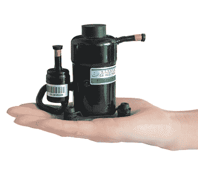](https://hackaday.com/2022/10/17/teardown-cooler-max-liquid-cooling-system/coolermax_minicomp/)  [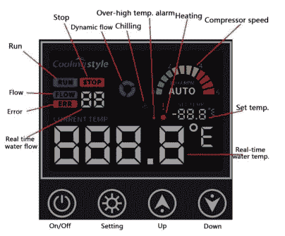](https://hackaday.com/2022/10/17/teardown-cooler-max-liquid-cooling-system/coolermax_panel/) 

翻开其中一台冷却器的说明书，我们可以看到所用的控制面板与 Cooler Max 的宣传图片中显示的控制面板完全相同。在这一点上，我真的变得非常兴奋——这东西看起来越来越像真的了。

事实上，CoolingStyle 上提供的冷却器之一， [Q 系列微型水冷却器](https://coolingstyle.com/micro-water-chiller/)，似乎与 Cooler Max 的整体布局非常相似。会不会是这家公司拿走了他们的一款高端工业散热设备，用一些 RGB LEDs 为游戏玩家群体进行了改装？

## 令人印象深刻的机器

我不得不承认，当我从盒子里拿出更酷的 Max 时，我印象深刻。这东西和中型台式电脑一样大，像坦克一样。这个案例中到处都有一些适合和完成的问题，但是考虑到它是一个预发布的原型，没有什么不能被原谅的。

 [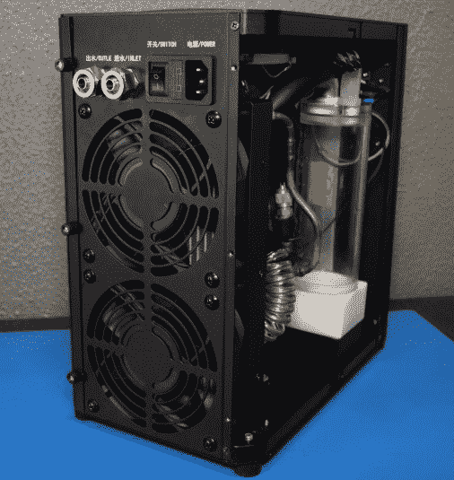](https://hackaday.com/2022/10/17/teardown-cooler-max-liquid-cooling-system/coolermax_open3/)  [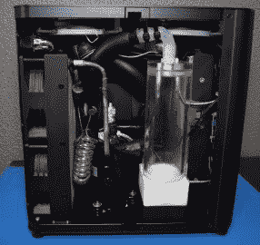](https://hackaday.com/2022/10/17/teardown-cooler-max-liquid-cooling-system/coolermax_open1/)  [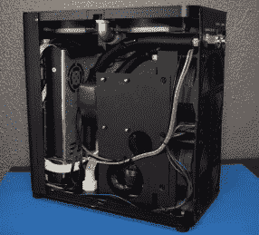](https://hackaday.com/2022/10/17/teardown-cooler-max-liquid-cooling-system/coolermax_open2/) 

就结构而言，它实际上非常类似于台式电脑的外壳，一旦你移除后面的指旋螺钉，金属片侧板就会滑下。前面板和后面板也是金属板，而顶部和底部似乎是注塑成型的塑料。事实上，如果它是某种定制的 jellybean PC 外壳，我不会感到惊讶，因为在一侧甚至有一个支持面板，看起来像是打算用来容纳主板。

## 电子学

朝向冷却器 Max 的前面是一个平均良好的 LRS-350 电源，为压缩机和大多数电子设备提供 24 V，在另一侧，我们可以看到一个通用的可调调节板，它被设置为 5 V，并连接到该单元顶部的双 120 mm RGB 风扇。由于压缩机的主控板已经有一个功能性的 5 V 轨，增加单独的调节器似乎有点麻烦；好像车载调节器没有完成处理大型照明风扇的任务。在任何情况下，如果生产单位不改变这一点，我会感到惊讶——即使只是降至固定的 5 V 调节器也会更便宜。

[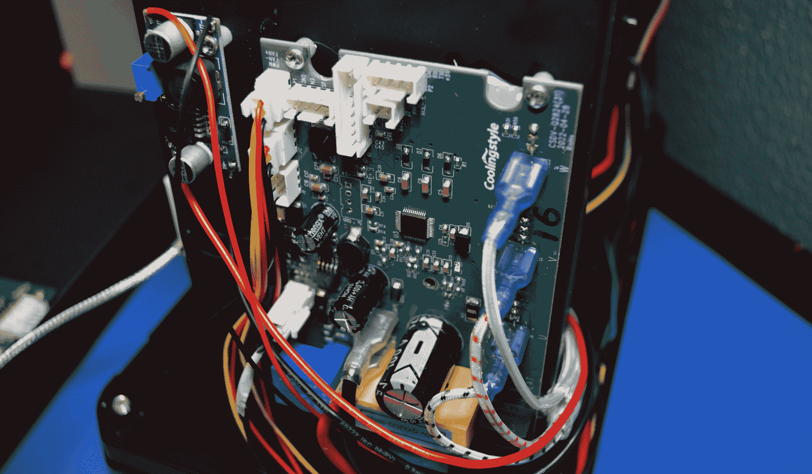](https://hackaday.com/wp-content/uploads/2022/10/coolermax_elec1.jpg)

Note the small adjustment screw on the blue regulator board for setting the output voltage.

压缩机控制板有相当多的正在进行，从所有未使用的连接器来看，有相当大的潜力尚未开发。很明显，在电路板的正上方有一个串行端口，这可能是未来实验的主题。总的来说，这里的建筑看起来很不错，我很欣赏像绝缘铲连接器这样的小细节。继电器可能是潜在的故障点，虽然它们没有插座，但把它们换出来并不十分困难。

在前面板的内部，我们有第二个 PCB。这似乎是大多数 CoolingStyle 产品的特色，所以正如您所料，考虑到这个相对简单的应用程序，它再次突出了许多未使用的连接。

[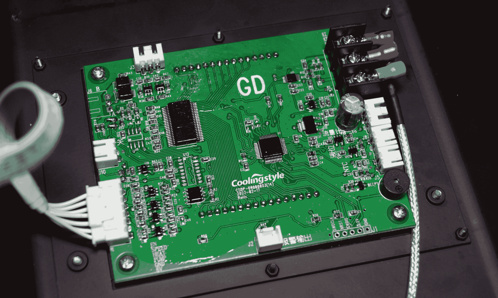](https://hackaday.com/wp-content/uploads/2022/10/coolermax_elec2.jpg)

虽然两个主要 IC 的标签已被移除，但这两个 IC 显然是一个微控制器和一个专用 LCD 控制器。请注意底部接头上清晰标记的 SWDIO/SWCLK 引脚:这是一个单线调试(SWD)接口，暗示我们的神秘 MCU 实际上是 STM32。像前面提到的串行端口一样，这个接口已经成熟，可以用于未来的实验。Matthew [wrongbaud] Alt 为那些不熟悉 ARM 对 JTAG 的回答的人收集了一些关于可以从 SWD 收集到的信息的优秀文章。

考虑到潜在的湿气，电路板上的保形涂层是一个不错的接触，热电偶的螺丝端子连接是一个受欢迎的惊喜。小的细节，但是它们说明了整体的构建质量。

## 水冷系统

[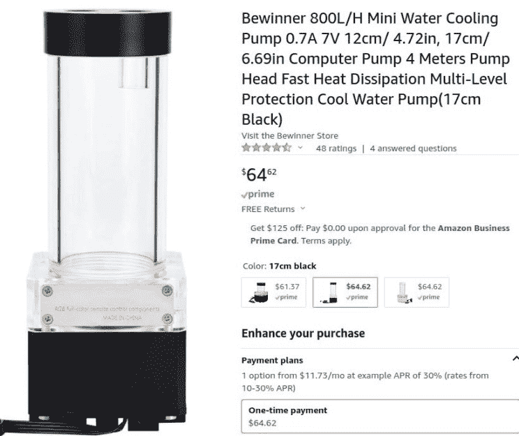](https://hackaday.com/wp-content/uploads/2022/10/coolermax_watercool.jpg) 我不会在这上面花太多时间，因为据我所知，Max 这部分冷却器看起来完全是现成的。虽然我显然没有一个比较，我会感到惊讶，如果这是你会发现在他们的任何专业冷却器；这可能是他们用来创造这种更面向消费者的设备的成本削减措施之一。

水冷组件上没有识别标记，但非常相似的装置可以很快在网上找到。可能已经进行了一些定制修改，例如添加了热电偶端口，但毫无疑问，泵、配件和储液器都是任何水冷游戏 PC 中的标准组件。这并不一定有什么错。

## 制冷循环

因此，在这一点上，应该清楚的是，冷却器 Max 实际上是一个微型(相对而言)制冷装置。就像空调一样，它有一个压缩机和一个相当大的冷凝器，配有大型风扇来保持凉爽。但不同的是，这个装置不是吹冷空气，而是用来抽冷水的。

因此，冷却器 Max 使用热交换器来冷却通过内部蓄水池泵入的水，而不是用另一组风扇吹过蒸发器盘管。不幸的是，这种制冷装置上焊接铜连接的性质使其不可能在不释放制冷剂的情况下完全分开，因此我们无法孤立地很好地观察这些组件。

[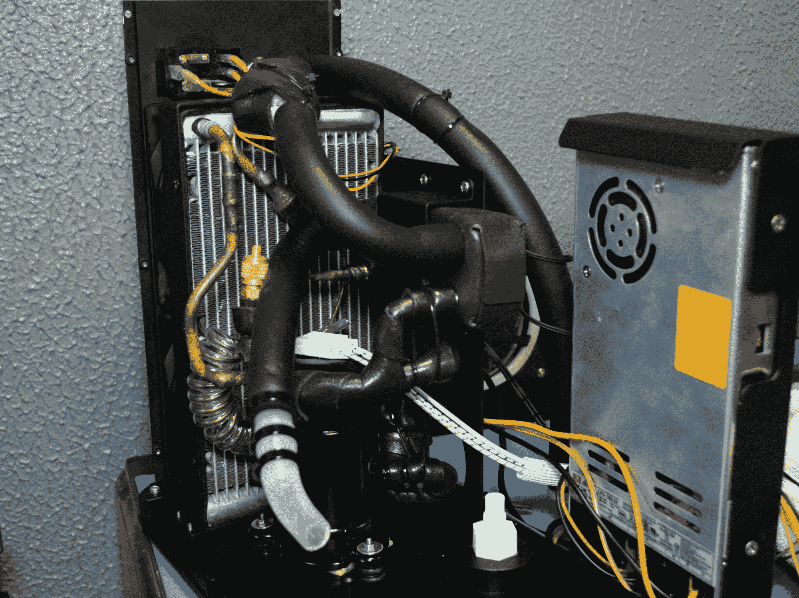](https://hackaday.com/wp-content/uploads/2022/10/coolermax_fridge.jpg)

但是，随着水箱的拆除，电源移到了一边，我们可以得到一个相当好的所有核心组件的概述。后面的银色散热器是冷凝器，安装在机箱底部的黑色圆柱体是 CoolingStyle 的微型压缩机，图像中心的泡沫包裹的盒子是热交换器。较厚的绝缘管是用于水的，如果你看图片顶部靠近交流电源进入装置的地方，你可以看到流量传感器的凸出部分，它用来确定有多少水实际上被泵入系统。

## 令人印象深刻的修复

在结束之前，我认为值得注意的是，Cooler Max 可能是我们在这个拆解系列中看到的最耐用的设备之一。从所有水冷装置到风扇和电源，如此多组件的替换品都可以在您选择的在线零售商处买到，而无需经过任何手续。

[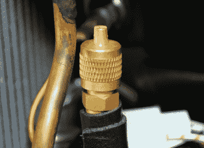](https://hackaday.com/wp-content/uploads/2022/10/coolermax_port.jpg)

R134a service port

该装置的设计和构造是这样的，正如你在这里看到的，它几乎可以完全被拆开，除了螺丝刀之外没有任何东西。所有的电气连接都是用插座或螺丝固定的，里面看不到一点胶水。

令人难以置信的是，它们甚至包括一个添加制冷剂的服务端口，这是你通常不得不自己动手做的事情。压缩机使用 R134a，至少在美国，你可以从汽车配件商店买到。

当然，作为一个原型，其中一些功能可能是由于它的一次性性质。最终的单元可能会去掉服务端口，用专有的零件替换一半的内部零件。也许吧。但是我们可以梦想。

## 好吧，但是它有用吗？

正如我开始所说，我不是电脑玩家。这也不是一个关于电脑游戏的网站。因此，在这种情况下，我没有资格评判更酷的麦克斯。这可能会让一些人感到不安，尤其是 CoolingStyle 的优秀员工。

[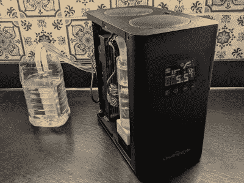](https://hackaday.com/wp-content/uploads/2022/10/coolermax_test.jpg)

Highly scientific kitchen counter testing.

然而，为了记录在案，我确实把它挂在一个基本的水块上做了一些简单的测试——它肯定会在短时间内变冷，当我把块浸入一桶热水中时，冷却器 Max 像疯了一样加速，并在一两分钟内将其降至室温以下。

我还可以告诉你，冷却器最大似乎是非常好的，设计，以便您可以打开它来修复它，并可能修改它，而没有在这个过程中破坏它的危险。这是一个我们不常看到的特点，所以尊重冷却风格是应该的。

考虑到市场上没有其他类似的东西，很难判断 Kickstarter 美元的入门价格。这是一大笔钱。但在技术层面上，你真正可以与之相比的最接近的东西是一台小型旅行空调，逛商店，它们的价格差不多。当然，在一天结束的时候，如果你有一台足够强大的游戏电脑，你甚至会考虑为你的冷却需求做些如此复杂的事情，这个数字可能不会打破你的预算。