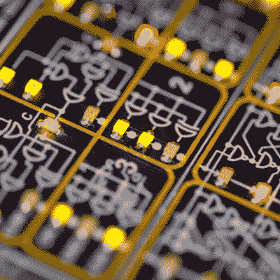

# 为什么要学古代科技？

> 原文：<https://hackaday.com/2022/10/15/why-learn-ancient-tech/>

随着 2022 年 Hackaday 超级太阳徽章的[宣布，Hackaday 太阳系的内部轨道一直在振动。这个故事的简短版本是它是一台“逆向计算机”。但我认为这多少有点低估了。徽章*实际上*是对机器语言的介绍，或者可能是一个编程难题，大量可爱的闪光灯和点击按钮，以及我认为的全栈黑客邀请。](https://hackaday.com/2022/10/12/the-2022-supercon-badge-is-a-handheld-trip-through-computing-history/)

Voja Antonic 设计了内部的虚拟 4 位机器。这台机器与真正的旧计算机的区别在于，你可能想要了解其状态的一切都被分解到正面的 LED 上，从组成 ALU 的低级逻辑元件的输出到 RAM，到作为反汇编器的双重功能的解码器 LED。你可以看到这一切，这使它成为一个无与伦比的学习辅助工具。或者至少它给了你一个战斗的机会。

 那么，你为什么要从一个不存在的 CPU 那里学习一种虚构的机器语言呢？汤姆·纳尔迪和我在播客上谈论我们的经历，我们都同意翻转比特，调用最简单的计算机操作，尽管如此，让它为你服务，有一种莫名其妙的魔力。或者说，这是反魔法的，因为正在发生的是隐喻和抽象的剥离。不只是从后面，而是透过窗帘。你现在看到的是真正发生的事情，从底部到顶部。

正如 Voja 在徽章本身背面的丝印上所写的:“一个从未用机器语言编写过 1 和 0 的程序员，就像一个从未赤脚在草地上跑过的孩子。”这不是必要的，或者甚至可能是相关的，但是整体学习一台复杂的机器同时也是基础和思维拓展。这只是一个你应该拥有的经历。

This article is part of the Hackaday.com newsletter, delivered every seven days for each of the last 200+ weeks. It also includes our favorite articles from the last seven days that you can see on [the web version of the newsletter](https://mailchi.mp/hackaday.com/hackaday-newsletter-649368). Want this type of article to hit your inbox every Friday morning? [You should sign up](http://eepurl.com/gTMxQf)!