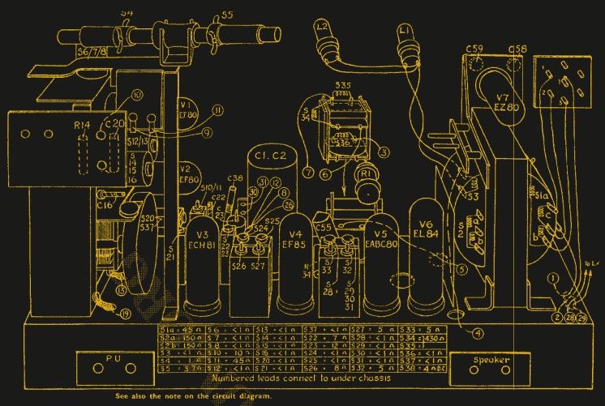

# 你想看的关于修复 1956 年收音机的一切

> 原文：<https://hackaday.com/2022/10/16/everything-you-wanted-to-see-about-restoring-a-1956-radio/>

有没有想过好好看看 20 世纪 50 年代收音机的内部，以及对内部和各种组件的用途的精彩评论？那么不要错过[Adam Wilson]对一辆 1956 年飞利浦 353 a 的修理和修复，维修手册的数字化版本使这项任务变得更加容易。[Adam]提供了大量精彩的图片，以及如何让老式电子产品起死回生的技巧。不喜欢什么？

像这样的老式电子产品往往充满了随着年龄而恶化的组件，所以我们不能简单地通电来看看它是否仍然工作。在通电之前，需要对这些设备进行检查和维修。即便如此，通电也应该使用电流控制电源，如果出现任何问题，该电源可以关闭。

Thank goodness for high quality, digitized service manuals.

像这样的设备在很大程度上早于印刷电路板，所以人们可以期待看到大量的点对点焊接。真空管完成了大部分艰苦的工作，所以它们代替了集成电路和晶体管。微法拉级的电容器比现代的同类产品大得多，纸/蜡电容器(字面上是由裹着蜡的卷纸制成)处理纳法拉级的电容，而不是今天的小陶瓷盘帽。

有一件事非常有帮助，就是前面提到的飞利浦 353A 维修手册，它不仅包括机箱和组件布局，甚至还有维修程序，如调谐拨盘的软线更换。当时，调谐度盘是一种机电组件，使用一圈电线来旋转调谐电容器，更换它是一个复杂的过程。要是所有的硬件都记录得这么好就好了！

最终效果看起来很棒，声音也很棒。作为最后的调整，[亚当]增加了一个外部音频输入电缆，作为对现代时代的点头。现在，我们过去已经看到一个[小 LED 屏幕令人信服地集成到一个古董](https://hackaday.com/2021/10/12/vintage-radio-gets-internet-upgrade/)中，但在这种情况下【亚当】完全保持了原来的样子。你可以看到它在行动，在下面嵌入的短视频中扮演一些弗兰克·辛纳屈。

 [https://www.youtube.com/embed/KQGpVpJnTwM?version=3&rel=1&showsearch=0&showinfo=1&iv_load_policy=1&fs=1&hl=en-US&autohide=2&wmode=transparent](https://www.youtube.com/embed/KQGpVpJnTwM?version=3&rel=1&showsearch=0&showinfo=1&iv_load_policy=1&fs=1&hl=en-US&autohide=2&wmode=transparent)

