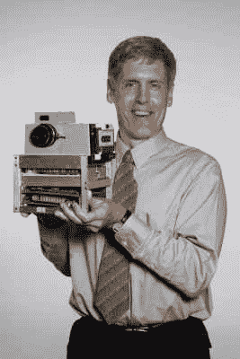

# 柯达胶片厂透露

> 原文：<https://hackaday.com/2022/10/18/kodak-film-factory-revealed/>

任何出生在 20 世纪 90 年代中期之前的人都可能记得胶片相机被用来记录他们的早年。尽管数码相机的便利取而代之，而且很大程度上被手机所取代，但仍有令人惊讶的各种摄影胶片被生产出来。尽管有悠久的历史，但我们当中有多少人真正知道是什么造就了一个令人惊讶的复杂而精确的产品？来自*smarter 的【Destin】每天*都去纽约州的罗彻斯特亲自寻找答案，你可以看到一系列三小时长的视频中的[第二段，它阐明了通常严格禁止的薄膜包衣操作。](https://www.youtube.com/watch?v=cAAJUHwh9F4)

Kodak’s first attempt at a digital camera in 1975\. The form-factor still left something to be desired…

自 1888 年以来，柯达一直以这样或那样的形式存在，并自 1889 年以来一直生产照相胶片。在世纪之交，数码摄影(柯达发明了它，但未能充分利用它)似乎将永远淘汰胶片，2012 年柯达甚至申请了第 11 章破产，这给了它重组业务的时间。

他们大幅缩减电影制作规模，以满足他们认为的未来需求，但幸运的是，在经历了长期下滑后，销售额在过去五年中飙升。事实上，柯达已经从几年前每周五天一班逐渐发展到现在的全天候运营。他们最近雇佣了 300 名电影技术人员，并仍在招募更多人员，以满足每年两位数的需求增长。

[Destin]不遗余力地解释这一过程，包括制作电影工厂的 3D 模型，以更好地可视化设施，以及许多有用的动画。步骤的数量之多令人难以置信，尤其是当你考虑到每一步所需的精确度，以及工厂在黑暗中连续运转的事实，从开始到结束大约有一英里长。令人惊讶的是，这一过程(尽管数量少得多，层数也少得多)最初是在莱特兄弟的第一次动力飞行之前开发的。

我们最近报道了如何让一台[老式电影扫描仪与 Windows 11](https://hackaday.com/2022/09/06/the-coolest-1990s-film-scanner-to-work-with-windows-11/) 一起工作，不久前我们向你展示了在 20 世纪 60 年代[用于从太空](https://hackaday.com/2018/08/02/the-photo-lab-that-flew-to-the-moon/)开发、扫描和传输电影图像的令人难以置信的技术。

 [https://www.youtube.com/embed/HQKy1KJpSVc?version=3&rel=1&showsearch=0&showinfo=1&iv_load_policy=1&fs=1&hl=en-US&autohide=2&wmode=transparent](https://www.youtube.com/embed/HQKy1KJpSVc?version=3&rel=1&showsearch=0&showinfo=1&iv_load_policy=1&fs=1&hl=en-US&autohide=2&wmode=transparent)

 [https://www.youtube.com/embed/cAAJUHwh9F4?version=3&rel=1&showsearch=0&showinfo=1&iv_load_policy=1&fs=1&hl=en-US&autohide=2&wmode=transparent](https://www.youtube.com/embed/cAAJUHwh9F4?version=3&rel=1&showsearch=0&showinfo=1&iv_load_policy=1&fs=1&hl=en-US&autohide=2&wmode=transparent)

感谢[青春痘]的提示。